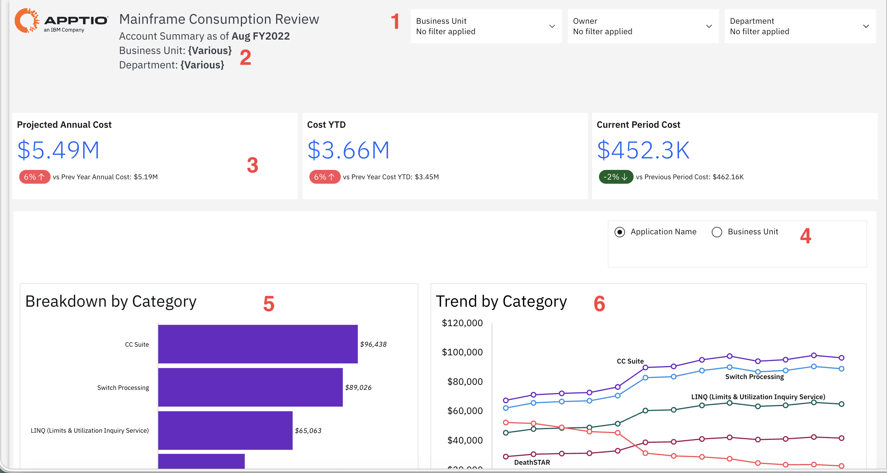
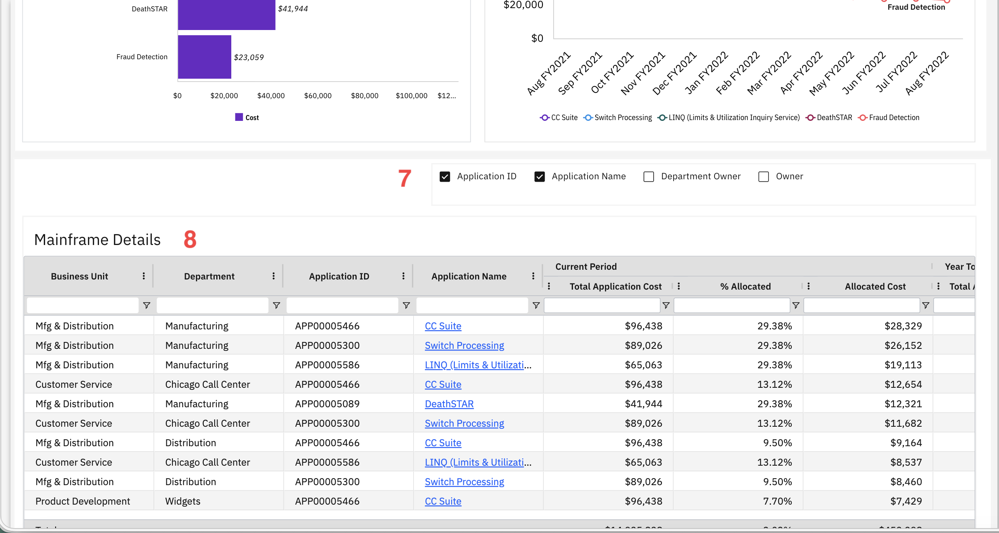

# Análise do consumo de mainframe

Utilize este relatório para compreender como os custos do mainframe são alocados, avaliar os gastos por aplicativo e período, e identificar tendências de custos para apoiar o repasse de custos e o planejamento financeiro. Aplique filtros e visualizações disponíveis para se concentrar nos dados relevantes para sua análise.

Este relatório foi elaborado para ser utilizado pelos seguintes perfis de usuários:

- Gerentes financeiros
- Líderes de Unidades de Negócios
- Chefes de Departamento
- Administradores de estornos

## Elementos-chave

| Elemento | Descrição |
| --- | --- |
| Controles de filtro (1) | Três filtros permitem filtrar o relatório por unidade de negócios, responsável e departamento. |
| Resumo da conta (2) | Mostra o período do relatório e os filtros selecionados para unidade de negócios e departamento. |
| Cartões de métricas principais (3) | Três cartões mostram o custo anual projetado, o custo acumulado no ano e o custo do período atual. Cada cartão inclui indicadores comparativos que mostram as variações em relação aos períodos anteriores. |
| Seletor de dimensão (4) | Use esses botões de opção para selecionar qual dimensão deseja visualizar nos gráficos: Nome do aplicativo ou Unidade de negócios. |
| Gráfico de distribuição por categoria (5) | Este gráfico de barras horizontais mostra a composição dos custos por categoria, como CC Suite, Processamento de Switch, LINQ (Serviço de Consulta de Limites e Utilização), DeathSTAR, e Detecção de Fraudes. |
| Gráfico de tendências por categoria (6) | Este gráfico de linhas mostra a evolução dos custos ao longo do tempo por categoria, com dados mensais de agosto de FY2021 a agosto de FY2022. |
| Painel de seleção de colunas (7) | Este painel permite mostrar ou ocultar colunas na tabela, como ID do aplicativo, Nome do aplicativo, Departamento responsável e Responsável. |
| Tabela de detalhes do mainframe (8) | Esta tabela apresenta dados de consumo do mainframe, com colunas como unidade de negócios, departamento, ID da aplicação, nome da aplicação, custo total da aplicação, porcentagem alocada e custo alocado. Os nomes dos aplicativos levam a informações mais detalhadas. |

## Perguntas e respostas

- Qual é o valor cobrado de cada unidade de negócios ou departamento pelo consumo do mainframe?
- Qual é a estimativa do custo anual em comparação com os gastos do ano anterior?
- Quais aplicativos contribuem mais para os custos de mainframe de cada unidade de negócios?
- Como os custos das candidaturas são distribuídos entre os diferentes departamentos?
- Quais são as tendências de custo para aplicações específicas ao longo do tempo?
- Como se comparam as despesas do período atual com as de períodos anteriores?
- Quais unidades de negócios apresentam padrões de consumo em alta ou em queda?

## Ações recomendadas

- Filtre por unidade de negócios ou departamento para analisar alocações de custos específicas.
- Analise a discriminação por categoria para entender quais aplicativos geram custos.
- Analise os dados de tendências para identificar aplicações cujos custos estejam aumentando ou diminuindo.
- Exportar detalhes da alocação para apoiar os processos de faturamento de estorno.
- Compare os custos do período atual com os de períodos anteriores para identificar anomalias.
- Revisar as porcentagens de alocação para garantir que os custos sejam distribuídos adequadamente.
- Compartilhe relatórios de consumo com os líderes das unidades de negócios para apoiar o planejamento orçamentário.
