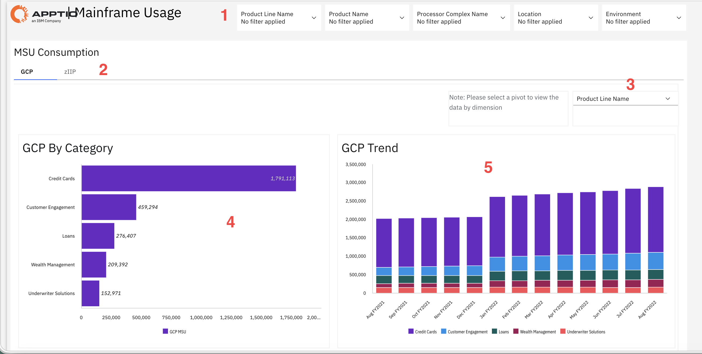
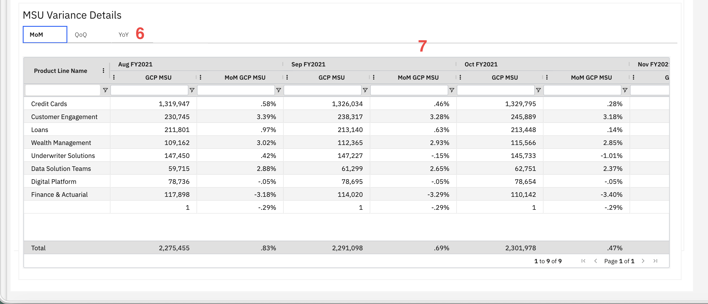

# Utilização de mainframes

Utilize este relatório para compreender o consumo do processador, avaliar o uso por categoria e período e identificar tendências para apoiar o planejamento de capacidade e a otimização da carga de trabalho. Aplique filtros e visualizações disponíveis para se concentrar nos dados relevantes para sua análise.

Este relatório foi elaborado para ser utilizado pelos seguintes perfis:

- Planejadores de capacidade
- Analistas de Desempenho
- Gerentes de Operações de TI
- Arquitetos de infraestrutura

## Elementos-chave

| Elemento | Descrição |
| --- | --- |
| Controles de filtro (1) | Cinco filtros permitem filtrar o relatório por nome da linha de produtos, nome do produto, nome do complexo de processadores, localização e ambiente. |
| Guias de consumo da MSU (2) | Duas guias permitem alternar entre as visualizações de consumo de MSU em GCP e zIIP. |
| Seletor de dimensão (3) | Use este menu suspenso para selecionar qual dimensão deseja visualizar nos gráficos, como, por exemplo, Nome da linha de produtos. |
| GCP gráfico por categoria (4) | Este gráfico de barras horizontais mostra o consumo de MSU d GCP, por categoria, como cartões de crédito, engajamento do cliente, empréstimos, gestão de patrimônio e soluções de subscrição. |
| GCP gráfico de tendências (5) | Este gráfico de barras empilhadas mostra as tendências de consumo de MSU da GCP ao longo do tempo, por categoria, com dados mensais de agosto de FY2021 a agosto de FY2021. |
| Guias de detalhes da variação da MSU (6) | Três guias permitem visualizar os dados de variação por período: MoM (mês a mês), QoQ (trimestre a trimestre) e YoY (ano a ano). |
| Tabela de detalhes da variação da MSU (7) | Esta tabela apresenta dados de variação de MSU, com colunas para o nome da linha de produtos, GCP valores de MSU e MoM GCP variações percentuais de MSU ao longo de vários meses. A tabela inclui uma linha de total e controles de paginação. |

## Respostas às perguntas

- Quais linhas de produtos consomem mais capacidade do processador?
- Como está a evolução do consumo do processador ao longo do tempo nas diferentes categorias?
- Quais são as variações mensais e anuais no consumo de MSU?
- Quais áreas apresentam padrões de uso do processador em aumento ou em diminuição?
- Como a carga de trabalho é distribuída entre os processadores GCP e zIIP?
- Existem padrões sazonais ou anomalias no consumo dos processadores?
- Quais linhas de produtos poderiam se beneficiar da otimização da carga de trabalho ou da mudança do tipo de processador?

## Ações recomendadas

- Alterne entre as guias “ GCP ” e “ zIIP ” para comparar o consumo entre os diferentes tipos de processador.
- Analise os detalhes das variações para compreender as mudanças em relação ao mês anterior e ao mesmo período do ano anterior.
- Identifique as linhas de produtos com aumentos significativos no consumo e investigue as causas.
- Filtre por linha de produtos ou ambiente para se concentrar em áreas específicas de interesse.
- Analisar tendências para prever as necessidades futuras de capacidade e planejar investimentos em infraestrutura.
- Exporte os dados de uso para compartilhá-los com as equipes de planejamento de capacidade e operações.
- Compare o uso de GCP e zIIP para identificar cargas de trabalho que poderiam ser migradas para processadores especializados.
