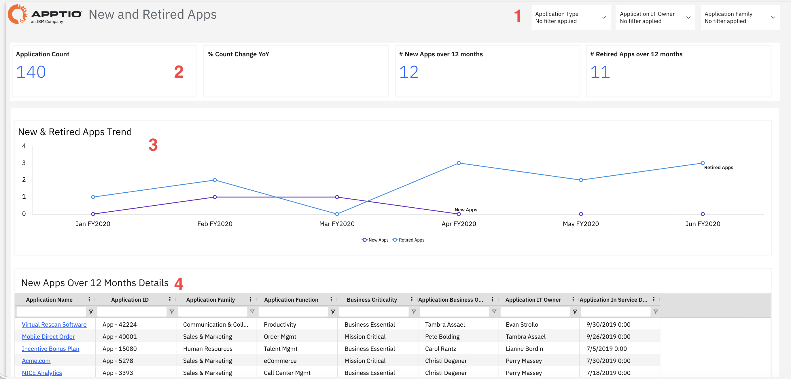
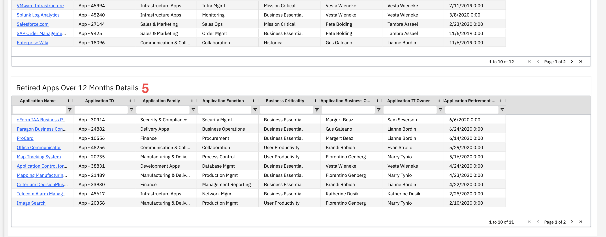

# Aplicativos novos e descontinuados

Use este relatório para acompanhar as mudanças no seu portfólio de aplicativos, incluindo novas adições e descontinuações ao longo do tempo, identificando tendências na evolução do panorama. Acesse informações como propriedade, importância para os negócios e datas de prestação de serviços para compreender melhor os períodos de mudanças significativas.

Este relatório foi elaborado para ser utilizado pelos seguintes perfis:

- CIO
- Gerentes de portfólio de aplicativos
- Arquitetos de Negócios
- Controladores Financeiros de TI
- Líderes de Unidades de Negócio

## Elementos-chave

| Elemento | Descrição |
| --- | --- |
| Controles de filtro (1) | Três filtros permitem filtrar o relatório por tipo de aplicativo, responsável pela TI do aplicativo, família de aplicativos e responsável comercial do aplicativo. |
| Fichas de resumo (2) | Quatro cartões de resumo mostram o número de solicitações, a variação percentual em relação ao ano anterior, as novas solicitações nos últimos 12 meses e as solicitações encerradas nos últimos 12 meses. |
| Gráfico de tendências de aplicativos novos e descontinuados (3) | Um gráfico de linhas mostra a evolução ao longo do tempo das novas aplicações e das aplicações descontinuadas. |
| Tabela com detalhes dos novos aplicativos nos últimos 12 meses (4) | Esta tabela inclui colunas como nome do aplicativo, ID do aplicativo, família do aplicativo, função do aplicativo, importância para os negócios, responsável comercial pelo aplicativo, responsável de TI pelo aplicativo e data de entrada em operação do aplicativo. |
| Tabela com detalhes dos aplicativos descontinuados nos últimos 12 meses (5) | Esta tabela inclui colunas como nome do aplicativo, ID do aplicativo, família do aplicativo, função do aplicativo, importância para os negócios, responsável comercial pelo aplicativo, responsável de TI pelo aplicativo e data de desativação do aplicativo. |

## Perguntas e respostas

- Nosso portfólio de aplicativos está crescendo ou diminuindo?
- Quantas novas aplicações adicionamos nos últimos 12 meses?
- Quantas aplicações foram descontinuadas nos últimos 12 meses?
- Que tipos de aplicativos estamos adicionando (por família e função)?
- Quem é o responsável pelas aplicações novas e descontinuadas?
- Quando esses aplicativos específicos foram adicionados ou descontinuados?
- Qual é a tendência em relação ao número de aplicativos novos e descontinuados ao longo do tempo?

## Ações recomendadas

- Analise o gráfico de tendências para identificar os meses com um grande número de novas inscrições e compreender o que motivou esses aumentos.
- Compare os novos aplicativos (12) com os aplicativos descontinuados (11) para avaliar se os esforços de racionalização do portfólio estão no caminho certo.
- Filtre por família de aplicativos para ver quais áreas (Vendas e Marketing, Finanças, RH, etc.) são os que mais instalam ou desinstalam aplicativos.
- Verifique a importância estratégica das novas aplicações para garantir que você está investindo em aplicações de missão crítica ou essenciais para os negócios.
- Analisar os aplicativos desativados para confirmar se foram devidamente desativados e se os custos foram eliminados.
- Clique nos nomes dos aplicativos para ver informações detalhadas sobre cada aplicativo novo ou descontinuado.
- Use o filtro “Responsável de TI pela aplicação” para ver quais equipes são responsáveis pela maioria das alterações no portfólio.
