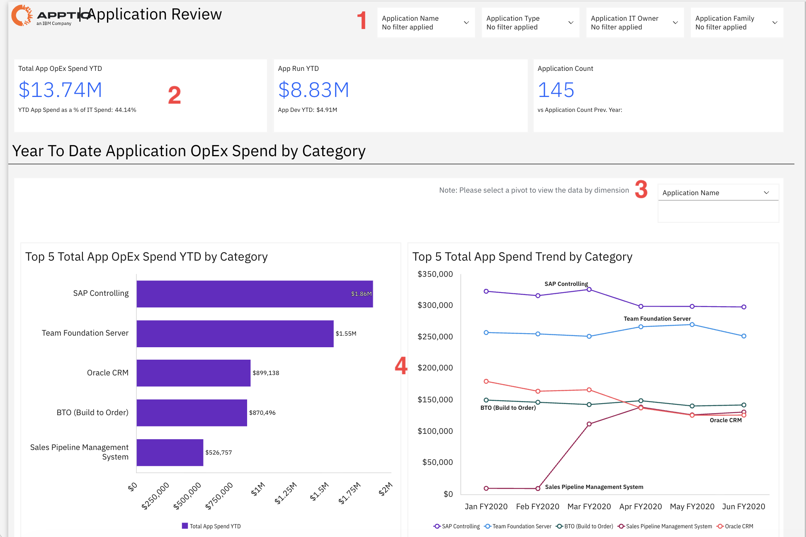
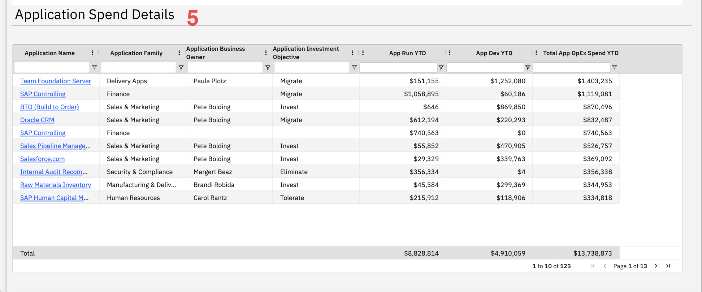

# Análise do aplicativo

Utilize este relatório para monitorar os gastos em todo o seu portfólio de aplicativos, comparando os custos entre os ambientes operacionais e de desenvolvimento para identificar tendências e aplicativos de alto custo. Utilize filtros para analisar os gastos por aplicativo, tipo, responsável ou família, a fim de tomar decisões específicas de gestão de custos.

Este relatório foi elaborado para ser utilizado pelos seguintes perfis:

- CIO
- Controladores Financeiros de TI
- Gerentes de portfólio de aplicativos
- Diretor financeiro
- Líderes de Unidades de Negócios

## Elementos-chave

| Elemento | Descrição |
| --- | --- |
| Controles de filtro (1) | Quatro filtros permitem filtrar o relatório por nome do aplicativo, tipo de aplicativo, responsável pela TI do aplicativo e família de aplicativos. |
| Fichas de resumo (2) | Três cartões de resumo mostram o total de despesas operacionais da aplicação no acumulado do ano, o número de execuções da aplicação no acumulado do ano e o número de aplicações. |
| Gastos com o aplicativo " OpEx " no acumulado do ano, por categoria (3) | Esta seção apresenta as despesas operacionais da aplicação acumuladas no ano, de acordo com a dimensão selecionada. |
| As 5 principais despesas totais com aplicativos no OpEx, acumuladas no ano, por categoria (4) | Um gráfico de barras horizontais mostra as cinco aplicações com as maiores despesas operacionais acumuladas no ano. |
| Tendência dos 5 principais gastos totais com aplicativos por categoria (4) | Um gráfico de linhas mostra a tendência de gastos ao longo do tempo para os cinco principais aplicativos. |
| Tabelas de detalhes de gastos por aplicativo (5) | Esta tabela inclui colunas como nome do aplicativo, família do aplicativo, responsável comercial pelo aplicativo, objetivo de investimento do aplicativo, desempenho acumulado do aplicativo no ano, desenvolvimento acumulado do aplicativo no ano e despesas operacionais totais acumuladas do aplicativo no ano. |

## Perguntas e respostas

- Qual é o nosso gasto total com aplicativos e como ele se compara ao gasto geral com TI?
- Quais aplicativos são os mais caros de se manter?
- Como está a evolução dos gastos com aplicativos ao longo do tempo?
- Qual é a porcentagem dos gastos com aplicativos destinada à operação de aplicativos em comparação com o desenvolvimento de novos recursos?
- Quantas inscrições temos em comparação com o ano passado?
- Quais áreas de negócios (Finanças, Vendas, RH, etc.) o que consome mais do orçamento?
- Quais são os objetivos de investimento para nossos projetos mais caros?

## Ações recomendadas

- Analise as cinco aplicações mais caras e avalie se os níveis de gastos com elas se justificam pelo valor agregado ao negócio.
- Verifique a divisão entre gastos com operação de aplicativos e desenvolvimento de aplicativos para ver se você está gastando demais com manutenção em detrimento da inovação.
- Use o seletor de filtragem para visualizar os gastos por família de aplicativos ou tipo de aplicativo e identificar quais categorias precisam de redução de custos.
- Analise o gráfico de tendências para identificar as aplicações cujos custos estão aumentando e investigar as razões desse aumento.
- Filtre por "Objetivo de investimento do aplicativo" para ver quanto você está gastando com aplicativos marcados como "Migrar" ou "Eliminar", cujos custos deveriam estar diminuindo.
- Compare o número de candidaturas (145) com o do ano anterior para avaliar se as medidas de racionalização do portfólio estão surtindo efeito.
- Clique nos nomes dos aplicativos na tabela de detalhes para explorar fatores de custo específicos e oportunidades de otimização.
