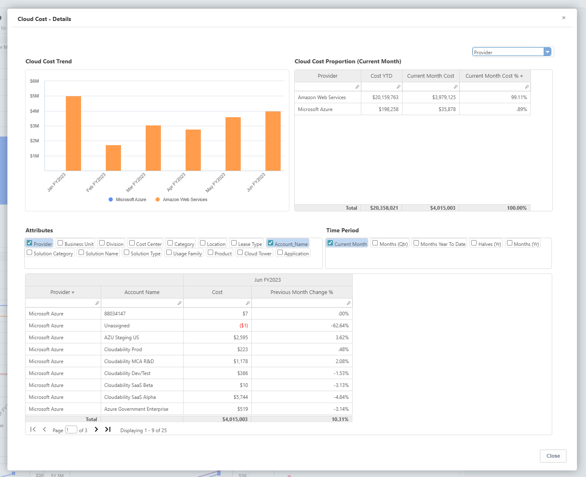

# Relatórios de TCO da nuvem pública

IBM Apptio Public Cloud Os relatórios de TCO oferecem aos membros da equipe de finanças insights sobre os gastos mensais com a nuvem, os geradores de custos e as práticas do FinOps em AWS e Azure.

| Descrição do elemento-chave |
| --- |
| 1. Resumo financeiro e operacional do Cloud for Cost YTD, incluindo quaisquer créditos aplicáveis |
| 2. Os metadados adicionais o tornam autointuitivo, alinham a taxonomia e facilitam a compreensão. |
| 3. A tendência de custo em diferentes serviços de nuvem ( AWS e Microsoft Azure ). |
| 4. As tendências de custo por atributos de negócios, como provedor, centro de custos, nome da conta etc. |

| Descrição |
| --- |
| 1. O relatório aprimora os serviços que impulsionam a direção dos custos. |
| 2. A eficácia do modelo de compra na nuvem e como ele se compara aos benchmarks Best-in-Class. |
| 3. A tendência da taxa unitária em relação às mudanças no consumo. |
| 4. Detalhamento dos custos, consumo e taxas unitárias dos provedores de serviços |

## Relatórios drill down

Aprofunde-se mais para entender os motivadores comerciais e técnicos de cada um dos relatórios.

- Os fatores que determinam o custo do serviço, incluindo a conta responsável e o valor correspondente.
- O serviço/aplicativo comercial que impulsionou a mudança.

**Custo da nuvem - detalhes**

**Horas da CPU - Detalhes**

**Armazenamento - Detalhes**

