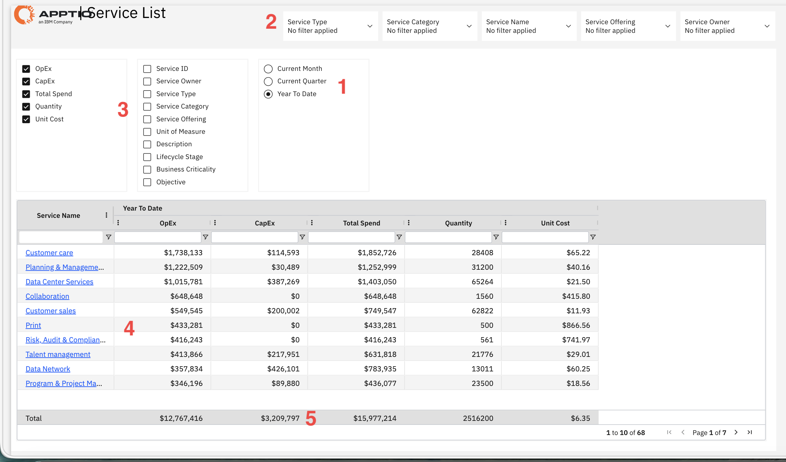

# Lista de serviços

Utilize este relatório para visualizar todos os serviços de TI, incluindo suas despesas operacionais e de capital, analisando os padrões de gastos por quantidade e custo unitário em diferentes serviços e períodos.

Este relatório foi elaborado para ser utilizado pelos seguintes perfis:

- Responsáveis pelo serviço
- Analistas financeiros
- Operações de TI
- Analistas de negócios
- Responsáveis pelos centros de custo

## Elementos-chave

| Elemento | Descrição |
| --- | --- |
| Seletor de período (1) | Use este seletor para visualizar os dados do relatório referentes ao mês atual, ao trimestre atual ou ao acumulado do ano. |
| Menus suspensos de filtro (2) | Cinco filtros permitem filtrar o relatório por tipo de serviço, categoria de serviço, nome do serviço, oferta de serviço e responsável pelo serviço. |
| Seletor de colunas (3) | Use este controle para mostrar ou ocultar as colunas disponíveis, incluindo métricas financeiras, métricas operacionais, detalhes do serviço e informações adicionais sobre o serviço. |
| Tabela de lista de serviços (4) | A tabela exibe os serviços com base nas colunas selecionadas. Você pode ordenar por coluna e acessar os detalhes do serviço clicando no nome do serviço. |
| Totais resumidos (5) | A linha do rodapé exibe os totais de despesas operacionais, despesas de capital, gastos totais, quantidade e custo unitário médio dos serviços exibidos. |

## Perguntas e respostas

- Qual é a lista completa de todos os serviços e seus preços?
- Quais serviços apresentam o maior gasto total?
- Qual é o custo unitário de cada serviço e quais são os mais caros por unidade?
- Quanto tráfego de OpEx e CapEx cada serviço consome?
- Quais serviços um determinado proprietário administra?
- Quais serviços pertencem a uma categoria ou tipo específico?
- Quantas unidades de cada serviço estão sendo consumidas?
- Qual é o valor total dos gastos em todos os serviços para o período selecionado?
- Quais serviços apresentam custos elevados, mas volumes reduzidos (o que indica altos custos unitários)?

## Ações recomendadas

- Ordene por “Gasto total” (do maior para o menor) para ver os serviços mais caros e verificar se eles estão alinhados com as prioridades da empresa.
- Classifique por custo unitário para identificar serviços com custos unitários excepcionalmente altos e analise por que eles são mais caros do que serviços semelhantes.
- Filtre por “Responsável pelo serviço” para ver todos os serviços gerenciados por uma pessoa; em seguida, analise os gastos totais e identifique oportunidades de consolidação.
- Compare as colunas OpEx e CapEx para identificar os serviços que estão em grande parte operacionais ( OpEx, alto e CapEx baixo) em comparação com aqueles que receberam investimentos significativos ( CapEx alto).
- Use o Seletor de Colunas para adicionar o Tipo de Serviço e a Categoria de Serviço; em seguida, classifique os dados para agrupar serviços semelhantes e comparar seus custos.
- Exporte os dados para o Excel para realizar análises mais aprofundadas, como calcular tendências de custos ou criar gráficos personalizados para apresentações.
- Clique nos nomes dos serviços de alto custo para acessar suas páginas detalhadas e entender o que está gerando esses gastos.
