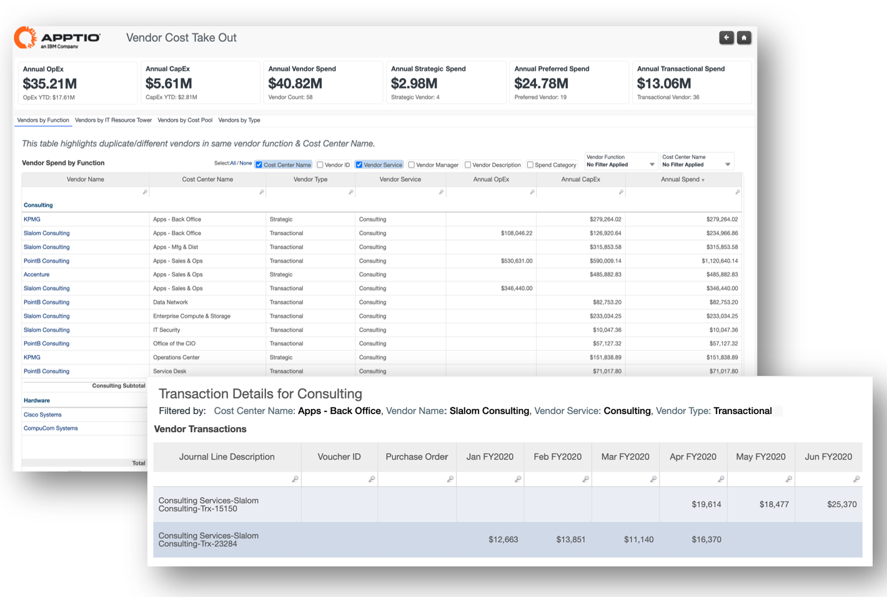
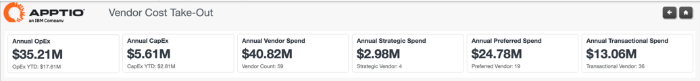
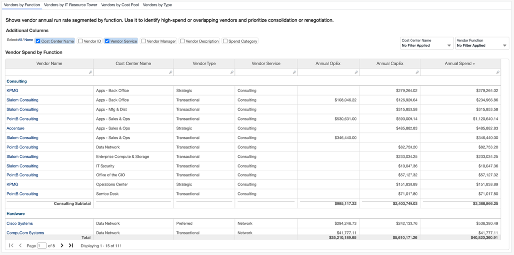
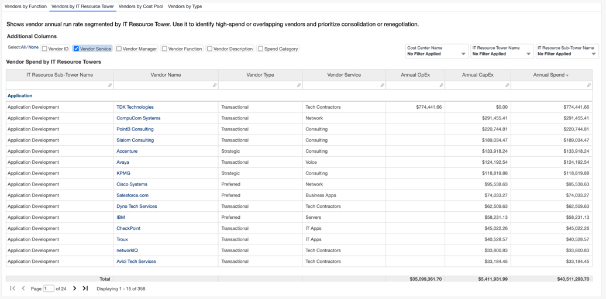
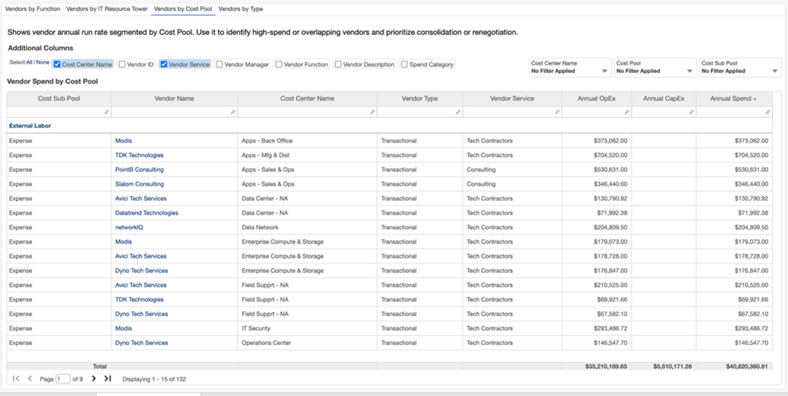
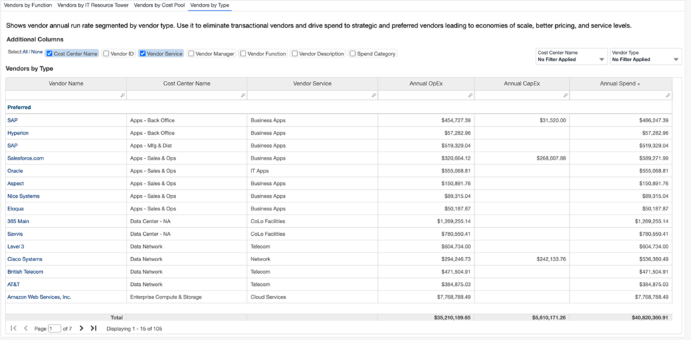

# Tomada de custos do fornecedor

| Principais benefícios | Detalhes |
| --- | --- |
| - Veja o gasto total do fornecedor em OpEx e CapEx - Detalhar as despesas mensais de cada fornecedor - Identificar fornecedores de alto e baixo custo para cada função ou serviço - Identificar áreas de duplicação para racionalizar os fornecedores por função, torre ou grupo de custos   **Perguntas respondidas**   - Devemos mudar o trabalho para um fornecedor ou para outro? Há alguma que possamos consolidar? - Podemos renegociar algum contrato? - Há algum fornecedor com o qual não deveríamos renovar nossos contratos? | **Para** :  Líderes de unidades de negócios, gerentes de fornecedores, gerentes de compras  **Como navegar** : Vá para **Relatórios** > **Cobranças do fornecedor** > **Tomada de custos do fornecedor** |

**Insights**

Os KPIs informam a taxa de execução anual geral para OpEx, CapEx e Total Spend.

**Fornecedor por função**  
Esta tabela fornece visibilidade dos fornecedores associados a cada centro de custos, juntamente com suas despesas correspondentes. Isso ajuda a avaliar os custos do fornecedor e a tomar decisões informadas, para decidir se deve continuar com um fornecedor ou mudar para uma alternativa.

**Fornecedores por torre de recursos**

Essa tabela fornece visibilidade dos fornecedores associados a cada Torre de recursos de TI e Subtorre de recursos de TI, para cada Centro de custos filtrado, juntamente com as Despesas correspondentes. Isso ajuda a avaliar os custos do fornecedor e a tomar decisões informadas, para decidir se deve continuar com um fornecedor ou mudar para uma alternativa.

**Fornecedores por Pool**

Essa tabela também é semelhante à tabela Vendors by Resource Towers e Vendors by Function.

**Fornecedores por tipo**

Esta tabela mostra diferentes fornecedores e suas despesas associadas para o mesmo centro de custos. Essa visão ajuda a eliminar os fornecedores transacionais e a direcionar os gastos para fornecedores estratégicos e preferenciais, o que leva a economias de escala, melhores preços e níveis de serviço.

