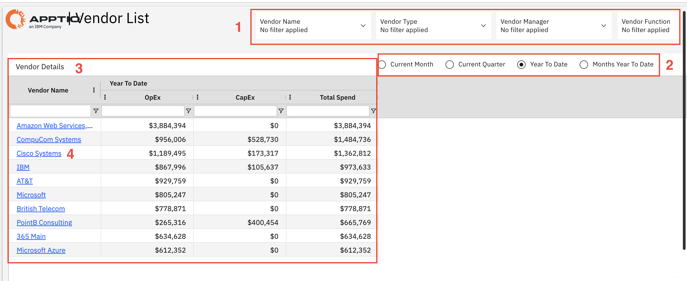

# Lista de fornecedores

Use este relatório para visualizar todos os fornecedores com suas despesas operacionais e de capital, identificando seus maiores fornecedores e comparando os gastos em diferentes períodos.

Este relatório foi elaborado para ser utilizado pelos seguintes perfis:

- Equipes de compras
- Equipes de Finanças
- Gerentes de Contratos
- Líderes de TI
- Equipes de auditoria

## Elementos-chave

| Elemento | Descrição |
| --- | --- |
| Controles de filtro (1) | Quatro filtros permitem filtrar o relatório por nome do fornecedor, tipo de fornecedor, gerente do fornecedor e função do fornecedor. |
| Seletores de período (2) | Use esses controles para visualizar os detalhes do fornecedor referentes ao mês atual, ao trimestre atual, ao acumulado do ano ou aos meses acumulados do ano. |
| Tabela de detalhes do fornecedor (3) | Esta tabela inclui colunas como nome do fornecedor, despesas operacionais, despesas de capital e total de gastos. |
| Links para nomes de fornecedores (4) | Os nomes dos fornecedores levam a informações mais detalhadas sobre o fornecedor selecionado. |

## Insights principais

- Quais são nossos principais fornecedores com base no gasto total?
- Quanto estamos gastando com cada fornecedor no período selecionado?
- Como as despesas são divididas entre custos operacionais ( OpEx ) e de capital ( CapEx )?
- Qual é o nosso gasto total com fornecedores no acumulado do ano?
- Quais fornecedores representam a maior parte do nosso orçamento de TI?
- Quais fornecedores devemos priorizar para a revisão ou negociação de contratos?
- Como os gastos são distribuídos entre os diferentes tipos de fornecedores ou funções?
- Como os gastos com fornecedores têm mudado ao longo do tempo? E há alguma tendência perceptível?

## Ações recomendadas

- Identifique os principais fornecedores analisando o gasto total e priorize-os para um acompanhamento mais próximo.
- Analise a diferença entre OpEx e CapEx para compreender a natureza do relacionamento com cada fornecedor.
- Analise detalhadamente as informações dos fornecedores para examinar os padrões de gastos e investigar quaisquer questões que suscitem preocupações.
- Use filtros para analisar tipos específicos de fornecedores ou funções e compreender os padrões de gastos.
- Compare os gastos em diferentes períodos para identificar tendências ou alterações incomuns.
- Analise a utilização dos fornecedores para identificar oportunidades de consolidação e redução de custos.
- Programe revisões periódicas para monitorar os gastos com fornecedores e garantir o controle dos custos.
