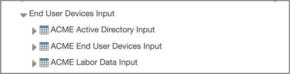

# Informações sobre o usuário final Introdução

O componente Dispositivos do Usuário Final fornece visibilidade sobre o custo dos dispositivos do usuário final, como PCs, laptops, smartphones, tablets e outros equipamentos de computação do cliente, e permite a alocação desses custos à força de trabalho da empresa.

Esta é uma solução independente que não requer configuração do modelo de custos principal. Todos os dados necessários são carregados diretamente nas tabelas de entrada, conforme descrito no guia de configuração.

## Instalação de componentes

**Dispositivos do usuário final**

O componente **Dispositivos do usuário final** instala o modelo Dispositivos do usuário final, as tabelas mestre e de alimentação necessárias, a lógica de alocação e relatórios pré-criados para analisar o inventário de dispositivos, o ciclo de vida, a conformidade e os custos estimados de atualização.

**Observação:** este componente está disponível nos modelos **v110 e posteriores**.

## Pré-requisitos

Não há pré-requisitos, pois a solução pode ser instalada e utilizada de forma independente

## Fontes comuns de dados

Os dados dos dispositivos dos usuários finais são normalmente obtidos a partir de uma combinação de sistemas de identidade, força de trabalho e ativos. Active Directory ou serviços de diretório semelhantes fornecem informações sobre o uso de dispositivos e atividades de login, enquanto os sistemas de RH ou de mão de obra fornecem atributos relacionados a funcionários, centros de custo e organização. As ferramentas de inventário de dispositivos e gerenciamento de ativos fornecem informações sobre hardware, propriedade, ciclo de vida, garantia e atualização para PCs, laptops, dispositivos móveis e outros terminais.

## Conjuntos de dados

O componente instala os conjuntos de dados e tabelas mestras necessários. A configuração requer a criação de três tabelas de entrada para garantir que os detalhes relevantes sejam carregados e, em seguida, mapeá-los para as tabelas mestras correspondentes.

- **Active Directory**
- **Dispositivos do usuário final**
- **Dados sobre o trabalho**

  Exemplo para referência: O nome das tabelas pode ser específico para cada cliente

  

Para obter mais detalhes sobre as etapas de configuração, clique [aqui.](https://www.ibm.com/docs/en/apptio-commercial/costing-standard/saas?topic=configuration-configure-end-user-devices "(Abre em uma nova guia ou janela)")
