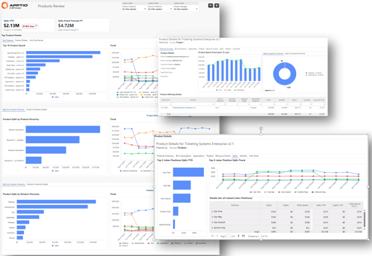
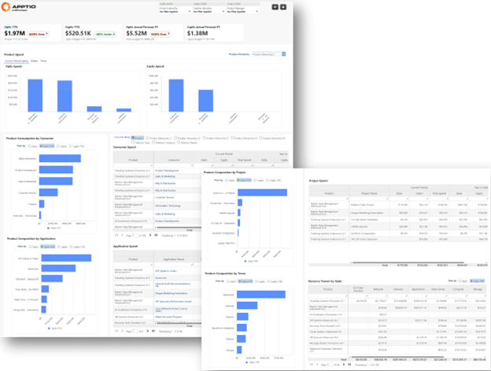
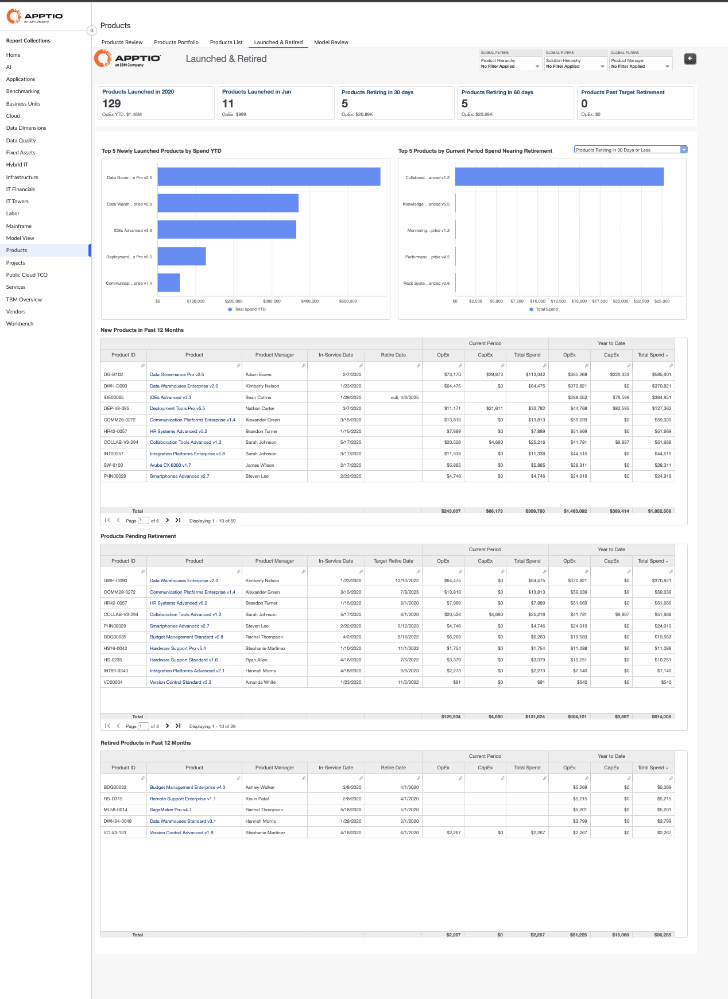
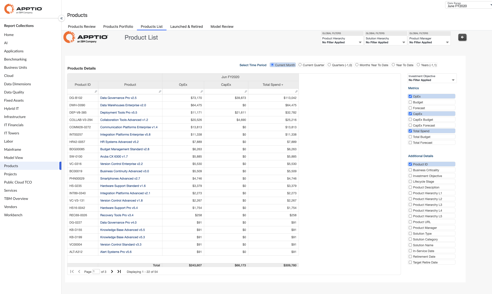
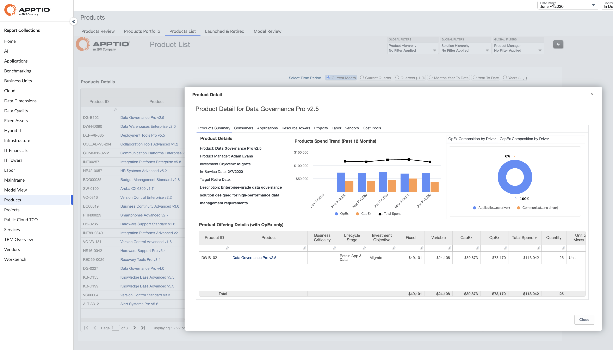
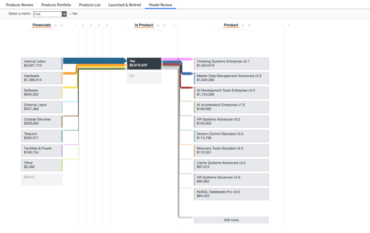

# Relatórios de produtos

A coleção **Produtos** oferece uma visão abrangente e centrada no produto dos custos de tecnologia, permitindo que as organizações compreendam, controlem e otimizem o custo total de propriedade (TCO) do produto em OpEx e CapEx. Esta coleção reúne hierarquias de produtos padronizadas, contexto do ciclo de vida e insights financeiros para ajudar as equipes de Produto, Finanças e Liderança a conectar os gastos aos resultados comerciais e tomar decisões informadas sobre o portfólio.

A coleção apoia a transparência ao nível do produto, rastreando os custos desde as fontes de custo fundamentais até aos produtos individuais, permitindo aos usuários analisar os fatores de custo, comparar o desempenho dos produtos e avaliar a eficiência do investimento em todo o portfólio. Ele também permite uma governança consistente, padronizando a forma como os produtos são definidos, lançados, retirados e relatados em toda a organização.

- **Relatórios disponíveis nesta coleção**
  - Relatório de análise de produtos
  - Relatório do Portfólio de Produtos
  - Relatório de lançamentos e aposentadorias
  - Relatório da lista de produtos
  - Relatório de revisão do modelo do produto

## Avaliação de produtos

O Relatório de Análise de Produtos fornece um resumo abrangente dos custos relacionados aos produtos, destacando tendências, métricas importantes e detalhamento hierárquico dos custos. O relatório está estruturado em vários grupos e guias para permitir uma análise detalhada das despesas operacionais ( OpEx ) e de capital ( CapEx ) em vários níveis de agregação.

Este relatório foi elaborado para ser utilizado pelas seguintes funções:

- Finanças de TI
- Escritório de Gestão de Produtos (PMO)
- Executivos e liderança de TI

**Informações fornecidas:**

- Identifique as principais áreas de gastos para determinar onde concentrar sua análise
- Analise os custos totais e unitários para descobrir ineficiências
- Visualize os custos por impulsionador de negócios ou hierarquia de produtos para conectar os custos aos resultados comerciais
- Alinhe as informações financeiras com as prioridades comerciais

## Portfólio de produtos

**O Relatório do Portfólio de Produtos** fornece uma análise detalhada dos custos relacionados aos produtos, tendências e alocações hierárquicas de gastos. O relatório compartilha os mesmos KPIs de alto nível do **Relatório de Revisão de** Produtos, garantindo consistência no monitoramento e comparação do desempenho de OpEx e CapEx.

Este relatório foi elaborado para ser utilizado pelas seguintes funções:

- Finanças de TI
- Escritório de Gestão de Produtos (PMO)
- Executivos e liderança de TI

**Informações fornecidas:**

- Segmente por hierarquias de produtos para se concentrar em uma área específica
- Compreender os produtos OpEx e CapEx dentro do portfólio
- Visualize os fatores de custo do portfólio em todas as unidades de negócios, aplicações, torres e projetos para maior transparência

Use insights sobre a origem dos custos e como eles evoluem para otimizar o planejamento do portfólio

## Lançado e retirado

O Relatório de Lançamentos e Retiradas fornece informações sobre os gastos do ciclo de vida do produto, analisando os produtos com base em suas datas de lançamento e retirada. O relatório concentra-se no monitoramento dos gastos atuais e acumulados no ano (YTD) para produtos recém-lançados e em fase de retirada, bem como na identificação de produtos que estão se aproximando ou já ultrapassaram suas datas de retirada planejadas.

Este relatório foi elaborado para ser utilizado pelas seguintes funções:

- Escritório de Gestão de Produtos (PMO)

**Informações fornecidas:**

- Acesse um resumo consolidado de todos os produtos do seu portfólio
- Centralize os atributos essenciais dos produtos para simplificar a governança do portfólio
- Filtre rapidamente por produto ou hierarquia de taxonomia TBM para se alinhar com as estruturas de relatórios

## Lista de Produtos

O relatório Lista de produtos fornece uma visão centralizada de todos os produtos definidos no modelo TCO do produto, juntamente com seus principais atributos, posicionamento hierárquico e contexto financeiro. Este relatório serve como base para a análise ao nível do produto, permitindo aos usuários validar as definições dos produtos, compreender a composição do portfólio e garantir uma governança consistente em todas as hierarquias de produtos antes de uma análise mais aprofundada dos custos e do desempenho.

Este relatório foi elaborado para ser utilizado pelas seguintes funções:

- Finanças de TI
- Líderes de PMO e PPM
- Gerentes de produto e líderes de portfólio

**Informações fornecidas:**

- Veja a lista completa de produtos em toda a organização com atributos e classificações associados
- Valide o alinhamento da hierarquia de produtos e garanta definições consistentes de produtos em todos os portfólios
- Identifique produtos ativos, novos, antigos e descontinuados para apoiar o gerenciamento do ciclo de vida
- Compreender a propriedade do produto e o alinhamento organizacional para responsabilidade e governança
- Estabeleça uma base clara para relatórios de custo, TCO e desempenho do produto a jusante
- Introduzidas métricas orçamentárias no relatório Lista de produtos

## Relatório de revisão do modelo

Os relatórios de modelo no Apptio fornecem rastreabilidade completa de como os dados de custo se movem pelo modelo Apptio, abrangendo modelos de alocação, estruturas de torre/subtorre, pools de custo etc. São utilizados para validar, solucionar problemas e analisar as transformações de dados aplicadas em cada etapa da taxonomia TBM.

Para a implementação do TCO dos produtos, foi introduzido um relatório modelo dedicado para mostrar o fluxo completo dos custos, desde a fonte de custos até à unidade de negócios, com base na condição **“É produto = Sim”** definida no conjunto de dados mestre “Todos os serviços de negócios”. O relatório também exibe os produtos específicos aos quais os custos são alocados e oferece a possibilidade de visualizar a movimentação dos custos entre as camadas, melhorando a transparência quanto à origem e alocação dos custos relacionados aos produtos.

