# Configurações

Conforme destacado na seção [Arquitetura](architecture.html), a integração técnica envolve 12 etapas distintas. Esta seção descreve cada etapa em detalhes. Qualquer coisa marcada em **vermelho** requer configuração do usuário, enquanto **laranja** indica uma etapa automatizada.

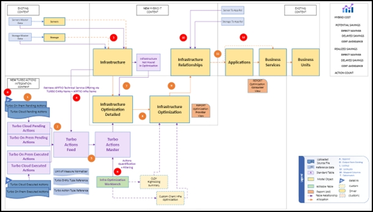

**Etapa 0** : Configuração de pré-requisitos

Certifique-se de que tanto o **IBM Apptio Datadrop** quanto o **IBM Apptio Target Type em IBM Turbonomic** estejam configurados. Essas configurações são explicadas nas seções anteriores. Uma vez que isso esteja em vigor, os arquivos de dados fluirão diariamente para o Datadrop. Os arquivos ficam visíveis no Datadrop Viewer em Datalink, conforme mostrado na captura de tela abaixo.

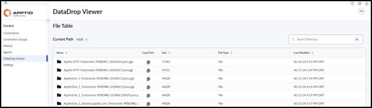

Em seguida, crie um novo conector Datalink usando o tipo de conector Datadrop.

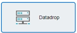

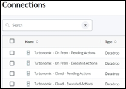

Defina a opção Transformar da seguinte forma:

- OVERWRITE para ações pendentes
- APPEND para ações executadas

Certifique-se de que o conector recupere o período de tempo dinamicamente a partir do nome do arquivo, selecionando a opção "File Name Month and Year".

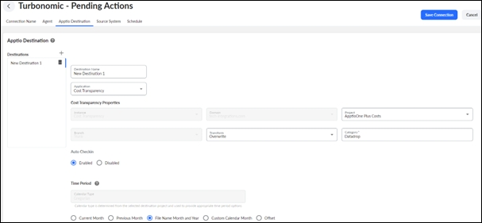

Na seção Source System, use o padrão de nome de arquivo fixo fornecido pelo IBM Turbonomic:

**Turbonomic\_<cloud/onprem>\_<executed/pending>\_actions\_<target name> \_MMDDYYYY.json**

- Dado um nome de destino de "ApptioA"
- E a data atual de "12 de outubro de 2024"
- E dados de ações pendentes no local
- Então, o nome do arquivo é:   
  Turbonomic\_onprem\_pending\_actions\_ApptioA\_10122024.json
- Dado um nome de destino de "Apptio\_B"
- E a data atual de "1º de novembro de 2024"
- E dados de ações executadas na nuvem
- Então, o nome do arquivo drop é Turbonomic\_cloud\_executed\_actions\_Apptio\_B\_11012024.json

Para o destino, defina os nomes das tabelas como:

- Ações pendentes do Turbo On Prem
- Ações pendentes do Turbo Cloud
- Ações executadas pelo Turbo On Prem
- Ações executadas no Turbo Cloud

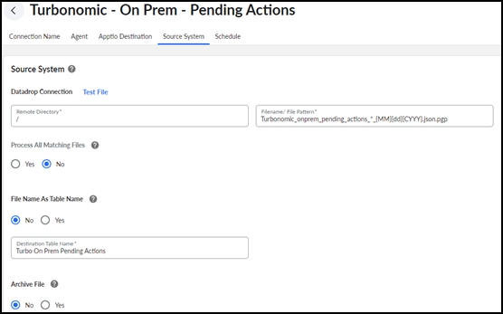

: Discuta as opções de arquivamento com o gerente de sucesso do cliente ou com a equipe DAT.

1. Após configurar os Datalink conectores, o feed de dados fluirá automaticamente para TBM Studio as tabelas: Ações pendentes do Turbo On Prem, Ações pendentes do Turbo Cloud, Ações executadas do Turbo On Prem, Ações executadas do Turbo Cloud. Essas tabelas são pré-criadas durante a instalação do componente, e a carga de dados seguirá a mesma sintaxe de coluna. Na primeira execução, faça uma verificação de sanidade para garantir que o formato e o conteúdo dos dados estejam corretos.
2. Os conjuntos de dados serão transferidos automaticamente para a tabela Turbo Actions Feed, combinando as ações pendentes e executadas para processamento posterior.
3. À medida que os dados são inseridos na tabela Turbo Actions Feed, eles serão vinculados aos modelos de dados Apptio existentes, especialmente para quantificação de dados no local. Essa etapa envolve:
   1. Anexar conjuntos de dados mestre de infraestrutura (por exemplo, dados mestre de servidores) na tabela de feed de infraestrutura.

      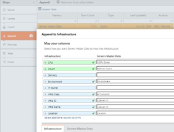
   2. Criação de novos drivers para os modelos Hybrid Cost e Hybrid Charge, vinculando o custo e a cobrança dos modelos existentes ao novo objeto do modelo de infraestrutura.

      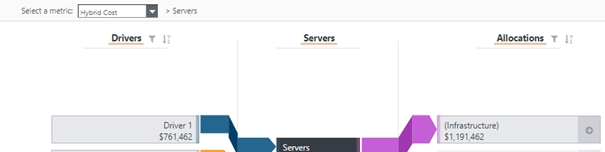
4. Depois que os conjuntos de dados de Apptio infraestrutura existentes forem anexados, valide a pesquisa pronta para uso (OOTB) entre a tabela Turbo Actions Feed e a tabela Infrastructure. Essa pesquisa vincula o Nome da Entidade do Turbo ao Nome da Infraestrutura do site Apptio. Esta etapa está destacada em vermelho porque a pesquisa OOTB pode precisar de personalização para maximizar a conexão de dados.

   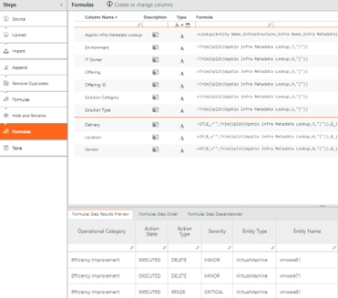
5. Os dados *do Feed de Ações Turbo* serão automaticamente anexados ao conjunto de dados *Mestre de Ações Turbo*. A tabela *Feed* pré-filtra e normaliza os dados, enquanto a tabela *Master* é onde ocorrem os principais cálculos, como os de economia.
6. O componente *Otimização de TI híbrida* cria um conjunto de tabelas editáveis do Workbench, que são expostas por meio da interface de relatórios. As principais tabelas a serem configuradas incluem:
   - Metas **e configurações** : garantir que as metas de COIN sejam definidas de acordo com os acordos internos.

     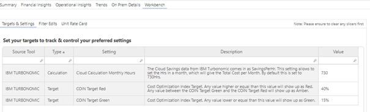
   - **Filtros** : Exclua quaisquer ações ou tipos de entidades que não afetem as economias potenciais ou realizadas.

     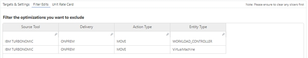
   - **Cartão de taxa** : A tabela editável mais importante é o Cartão de taxa unitária. Defina a porcentagem endereçável (%) e seus detalhamentos; caso contrário, o sistema usará como padrão as colunas Custo unitário e Preço com base no Custo total de propriedade (TCO).

     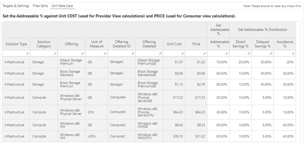
7. Como parte do componente *Otimização de TI híbrida*, várias tabelas adicionais são criadas automaticamente. Uma dessas tabelas é a tabela " *Infraestrutura não encontrada na otimização* ", que fornece informações sobre a parte do conjunto completo de infraestrutura carregada Apptio que tem otimizações do Turbo aplicadas. Esses dados são visualizados no relatório Provider View em duas áreas::
   - **Impacto da otimização** : a extensão em que a infraestrutura é otimizada ou afetada.

     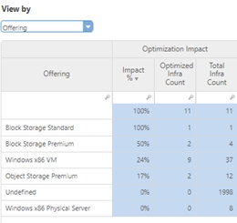
   - **Infra sem nenhuma ação** : Infraestrutura sem ações pendentes ou executadas.

     Isso pode ocorrer porque a infraestrutura não está dentro do escopo da otimização Turbo ou já está totalmente otimizada.

     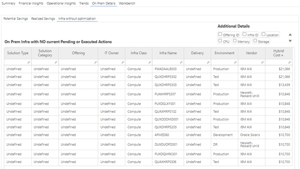
8. O objeto *Detalhes da otimização da infraestrutura* é atribuído à *Otimização da infraestrutura*. A estrutura inclui um objeto detalhado e um objeto resumido para otimizar os recursos de relatório e detalhamento. Ambos os objetos são instalados como parte do componente *Otimização de TI híbrida*.
9. Para permitir a geração de relatórios a partir da perspectiva do aplicativo (consumidor), os dados de infraestrutura devem estar relacionados aos aplicativos. Essa etapa aloca métricas de modelo ao objeto Relacionamentos de infraestrutura.
10. Anexe os dados *de relacionamento* de Apptio infraestrutura existentes ao novo objeto Relacionamentos de infraestrutura. Isso é feito por uma questão de eficiência, e não para expandir o conjunto de dados anterior. 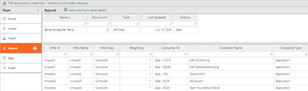

    Se o relacionamento com o consumidor de infraestrutura existir dentro do mesmo conjunto de dados (por exemplo, o conjunto de dados mestre do servidor), ele será anexado ao modelo nesse estágio para fins de eficiência, em vez de expandir o conjunto de dados original de infraestrutura.
11. O componente *Otimização de TI híbrida* inclui linhas de alocação pré-construídas que transferem automaticamente todas as métricas do modelo do objeto Relação de infraestrutura para o objeto Aplicativos. Isso permite relatórios de visualização do consumidor prontos para uso (OOTB) da perspectiva das aplicações.
12. Esta etapa final fornece um espaço reservado para que os clientes ampliem os relatórios além dos aplicativos, permitindo alocações posteriores para Serviços Comerciais ou Unidades Comerciais, conforme necessário. Isso permite a geração de relatórios adicionais sobre oportunidades de otimização e economia.
