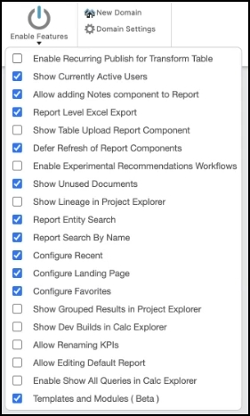

# Instalação de componentes

Para permitir a integração dos dados do IBM Turbonomic Action com o IBM Apptio, foram desenvolvidos três novos componentes. Esses componentes estão atualmente atrás do sinalizador Beta em TBM Studio, localizado na guia Project (Projeto) em Enable Features (Ativar recursos). Como resultado, somente os usuários com acesso ao Apptio Admin podem torná-los visíveis na seção Available (Disponível) da guia Components (Componentes) nesse estágio.

Observação: Certifique-se de que a versão dos componentes em Configurações do projeto esteja definida como Versão 120. Depois que os componentes forem instalados, você poderá reverter a versão do componente para o modelo desejado ou anterior.

## Componente de otimização de TI híbrida

O primeiro componente a ser instalado é o NOVO componente *Hybrid IT Optimization*. Esse componente apresenta um conjunto de novos conjuntos de dados mestre, métricas (modeladas e calculadas) e alocações de modelos. Esses elementos foram projetados para dar suporte a uma arquitetura que permite a modelagem e a geração de relatórios sobre as otimizações da infraestrutura híbrida de TI.

Como esse componente é destinado aos clientes existentes, ele pode exigir a personalização de determinadas pesquisas de tabela, métricas e alocações para se alinhar ao modelo Apptio existente dentro da nova estrutura de otimização de TI híbrida.

Para obter informações mais detalhadas sobre o componente, consulte a descrição fornecida ao navegar até o componente no sistema.

## Turbonomic - Componente de ações

Enquanto o primeiro componente, *Hybrid IT Optimization*, estabelece a estrutura, o segundo componente, Turbonomic - Actions, instala as tabelas e os conjuntos de dados mestre necessários para permitir a integração perfeita dos dados do *IBM Turbonomic Action* - via Datadrop - no IBM Apptio 's TBM Studio.

Observação: O componente *Hybrid IT Optimization* deve ser instalado primeiro, pois a tabela Turbo Actions Master depende de dependências de pesquisa para três tabelas editáveis incluídas no componente *Hybrid IT Optimization*.

Para obter mais detalhes sobre o conteúdo desse componente, consulte a descrição fornecida ao navegar até o componente.

## Otimização da TI híbrida - componente de relatório

O terceiro e último componente é o componente *Hybrid IT Optimization - Reporting*. Esse componente instala dois relatórios que visualizam insights acionáveis da integração. Ele fornece:

- O departamento financeiro de TI e o proprietário do serviço técnico (provedor de TI) com uma visão de economia potencial e realizada a partir de uma perspectiva de custo.
- Proprietário da solução/aplicativo (consumidor de TI) com uma visão de economia potencial e realizada a partir de uma perspectiva de cobrança.

Para obter mais detalhes sobre o conteúdo desse componente, consulte a descrição fornecida ao navegar até o componente.
