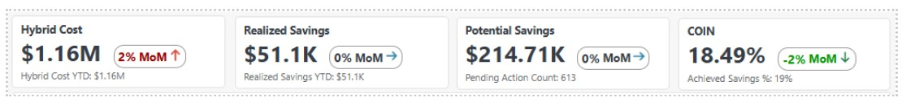
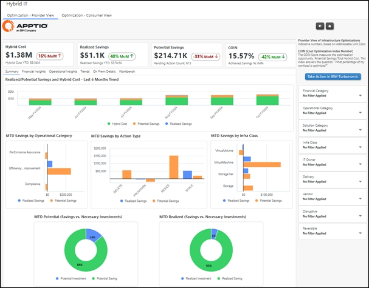
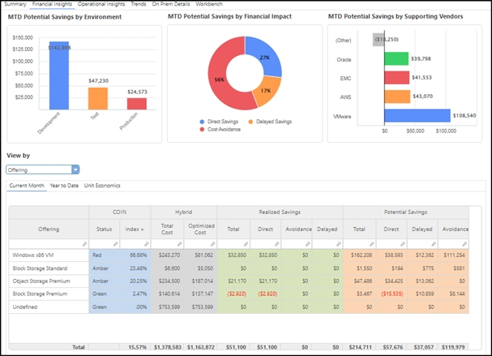
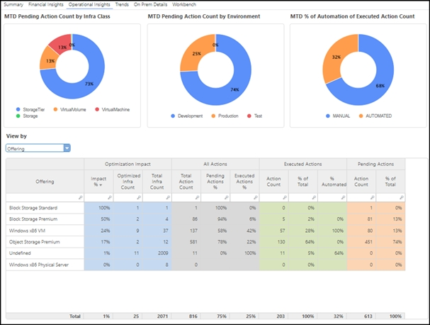
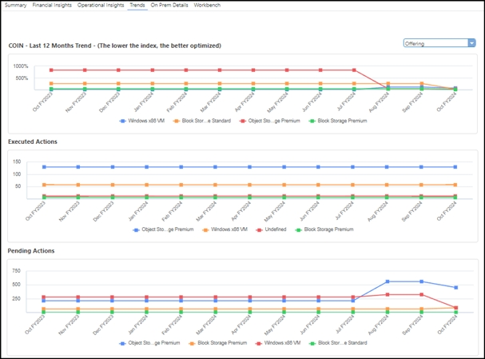
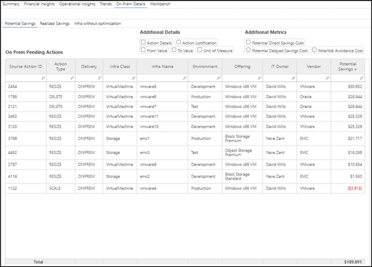
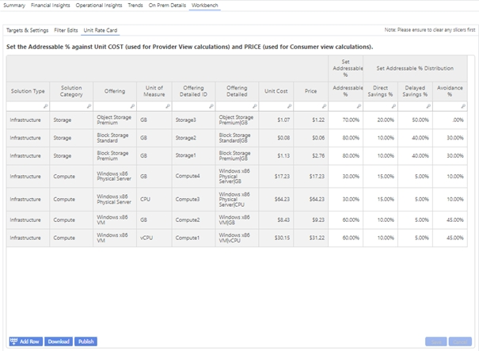
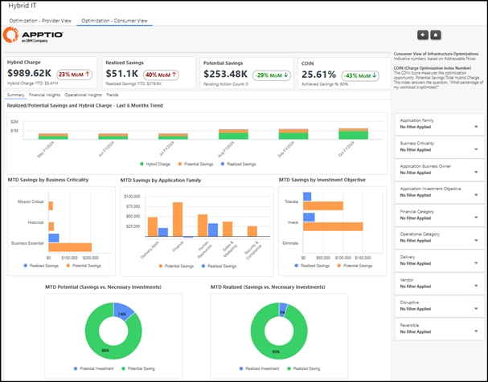

# IBM Turbonomic Relatórios

O componente Hybrid IT Optimization Reporting instala dois relatórios como parte de uma nova coleção de relatórios chamada "Hybrid IT".

## **KPIs comuns**

Um conjunto de KPIs comuns é utilizado nos dois relatórios. Esses KPIs se concentram em apresentar indicadores-chave de desempenho em várias dimensões operacionais e financeiras.

- **Custo híbrido** - Cria a compreensão da linha de base dos custos totais da infraestrutura híbrida no local e na nuvem, usando fatores de alocação flexíveis por meio de uma métrica modelada separada que não afeta o modelo de custo principal. O objetivo é reduzir o custo híbrido total ao longo do tempo, à medida que as otimizações são implementadas.
- **Economias realizadas** - Mostra quanto foi economizado no mês até a data e no ano até a data, com base na quantificação das ações executadas que são carregadas e agregadas no mês até a data e no ano até a data. O objetivo é aumentar a economia realizada e acompanhar quanto foi economizado no acumulado do ano.
- **Economias potenciais:** - Fornece o panorama mais recente das economias potenciais com base no conjunto mais recente de ações pendentes, abrangendo tanto a nuvem quanto o local (este último usando apenas a porcentagem endereçável do custo unitário). O objetivo é compreender o “tamanho do prêmio” e agir de forma a obter o máximo possível de economias potenciais.
- **COIN (Índice de Otimização de Custos)** - Mede a oportunidade de otimização como Economia Potencial dividida pelo Custo Híbrido Total, ajudando a avaliar o quanto do ambiente foi otimizado. Um KPI secundário mostra a % de economia alcançada como economia realizada dividida pela economia total. O objetivo é manter o COIN baixo em todos os aspectos, garantindo a carga de trabalho mais otimizada possível.

## Informações sobre otimização de infraestrutura - Relatório do provedor

Este relatório é destinado aos provedores de serviços técnicos responsáveis pelo gerenciamento da otimização da infraestrutura.

**Personas-alvo**

- Proprietário do serviço técnico (por exemplo, chefe de computação)
- Finanças de TI

**Guia Resumo**

A guia Resumo permite que os usuários executem:

- Análise de tendências para custo híbrido, economia potencial e economia realizada
- Análise de economia com base nas principais dimensões, como categoria operacional, tipo de ação e classe de infraestrutura
- Um detalhamento da economia líquida em economia real vs. investimentos necessários

  

**Guia Informações financeiras**

A guia Informações financeiras permite:

- Uma visão das economias potenciais por ambiente, fornecedor e categorias como direto, atrasado ou custo evitado
- Pivotamento por oferta, permitindo insights sobre o desempenho financeiro em nível de proprietário de serviço técnico
- Índice de COIN + Status, dinamizável por Proprietário ou Categoria
- Economia da unidade, mostrando a relação entre as ações e as economias realizadas, o que ajuda a priorizar as ações com maior impacto

  

**Guia Insights operacionais**

A guia Insights operacionais fornece:

- Contagens de ações pendentes, agrupadas por classe de ambiente e infraestrutura
- Insights sobre a taxa de automação das ações executadas
- Impacto da otimização, mostrando o quanto da infraestrutura é otimizada pelo IBM Turbonomic em comparação com a parte que está totalmente otimizada ou que ainda não está no escopo
- Detalhamento das ações em Pendentes vs. Executadas e análise do total de ações, destacando as principais áreas

  

**Guia Tendência**

A guia Trend oferece os seguintes insights:

- Tendência COIN para monitorar a taxa de ações executadas vs. pendentes
- Tendência das ações executadas ao longo do tempo
- Tendências de ações pendentes, seja diminuindo devido à execução de mais ações ou aumentando à medida que mais infraestrutura entra no escopo da otimização
- Todas as tendências podem ser alteradas em várias dimensões

  

**Guia Detalhes no local**

A guia Detalhes no local fornece:

- Análise da economia potencial e da economia realizada no nível de Infra ID/Nome
- Quantificação da economia com base no custo unitário no nível da Oferta de Serviços Técnicos, multiplicado pelo delta de quantidade específico para cada ID de Infraestrutura
- Insights sobre a infraestrutura sem oportunidades de otimização identificadas, indicando uma infraestrutura totalmente otimizada ou itens ainda não incluídos no escopo

  

**Guia Workbench**

A guia Workbench contém:

- Unit Rate Card, um relatório editável em que os usuários definem a porcentagem endereçável, juntamente com detalhamentos de economias diretas, atrasadas e de custo evitado
- Guias editáveis para Target & Settings e Filter Edits

  

## Informações sobre otimização de infraestrutura - Relatório do consumidor

Este relatório fornece insights da perspectiva dos consumidores de serviços de infraestrutura, principalmente dos proprietários de aplicativos.

**Personas-alvo**

- Proprietário da solução, com foco principal no proprietário do aplicativo
- Essa visualização pode ser estendida a visualizações de nível superior, como personas de Serviços e Unidades de Negócios (BU)

**Principais diferenças em relação à visão do provedor**

- Charge é usado em vez de Cost, pois essa visualização está focada no consumo
- As principais dimensões se concentram nos metadados relacionados a aplicativos, como a criticidade do negócio e o objetivo do investimento
- Ele oferece menos exibições granulares, sem uma guia Detalhes no local ou uma guia Workbench

  
