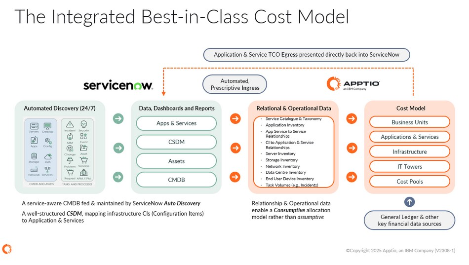

# ServiceNow Visão geral

## Visão geral

A integração entre ServiceNow e IBM Apptio Costing oferece uma maneira prescritiva, escalável e repetível de trazer dados de alta qualidade sobre infraestrutura, aplicativos, serviços e relacionamentos do ServiceNow para os modelos financeiros do IBM Apptio. Ao aproveitar as estruturas CMDB ( ServiceNow’s ) e CSDM (Configuration Service Delivery Model), os clientes obtêm uma fonte confiável e continuamente atualizada de informações precisas sobre itens de configuração, portfólios de aplicativos, relações de serviço e metadados operacionais.

Essa integração acelera significativamente o tempo de retorno do investimento para implementações de IBM Apptio, automatizando a ingestão de dados, melhorando a validade das alocações de consumo e permitindo insights mais confiáveis e defensáveis sobre o TCO para aplicativos, serviços, unidades de negócios e outras camadas de TBM.

Por meio de conectores de entrada padrão Datalink, mapeamento de projetos e recursos adicionais de saída para direcionar insights de TCO (custo total de propriedade) Apptio de volta para painéis ServiceNow, a integração cria uma visão operacional e financeira unificada e bidirecional da empresa de tecnologia.

## Público-alvo

Essa integração foi projetada para organizações que utilizam o ServiceNow como sistema de registro de dados operacionais e de configuração e desejam fortalecer sua transparência financeira e modelagem de TCO (custo total de propriedade) no IBM Apptio e democratizar essa inteligência financeira para os principais usuários do ServiceNow e IBM Apptio. Personas típicas incluem:

**Equipes de TI, Finanças e TBM**

Exija alocações de custos precisas, consumíveis e defensáveis usando CMDB em tempo real e dados operacionais.

**Aplicativo, proprietários de serviços e proprietários de produtos**

Precisa de visibilidade sobre o TCO (custo total de propriedade) de aplicativos e serviços, fatores de custo, tendências e padrões de consumo para orientar as decisões de investimento e otimização.

**Equipes de operações e infraestrutura de TI**

Confie nos dados de ativos e relacionamentos de alta qualidade do Discovery and Service Mapping (Mapeamento de Descoberta e Serviços) do ServiceNow para apoiar a modelagem de custos de consumo e o TCO (Custo Total de Propriedade) da infraestrutura.

**Arquitetos Empresariais (EA)**

Use dados EA/APM ( ServiceNow ) enriquecidos com métricas de TCO ( IBMApptio ) para impulsionar a racionalização, a modernização e as decisões sobre o portfólio de aplicativos.

**Gestão de Portfólio Digital (DPM) e Líderes de Soluções**

Use os insights de TCO (custo total de propriedade) do IBMApptio para orientar as decisões do ciclo de vida de planejamento, construção e execução e gerenciar produtos digitais de forma holística em um DPM ( ServiceNow ).

## Casos de uso

**Crie uma base CMDB confiável, automatizada e orientada para serviços**

A integração utiliza um CMDB ( ServiceNow’s ), estruturas CSDM e descoberta automatizada como fonte autorizada para relações de infraestrutura, aplicativos e serviços. IBM Apptio extraia esses dados por meio de conectores prescritivos Datalink que automaticamente coletam, normalizam e mapeiam conjuntos de dados importantes, eliminando assim extrações manuais e reduzindo problemas de qualidade dos dados.

Com dados operacionais continuamente atualizados, o IBM Apptio pode aplicar alocações de consumo reais em vez de suposições, produzindo um TCO preciso e defensável para aplicativos e serviços. Isso fornece uma base confiável para estornos, insights sobre fatores de custo e relatórios alinhados com o TBM.

**TCO de aplicativos e serviços consumíveis e defensáveis**

A integração alinha os serviços técnicos e comerciais da ServiceNow aos IBM Apptio TBM Solutions, permitindo:

- Relatórios de TCO de aplicativos e serviços
- Estorno/showback
- Visão detalhada dos fatores que influenciam os custos (mão de obra, infraestrutura, software, armazenamento, tickets, incidentes, tarefas)
- Análise de tendências em diferentes ambientes e portfólios

IBM Apptio Os conectores de saída também devolvem métricas de TCO aos painéis nativos do ServiceNow para uso por proprietários de serviços, proprietários de aplicativos e gerentes de portfólio.

**Racionalização de aplicativos com arquitetura empresarial**

Ao inserir os dados de TCO ( IBMApptio ) do ServiceNow no EA/APM (), as equipes de EA obtêm:

- Visibilidade total dos custos para cada aplicação empresarial
- Informações sobre quais aplicativos manter, modernizar, consolidar ou desativar
- Alinhamento do TCO com os objetivos de investimento da aplicação

Isso unifica os dados arquitetônicos, operacionais e financeiros para decisões de racionalização mais informadas.

**Otimização da Gestão de Portfólio Digital (DPM)**

Ao integrar as informações sobre custos, consumo e investimentos IBM Apptio ao DPM, é possível obter uma governança de portfólio completa:

- Uma visão compartilhada para planejar, construir, operar e calcular os custos de produtos digitais
- Capacidade de acompanhar o custo versus o valor ao longo do ciclo de vida dos produtos
- Alinhamento dos planos de desenvolvimento de produtos com o desempenho financeiro

**Maior transparência em cobranças, showback e unidades de negócios**

Com um mapeamento preciso d ServiceNow’s s para Aplicações, Serviços e Unidades de Negócio, IBM Apptio pode:

- Alocar custos com base no consumo real
- Melhorar a confiança nas despesas com TI
- Aumentar a adoção e a responsabilidade das partes interessadas

## Resultados

**Tomada de decisões operacionais e financeiras unificadas**

Ao combinar os dados operacionais do CMDB com a inteligência financeira d IBMApptio, as equipes obtêm insights compartilhados entre TI Financeira, I&O, EA, Proprietários de Serviços e Unidades de Negócios. Isso permite decisões mais rápidas e defensáveis, além de acelerar iniciativas de transformação com ROI claro.

**Visibilidade completa em todo o ciclo de vida do aplicativo e do serviço**

A integração conecta infraestrutura, aplicativos, serviços e unidades de negócios em uma visão única de consumo, custo, desempenho e valor. Os líderes podem compreender como a tecnologia apoia os negócios e tomar decisões mais informadas sobre portfólios e investimentos.

**Maior alinhamento com as normas TBM e CSDM**

A integração reforça a estrutura de ambas as estruturas, alinhando os modelos operacionais CSDM com a taxonomia financeira TBM. Isso garante definições consistentes, hierarquias mais claras e melhor colaboração entre as equipes de arquitetura, operações e finanças.

**Melhoria na qualidade dos dados e modelos de custos com maior fidelidade**

ServiceNow’s A descoberta automatizada e o mapeamento de serviços fornecem dados de infraestrutura e aplicativos continuamente atualizados. IBM Apptio usa isso para impulsionar alocações de consumo mais precisas e eliminar problemas comuns causados por registros CMDB obsoletos ou incompletos.

**Tempo de retorno mais rápido**

Conectores prescritivos e uma abordagem simplificada de integração reduzem o esforço manual e aceleram a adoção. As organizações podem implementar relatórios de TCO defensáveis, estornos e transparência de custos de forma significativamente mais rápida, ao mesmo tempo que reduzem as despesas gerais de manutenção contínua.
