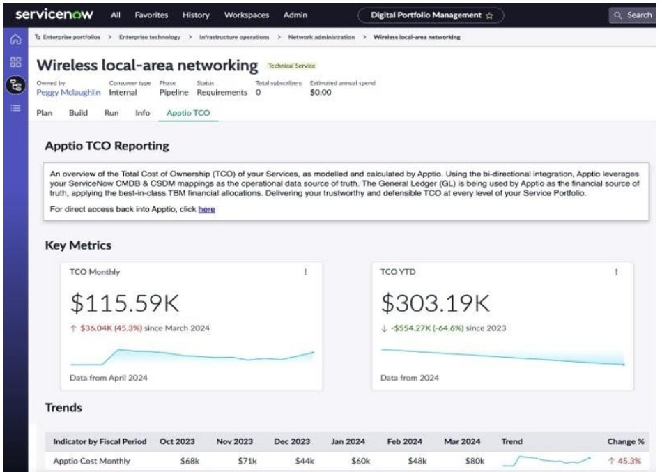
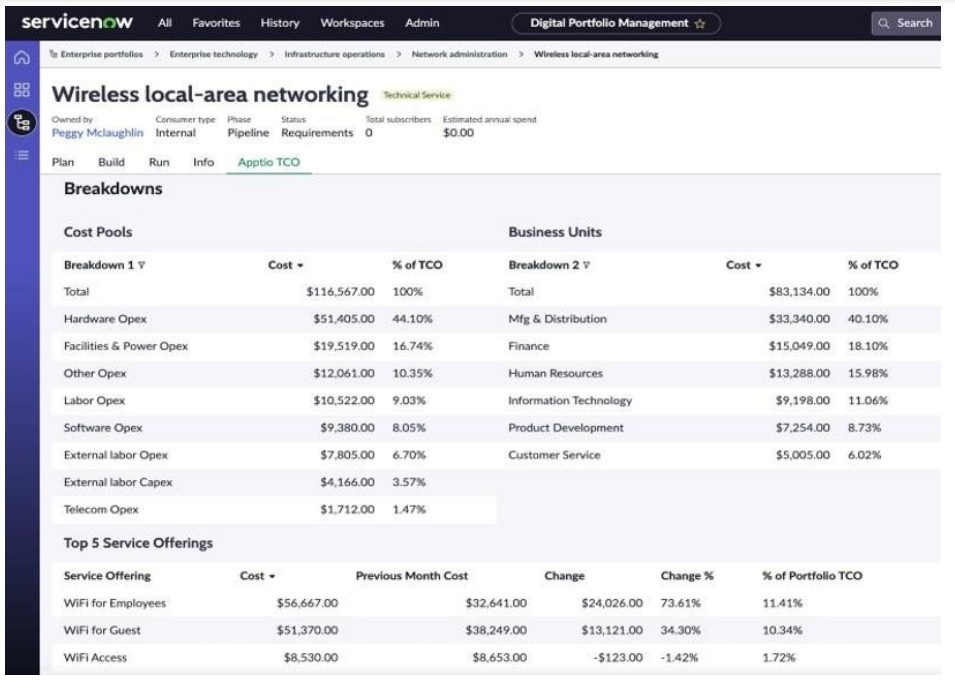
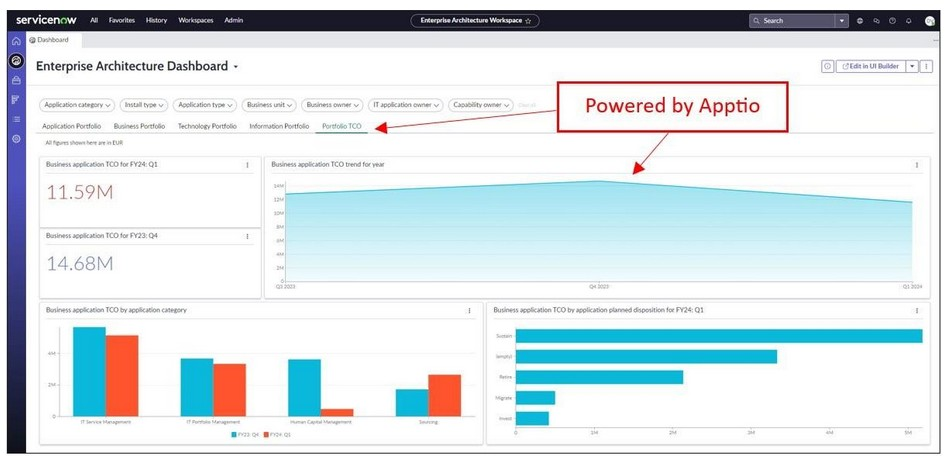
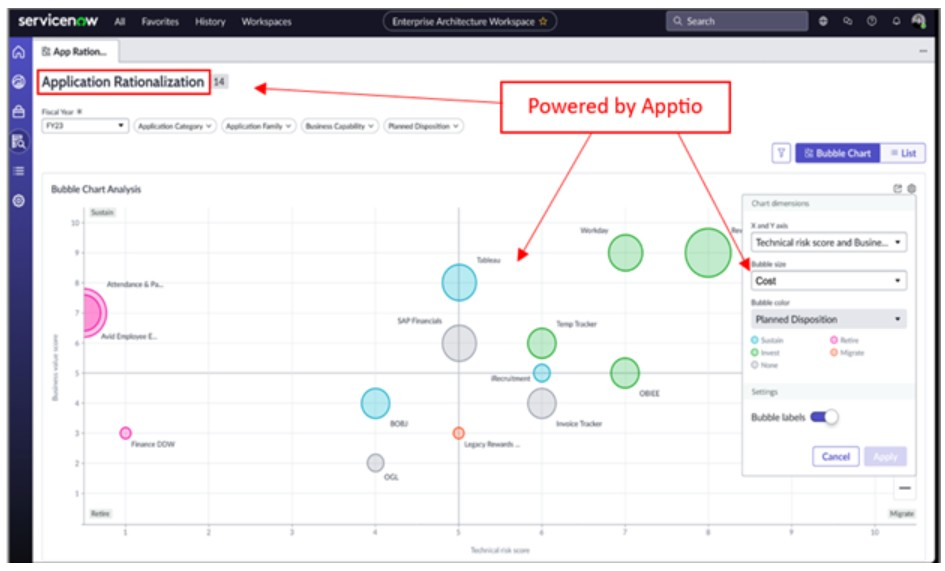

# ServiceNow Relatórios

Embora não existam relatórios específicos ServiceNow em IBM Apptio Costing atualmente, a integração (especificamente a entrada automatizada de conjuntos de dados importantes ServiceNow ) melhora significativamente os relatórios e recursos existentes IBM Apptio. Produzindo inteligência financeira baseada em dados, defensável e de primeira classe.

IBM Apptio As coleções de relatórios de custos mais afetadas são:

- Serviços
- Aplicativos
- Produtos
- da nuvem e híbrida
- Bilhetes/Balcão de atendimento
- Projetos

No lado do ServiceNow, o IBM Apptio Egress transfere o custo total de propriedade (TCO) de aplicativos e serviços do IBM Apptio para painéis nativos do ServiceNow.

**IBM Apptio Custo total de propriedade do serviço em um gerenciamento de portfólio digital (DPM) d ServiceNow**

IBM O TCO do serviço da Apptio aparece nativamente no ServiceNow DPM, proporcionando aos proprietários de produtos e serviços digitais uma visibilidade abrangente dos custos em todas as atividades de planejamento, construção e execução. Ao combinar os dados operacionais do CMDB com o modelo financeiro d Apptio, os usuários obtêm informações sobre os principais fatores de custo, falhas e tendências de cada serviço. Isso permite uma priorização mais informada, um melhor orçamento e previsão, e uma compreensão unificada do desempenho financeiro do portfólio digital.

O relatório fornece (de cima para baixo):

- Um portal para IBM Apptio para uma análise mais detalhada do relatório (a página inicial IBM Apptio pode ser definida nas respectivas propriedades ServiceNow )
- Métricas importantes, como o custo total de propriedade (TCO) mensal e acumulado no ano
- Análise de tendências de custos abrangendo 6months

  
- Análise dos principais fatores de custo (2 visualizações), nomeados com sua escolha de detalhamentos, conforme obtidos do modelo de custo de IBMApptio
- Visibilidade das 5 principais ofertas de serviços em termos de variação mensal e impacto

  

**IBM Apptio TCO da aplicação em uma arquitetura empresarial (EA) d ServiceNow**

A integração traz o TCO (custo total de propriedade) do aplicativo IBM Apptio diretamente para o EA (arquitetura empresarial) ServiceNow, permitindo que os arquitetos empresariais avaliem os aplicativos usando tanto o contexto arquitetônico quanto o impacto financeiro. As decisões de racionalização de aplicativos — como investir, manter, migrar ou desativar — agora são baseadas em dados confiáveis de TCO, fatores de custo e alinhamento com os objetivos de investimento. Isso proporciona às equipes de EA uma fonte única e consistente de informações financeiras confiáveis para priorizar a modernização, eliminar redundâncias e otimizar o portfólio de aplicativos.

Dois relatórios destacam os números do TCO (custo total de propriedade) do aplicativo IBM Apptio.

**Relatório 1:** Guia TCO do portfólio dedicado no painel de controle da arquitetura empresarial. Esta guia oferece:

- Visualizações do TCO total do aplicativo ao longo do tempo
- TCO da aplicação baseado em dimensões críticas, como categoria da aplicação e disposição planejada (investir, manter, migrar, retirar)
- TCO da aplicação como parte de uma pontuação de TCO da aplicação calculada pelo ServiceNow. Essa pontuação ajuda a entender a distribuição/peso relativo das várias aplicações. E.g.: Temos muitas aplicações de baixo ou alto custo?
- TCO da aplicação apresentado em 2 eixos:
  - Uma delas é a Disposição Planejada (Investir, Manter, Migrar, Retirar)
  - Outro é uma análise detalhada, conforme indicado pela sua escolha e obtida a partir do modelo de custos de IBM Apptio. Isso poderia ser, por exemplo, um Pool de Custos ou uma Torre de Recursos ( g.: ).

Essa visão ajuda a identificar rapidamente quais áreas têm custos significativos associados a elas. E.g.: Para as aplicações marcadas como “Aposentar”, a maior parte dos custos está na Torre de Recursos “Computação”

**Relatório 2:** Dimensão TCO disponível no Painel de Racionalização de Aplicações

O Painel de Racionalização de Aplicativos é um painel pronto para uso do ServiceNow que permite que você compreenda rapidamente o panorama dos seus aplicativos. Apresenta as aplicações em quatro quadrantes, orientados pela disposição planejada (investir, manter, migrar, retirar).

A colocação das aplicações dentro destes quadrantes é definida pelo usuário, com base num conjunto selecionável de medidas principalmente qualitativas, tais como Valor Comercial, Adequação Técnica e Pontuação de Risco Técnico. O custo total de propriedade (TCO) da aplicação pode ser selecionado como a métrica de dimensionamento, determinando o tamanho relativo de cada bolha da aplicação.

