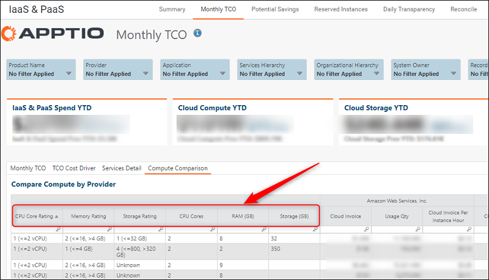

# Mapeamento de atributos do Cloud Compute

Observação: Aplica-se a: Cloud Cost Management em TBM Studio 12.5 e posterior

Use o arquivo Cloud Compute Attributes (anexado abaixo) para mapear seus atributos de computação, como memória, armazenamento e núcleos de CPU, para as colunas correspondentes na tabela Cloud Service Provider Master Data. Os valores entre os núcleos de memória, armazenamento e CPU são determinados pelo tipo de instância listado em sua fatura. Esses atributos são usados na normalização dos tamanhos dos servidores e aparecem no relatório Compute Comparisons (Comparações de computação) no CBM.

O arquivo de atributos do Cloud Compute deve ser carregado manualmente na tabela de atributos do Cloud Compute, começando com TBM Studio 12.5.

**Para fazer download do arquivo de atributos do Cloud Compute** :

1. Clique com o botão direito do mouse no anexo do arquivo abaixo e clique em Salvar link (ou destino) como.
2. Escolha onde deseja salvar o arquivo e clique em Salvar.

Observação: para obter as atualizações mais recentes desse arquivo, consulte este artigo a cada lançamento de conteúdo.

| Data | Atualizar |
| --- | --- |
| 1/03/2022 | Atualização abrangente de todos os novos tipos de instância até 3 de janeiro de 2022 para AWS, Azure e Google Cloud. |
| 01/03/2019 | Adicionada a coluna Instance Family.  Adição de novos tipos de instância, incluindo:   - AWS : a1, c5n, m5a, p3dn, r5, r5d, t3, u, z1d - Azure : S ( SAP Hana em Azure Instâncias grandes) |
| 7/07/2018 | Versão inicial |

[Faça o download do arquivo de mapeamento](https://community.apptio.com/viewdocument/updated-hbm-cloud-pricing-data-for-1 "(Abre em uma nova guia ou janela)")
