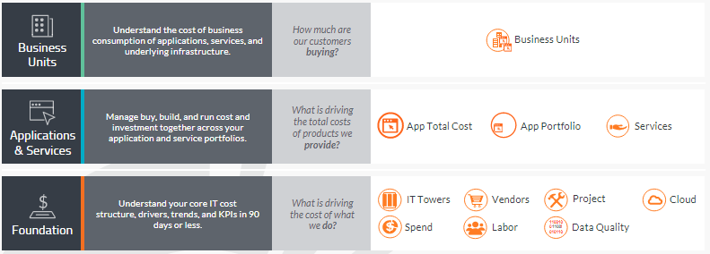

# Folha de dados de visão geral do cálculo de custos padrão

Entenda os custos e os KPIs para gerar mais valor com seu negócio de tecnologia.

## Visão geral

Tome melhores decisões sobre recursos mais rapidamente, colocando informações acionáveis, atuais e confiáveis sobre os custos de TI na ponta dos dedos dos tomadores de decisão todos os meses. Comece com o módulo Apptio Costing Standard Foundation para expor a verdadeira estrutura de custos, os motivadores e as tendências por projetos, mão de obra interna e contratada, fornecedores, funções internas, como suporte a aplicativos e gerenciamento de serviços, e os custos totais de sua infraestrutura. Em seguida, veja como essas bases impulsionam o custo total dos produtos que você fornece com o módulo Apptio Costing Standard Applications and Services. Por fim, conduza conversas baseadas em fatos e orientadas para o valor, vendo como os aplicativos e serviços apoiam os negócios com o módulo Apptio Costing Standard Business Unit.

## Principais benefícios

- Substitua suposições e emoções por fatos que impulsionem a agilidade nas decisões
- Estabelecer maior confiança com os parceiros de negócios
- Gaste menos tempo lutando com os dados e mais com a análise
- Aproveite as práticas recomendadas e alinhe-se aos benchmarks de seus pares
- Custos baseados em fatos que você pode entender, confiar e usar
- Adoção em 90 dias ou menos com seus dados brutos
- Gerenciar melhor os custos de fornecedores, projetos e mão de obra

## Rateio Costing Standard Modules

