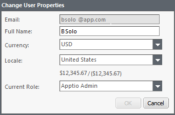

# Exibir e editar as propriedades do usuário

Suas propriedades de usuário incluem seu nome completo, endereço de e-mail, senha e função atual. Para editar as propriedades do usuário, clique no seu nome de usuário no canto superior direito da janela do navegador do aplicativo.

- Aplica-se a: Costing Standard 11.8.x em execução em TBM Studio v12 ou TBM Studio v11.

Quando o administrador do Apptio criou a conta Apptio, ele inseriu as propriedades do usuário, inclusive:

E-mail
:   Seu nome de usuário do aplicativo. Use esse nome para fazer login no aplicativo.

Nome Completo
:   Seu primeiro e último nome. Esse nome é exibido na lista de usuários na guia Administração.

Moeda
:   Sua moeda preferida ao visualizar relatórios.

Localidade
:   Sua localidade preferida usada para determinar o formato dos números exibidos nos relatórios.

Função atual
:   Sua função determina as ações que você pode executar no aplicativo. Se o administrador do site Apptio tiver ativado as funções disponíveis para você, será possível atribuir-se uma função diferente.

## Exibir as propriedades do usuário

Para exibir as propriedades do usuário:

1. Clique na seta para baixo ao lado do seu nome de usuário no cabeçalho global.

   A caixa de diálogo Change User Properties (Alterar propriedades do usuário ) é exibida, conforme mostrado na imagem a seguir.

   

## Mudar sua função

Se o administrador do site Apptio tiver ativado as funções disponíveis para você, é possível alterar sua função clicando na seta para baixo no campo Função atual e selecionando uma função. Para obter uma descrição das funções, consulte Definição de funções no Guia do administrador.
