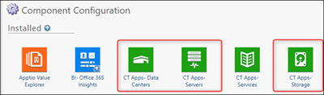
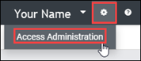
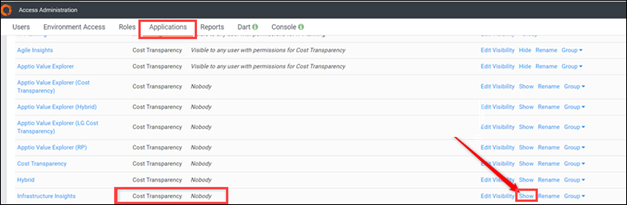
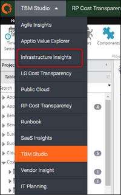

# Atualizar a visibilidade dos relatórios de infraestrutura após a atualização do site v106

A partir do site TBM Studio 12.6 (com o modelo v106 ), os relatórios Infra Server e Storage foram transferidos da coleção de relatórios Infrastructure Insights para a coleção de relatórios Infrastructure & Cloud em Costing Standard. Devido a essa alteração na navegação, o padrão em Enhanced Access Administration mostra que os relatórios podem ser visualizados por Ninguém, o que pode gerar confusão quando você tenta acessar seus relatórios antigos.

Aplica-se a: Costing Standard em TBM Studio 12.6 e posterior, com modelo v106 e posterior

Para corrigir a navegação, use as etapas a seguir para reconfigurar os componentes do CT Server e do Storage.

## Atualize para 12.6

1. Certifique-se de atualizar os seguintes componentes durante a atualização para TBM Studio 12.6:
   - Aplicativos CT - Centros de dados
   - Aplicativos CT - Servidores
   - Aplicativos CT - Armazenamento

   

   Para obter mais informações, consulte [Atualizar Costing Standard do modelo v104+ para a versão mais recente](../../cost-transparency/v12.x%20on%20tbm%20studio%2012.x/upgradect-v104.htm "(Abre em uma nova guia ou janela)").
2. Clique no ícone Settings (Configurações)  e, em seguida, clique em Access Administration.

   
3. Clique na guia Aplicativos.
4. Na linha Infrastructure Insights, clique em Show.

A coluna Visible to muda de Nobody para Visible to any user with permissions for Costing Standard.

O menu do relatório Costing Standard agora mostra o Infrastructure Insights. Se você clicar em Infrastructure & Cloud, será redirecionado para o caminho atualizado dos relatórios de infraestrutura.

## TBM Studio ( 12.6 e posteriores) em relatórios do Infrastructure Insights

A partir de 12.6, os relatórios a seguir ainda estão no núcleo Costing Standard , mas também são visíveis no Infrastructure Insights:

- Compute:
  - Resumo de utilização
  - Detalhes do servidor host
  - Por aplicativos
- Centros de dados:
  - Resumo
  - Resumo operacional
  - Visão financeira
- Armazenamento:
  - Resumo de utilização
  - Por aplicativos
- Central de serviços:
  - Resumo
  - Detalhes da tarefas
  - Detalhes do recurso
  - Por aplicativos

## Costing Standard ( 12.5 e anteriores) relatórios em componentes Costing Standard

Os relatórios a seguir constituíam o núcleo do site Costing Standard antes de 12.6.

- Compute:
  - Resumo
  - Perfil de despesas
  - Resumo operacional
  - Detalhes do servidor lógico
  - Visão financeira
- Armazenamento:
  - Resumo
  - Perfil de despesas
  - Resumo operacional
  - Detalhes do dispositivo
  - Detalhes do LUN de armazenamento
  - Visão financeira

## Informações relacionadas

- [Enviar comentários sobre a Central de Ajuda](productfeedback@apptio.com "(Abre em uma nova guia ou janela)")
