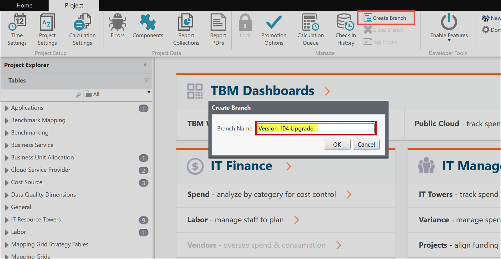
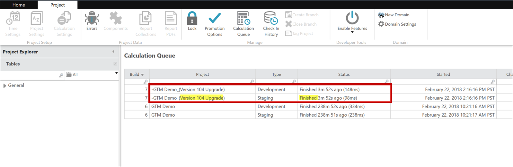

# Etapa 1: Criar uma filial

Execute o processo de upgrade em uma filial separada, em vez de em um ambiente **de desenvolvimento** pessoal.

1. Antes de criar a ramificação, conclua e verifique todas as alterações em seu projeto principal.
2. Na **guia Projeto**, clique em **Criar filial**. A caixa de diálogo Criar filial é aberta.
3. Digite um novo nome de filial, por exemplo, "Upgrade da versão 104"

   
4. Clique em **OK**.

   A caixa de diálogo Fila de cálculo é aberta. Aguarde a conclusão dos cálculos.

   

## Informações relacionadas

- [Enviar comentários sobre a Central de Ajuda](productfeedback@apptio.com "(Abre em uma nova guia ou janela)")
