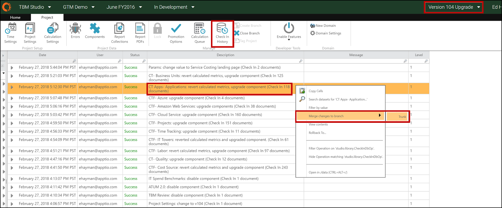
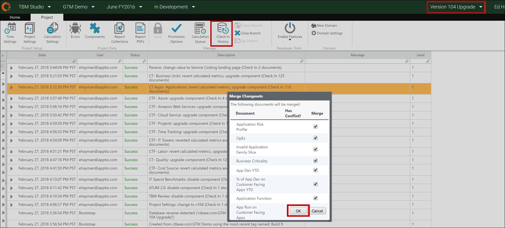
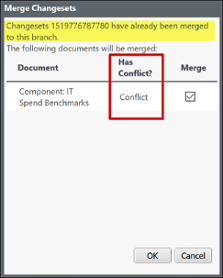
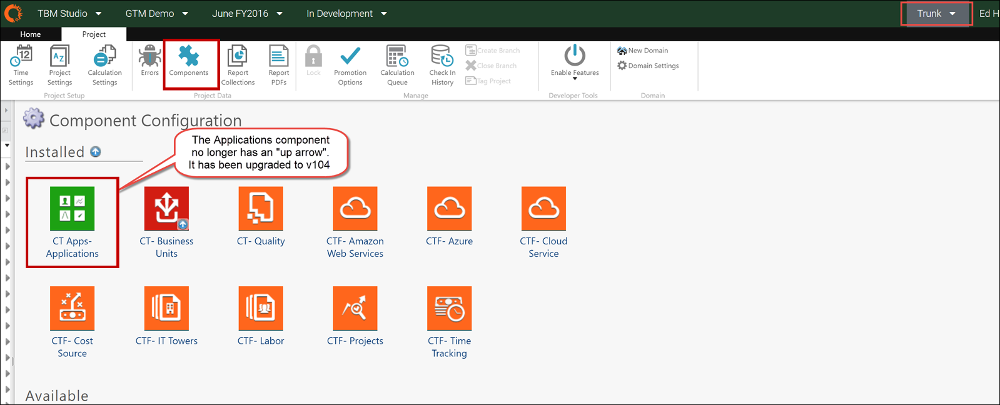
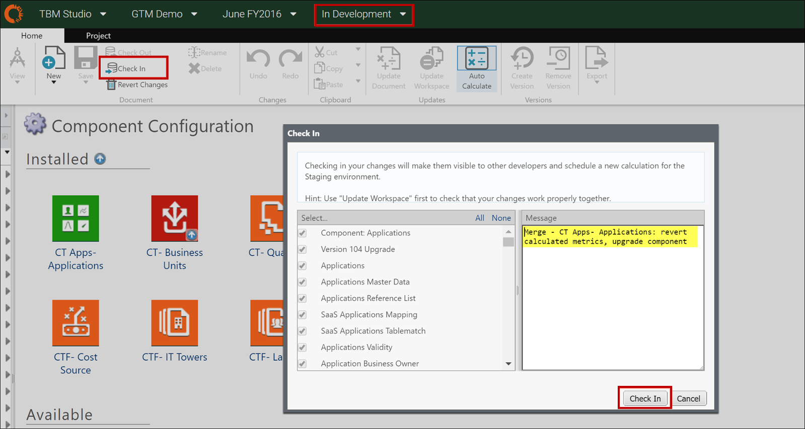
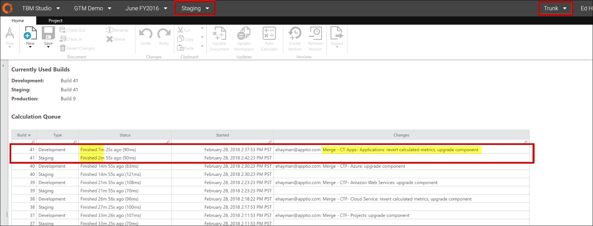
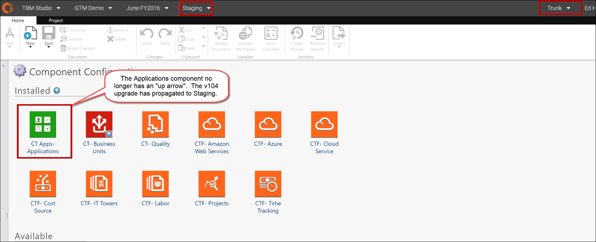

# Etapa 9: mesclar alterações no projeto principal (Trunk)

Consulte as [práticas recomendadas de ramificação, hotfix e ramificação](https://community.apptio.com/docs/DOC-5472 "(Abre em uma nova guia ou janela)") na Central de produtos.

1. Retornar para **TBM Studio**.
2. Selecione o ramo de upgrade (por exemplo, Upgrade da versão 104).
3. Na guia **Projeto**, clique em **Check-in History**.
4. Role para baixo até o final da lista e clique no primeiro item acima das entradas "bootstrap", por exemplo, "Project Settings: change to v104 " check-in.

   Observação: Você pode selecionar itens adicionais para fazer o check-in como uma única mesclagem, mas não selecione mais do que 5 itens de uma só vez. A mesclagem de mais de 5 itens em um único check-in pode fazer com que o aplicativo falhe.
5. Clique com o botão direito do mouse no item de linha e selecione **Mesclar alterações na ramificação**.

   Para as capturas de tela deste exemplo, usaremos o item de mesclagem CT-Apps Application.
6. Selecione **Tronco** como o destinatário da mesclagem.

   

   A caixa de diálogo **Mesclar conjuntos de alterações** é aberta.
7. Selecionar todos os itens para mesclagem (padrão).

   Observação: Não desmarque nenhum item individual. Todos os itens são mesclados, estejam eles selecionados ou não.
8. Clique em **OK**.

   

   **RECOMENDAÇÃO:** rastreie manualmente as etapas mescladas à medida que você atualiza os componentes, pois a caixa de diálogo Check-in History não indicará quais itens foram mesclados. Se você tentar fazer o check-in de um item duas vezes e a seguinte mensagem for exibida, clique em **Cancelar** e, em seguida, prossiga com um componente diferente.

   
9. Depois de concluída, a janela poderá mudar para **Tronco**.
10. Mude para **Trunk** para verificar o item mesclado em seu projeto.
11. Para verificar se a alteração foi propagada para o ambiente de desenvolvimento:
    1. Na barra de navegação, selecione o ambiente **In Development**.
    2. Clique na guia **Projeto**.
    3. Clique em **Components (Componentes** ).
    4. Verifique se o componente não exibe mais a seta de atualização, como neste exemplo, para o componente Aplicativo CT-Apps. 
12. No menu Environment (Ambiente) da barra de navegação, selecione **Staging (Preparação** ).
13. Na faixa de opções **Projeto**, verifique se o ícone Bloqueado está acinzentado (não bloqueado).

    Você precisa fazer isso apenas uma vez.
14. Clique em **Components (Componentes** ) e observe que o componente CT Apps Applications (Aplicativos do CT) exibe a seta de atualização para v103.
15. No menu Ambiente da barra de navegação, selecione **Em desenvolvimento** e clique em **Check-in**.

    A caixa de diálogo **Check-in** é aberta.

    Observação: Se o ícone **Check In** na faixa de opções estiver esmaecido, talvez seja necessário aguardar alguns minutos para que os documentos sejam processados e, em seguida, ir para o ambiente **de teste**, voltar para o ambiente **de desenvolvimento** e tentar novamente.
16. Selecionar todos os itens no painel esquerdo (padrão). Isso deve ser limitado aos itens mesclados.
17. Digite uma descrição dos itens no painel **Mensagem**.

    **RECOMENDAÇÃO:** use uma descrição útil, como "Merge - CTF- Cost Source: reverter alterações no conjunto de dados, componente atualizado"
18. Clique em **Check In**.

    

    Aguarde a conclusão da compilação.

    
19. Verifique se a alteração esperada da etapa de mesclagem de ramificação é aplicada ao ambiente de preparação.

    Neste exemplo, na guia **Projeto**, clique em **Componentes** para verificar se o site v104 está ativo.

    
20. Retorne ao ramo de upgrade (por exemplo, Upgrade da versão 104) para prosseguir com o próximo item a ser mesclado.

Problemas conhecidos:

- **Mensagem de erro** - O primeiro item mesclado deve ser a **alteração das Configurações do projeto para v104** (ou qualquer versão para a qual você esteja atualizando). Depois de mesclar o item, você poderá ver uma mensagem de erro, "Erro do servidor: Entre em contato com o administrador"

  **Solução** - Saia do navegador, abra-o novamente e prossiga com a etapa de check-in no Trunk. Depois que a alteração do branch de upgrade for feita e propagada para o Staging, você não deverá mais ver a mensagem de erro.
- **Informações conflitantes na barra de navegação** - Ao alternar entre o Tronco e a ramificação do novo modelo (como a atualização da versão 104), a nova ramificação de atualização pode aparecer na barra de navegação enquanto o histórico de check-in é do Tronco. Se isso ocorrer, siga estas etapas:
  1. Feche a caixa de diálogo **Check In History** e talvez todas as outras caixas de diálogo.
  2. Mudar para **Tronco**.
  3. Volte para a ramificação de **upgrade da versão 104**.
  4. Reabra o **histórico de check-in**.
  5. Prossiga com a mesclagem na próxima etapa.
- **Mesclagem de componentes desativados** - Depois de uma etapa mesclada para um componente desativado, os itens da mesclagem anterior ainda podem estar listados no painel esquerdo.

  **Solução** - Digite a descrição apropriada do que acabou de ser mesclado (por exemplo, "Merge - ATUM 2.0 component disabled"). Quando o cálculo for concluído, você poderá verificar as alterações esperadas no Staging.

## Informações relacionadas

- [Enviar comentários sobre a Central de Ajuda](productfeedback@apptio.com "(Abre em uma nova guia ou janela)")
