# Atualizar o padrão de cálculo de custos do modelo v104+ para a versão mais recente

Aplica-se a: Costing Standard em TBM Studio 12 e posterior, com o modelo v104 e posterior

## Atualize os componentes do aplicativo para a versão mais recente

Este artigo fornece instruções gerais para atualizar o site Costing Standard para a versão mais recente do modelo. Conclua as etapas deste artigo somente depois de fazer o upgrade do aplicativo para a versão mais recente do site TBM Studio . As imagens deste artigo referem-se à versão 12.5 com uma atualização do modelo v104 para v105, mas as instruções funcionam para qualquer atualização de modelo. Estas instruções solicitam que você, na [Etapa 6: Etapas de upgrade específicas do componente](#UpgradeCostingStandardfromtemplatev104tothelatestversion__Step6Componentspecificupgradesteps), vá para outro artigo para obter instruções específicas do componente e, em seguida, retorne a este artigo para concluir o upgrade.

Para obter uma lista dos conjuntos de dados que precisam ser atualizados, consulte:

- Alterações no conjunto de dados mestre para aplicativos em TBM Studio 12.5
- Alterações no conjunto de dados mestre para aplicativos em TBM Studio 12.6
- Alterações no conjunto de dados mestre para aplicativos em TBM Studio 12.7

Observação: a atualização para o modelo v104 introduziu uma nova experiência de usuário com coleções de relatórios recém-organizadas e relatórios novos e simplificados. Se você precisar fazer upgrade do v103 para uma versão mais recente do modelo ( v104 ou posterior), use as instruções em [Upgrade Costing Standard do modelo v103 para a versão mais recente](upgrade-guide-v103-to-latest/upgradect.html) em vez deste artigo.

## Prática recomendada para desenvolvimento paralelo durante o processo de upgrade

Se você planeja continuar com as atividades de desenvolvimento enquanto faz o upgrade dos componentes, recomendamos as seguintes práticas recomendadas:

- Verifique todas as alterações antes de criar uma ramificação de atualização. Idealmente, é melhor concluir a atualização e mesclar o ramo o mais rápido possível.
- Se o trabalho de desenvolvimento precisar continuar, as atividades a seguir também poderão continuar enquanto uma ramificação de upgrade estiver aberta:
  - Carregar dados e publicar nos ambientes de desenvolvimento, preparação e produção.
  - Criar novos relatórios personalizados.
  - Modificar relatórios personalizados existentes.
- Evite as seguintes atividades até que a ramificação tenha sido mesclada:
  - Instale novos componentes.
  - Anexar e mapear conjuntos de dados para conjuntos de dados mestre.
  - Alterar as configurações ou alocações do modelo.
  - Modificar relatórios prontos para uso (OOTB).

O tempo estimado para concluir o processo de upgrade depende do número de componentes que estão sendo instalados, da quantidade de personalização feita nos relatórios OOTB e do nível de validação necessário antes de mesclar a ramificação. Por exemplo, uma atualização recente de 25 componentes para Costing Standard (pilha completa) e Vendor Insights levou aproximadamente uma semana e meia.

## Configuração de pré-requisito

Se você precisar atualizar o componente Cloud Service Provider, a métrica Cloud Invoice Weighting deverá ser configurada antes de iniciar o processo de atualização.

Para atualizar a métrica de ponderação da fatura na nuvem antes de iniciar o processo de upgrade.

1. Navegue até TBM Studio e, em seguida, no Project Explorer, clique em Metrics

   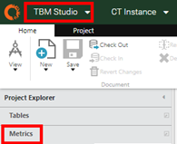
2. Localize a métrica de ponderação da fatura na nuvem e atualize-a da seguinte forma:
   - Atualize o campo Metric Type (Tipo de métrica) para Costing (Cálculo de custos)
   - Certifique-se de que o valor no campo Cálculo do valor seja =TimePeriod(Cloud Invoice,-1 )

   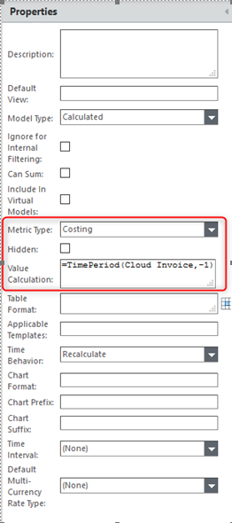
3. Verifique as atualizações

## Etapa 1: Criar uma filial

Antes de executar esta etapa, atualize para a versão mais recente do site TBM Studio .

Execute o processo de upgrade em uma filial separada, em vez de em um ambiente de desenvolvimento pessoal.

1. Antes de criar a ramificação, conclua e verifique todas as alterações em seu projeto principal.
2. Na guia Projeto, clique em Criar filial.

   A caixa de diálogo Criar filial é aberta.
3. Digite um novo nome de ramo, por exemplo, Ramo de atualização de versão.

   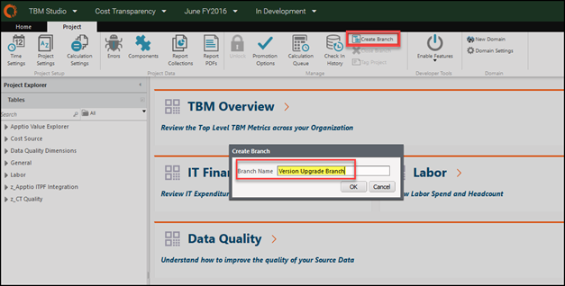
4. Clique em OK.

   A caixa de diálogo Fila de cálculo é aberta. Aguarde a conclusão dos cálculos.

   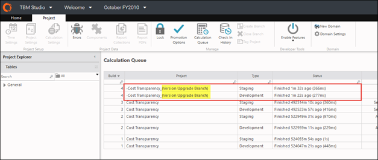

## Etapa 2: Abra a nova filial

Atualize o projeto em uma ramificação separada. Para obter mais informações, consulte [Práticas recomendadas: Ramificação de projetos](../../studio/admin/bp-branching-projects.html "Aplica-se a: TBM Studio 12.1 e posterior").

1. Na guia Project (Projeto), clique em Trunk (Tronco).
2. Selecione o ramo que você deseja, por exemplo, Ramo de atualização de versão.

   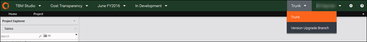

   Após selecionar uma ramificação, você verá a ramificação ativa na barra de menus.

   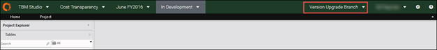
3. Sempre que retornar ao site TBM Studio, verifique se você está no ramo de upgrade correto antes de continuar. Caso contrário, e Trunk for exibido, você precisará selecionar novamente a ramificação de atualização de versão.

CUIDADO:

Não faça alterações no projeto principal (por exemplo, Tronco) durante o curso das atividades de atualização na ramificação de atualização separada. Se você fizer isso, todas as alterações feitas no tronco principal serão perdidas após a mesclagem da ramificação de atualização.

## Etapa 3: Alterar a versão do componente

1. Na guia Projeto, clique em Configurações do projeto.

   A caixa de diálogo Editar configurações do projeto é aberta.
2. Para Versão do componente, selecione a versão mais recente, por exemplo, Versão 105.

   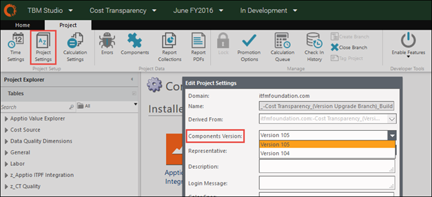
3. Clique em Save.
4. Marque a alteração e insira uma descrição, como Configurações do projeto: alterar para [atualizar versão do modelo].

## Etapa 4: Analise os componentes a serem atualizados

Confirme se as novas versões dos componentes estão disponíveis e, em seguida, atualize-as.

1. Na guia Projeto, clique em Componentes.

   A caixa de diálogo Configuração de componentes é aberta.
2. Exibir a lista de componentes instalados.

   Uma seta no canto inferior direito de cada componente instalado indica que há uma versão atualizada disponível para esse componente.

   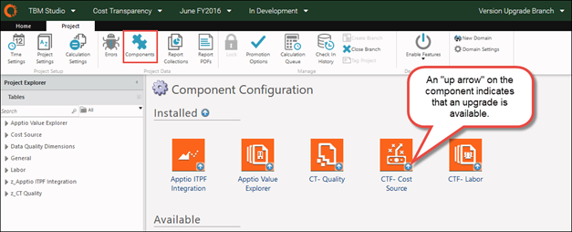
3. Instale e atualize todos os componentes para a nova versão do modelo. Execute a etapa a seguir para cada componente que precisa ser atualizado.

## Etapa 5: Faça upgrade de componentes individuais e verifique as alterações

1. Na caixa de diálogo Configuração de componentes, clique duas vezes em um componente específico, por exemplo, CTF - Fonte de custos.

   Uma página de componente é aberta.

   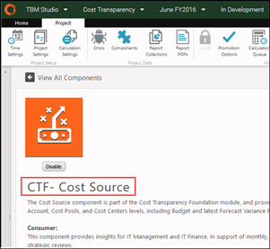
2. Role para baixo, abaixo da lista de relatórios incluídos, até a seção Upgrade disponível.
   - Uma caixa azul indica que não foram feitas personalizações em nenhum item do componente.
   - Uma caixa amarela indica que foram encontradas personalizações nos dados, métricas calculadas ou relatórios.

   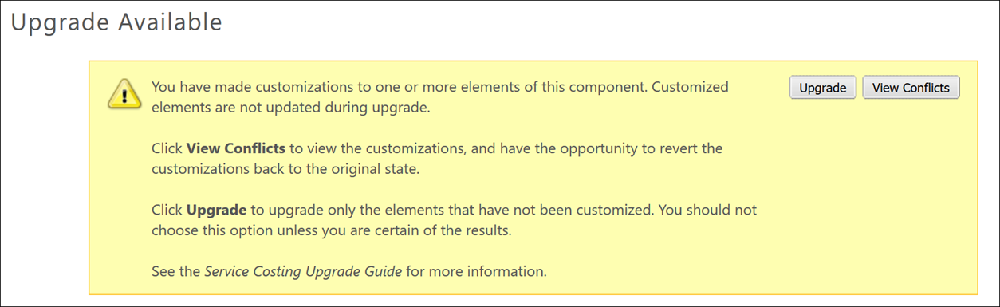

   Observação: Ocasionalmente, a caixa amarela permanece depois que você reverte todas as personalizações. Para continuar, clique no botão Upgrade na caixa amarela.
3. Se houver personalizações, clique em View Conflicts (Exibir conflitos) ou role até a parte inferior da página.
4. Reverter todos os relatórios personalizados e métricas calculadas.

   Observação: não reverta os conjuntos de dados. Se alguma das colunas ou fórmulas padrão do conjunto de dados mestre tiver sido personalizada, talvez seja necessário revisar a configuração após a atualização para garantir que os conjuntos de dados tenham as colunas e a configuração adequadas. Consulte a Etapa 6 para obter mais informações.

   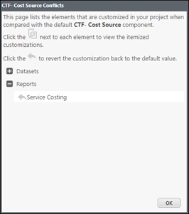
5. Clique em Upgrade e confirme se a seta de upgrade não é mais exibida.

   O aplicativo leva alguns minutos para processar a atualização. Depois que a página do componente for atualizada e retornar à página de configuração do componente, você poderá continuar.

   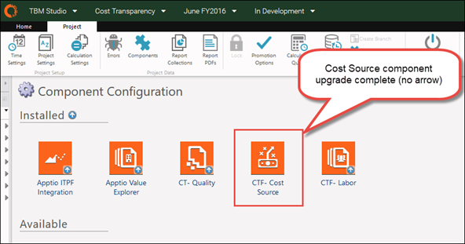
6. Após a conclusão do upgrade, você deve alterar manualmente quaisquer outros conjuntos de dados personalizados que não tenham sido revertidos. Consulte uma das listas cumulativas a seguir para identificar quais alterações são necessárias:
   - Alterações no conjunto de dados mestre para aplicativos em TBM Studio 12.5
   - Alterações no conjunto de dados mestre para aplicativos em TBM Studio 12.6
   - Alterações no conjunto de dados mestre para aplicativos em TBM Studio 12.7

   Observação: essa atividade pode exigir tempo para entender e implementar corretamente as alterações no conjunto de dados mestre.
7. Execute os procedimentos a seguir, conforme necessário, para reverter seus conjuntos de dados personalizados:
   - Para adicionar novas colunas a um conjunto de dados mestre existente:
     1. Navegue até Tabelas e verifique os Dados mestre da fonte de custos.
     2. Adicione uma etapa Formula antes da etapa Append.
     3. Na nova etapa Formula, adicione as novas colunas.

     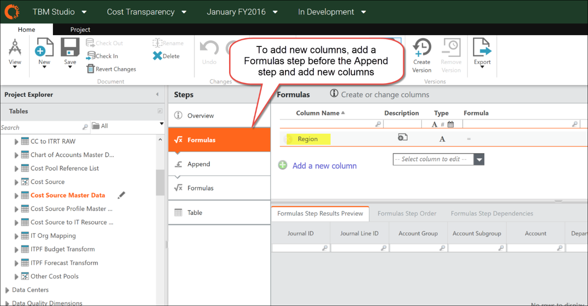
   - Para fazer upgrade dos seguintes componentes do Cloud Cost Management (CCM), execute as etapas descritas aqui e, em seguida, retorne a este artigo:
     - Aplicativos de TC - AWS Recomendações
     - CTF - Amazon Web Services
     - CTF - Azure
     - CTF - Provedor de serviços em nuvem
     - CTF - Public Cloud MTD
     - CTF - Integração de CCM a CT
   - Para atualizar os seguintes componentes do site Vendor Insights , clique no link correspondente abaixo para obter instruções detalhadas:
     - Fundação Vendor Insight
     - Insight do fornecedor PO
8. Quando terminar de atualizar seus conjuntos de dados personalizados, verifique as alterações relacionadas a um upgrade de componente único, uma de cada vez, da seguinte forma:

   CUIDADO:

   Deixar de fazer o check-in de um componente de cada vez pode resultar em um erro que faz com que você perca seu trabalho e reinicie a atualização desde o início.

   1. Selecione Projetos e clique em Check-in.
   2. Selecione Todos os itens no painel esquerdo (padrão).
   3. Digite uma descrição dos itens no painel Mensagem.

      A caixa de diálogo Check-in é aberta.

      Observação: insira uma descrição útil, como Fonte de custos: reverter alterações no conjunto de dados, componente atualizado. Isso é fundamental para as atividades de mesclagem de ramificações mais adiante neste processo de atualização. Revise [a Etapa 10: Mesclar alterações no projeto principal (Tronco)](upgradect-v104.html) para entender por que isso é importante.

      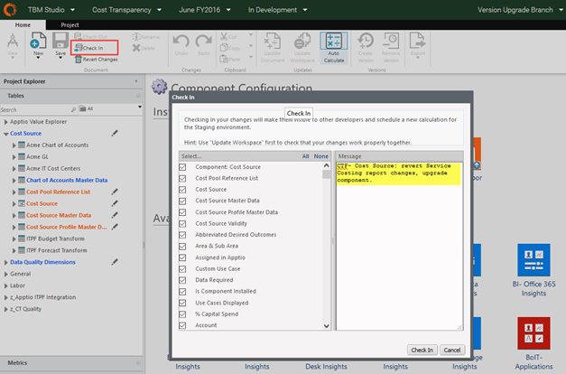
   4. Clique em Check In.

## Etapa 6: Etapas de upgrade específicas do componente

Os componentes a seguir requerem instruções especiais:

- v106 Componentes - Faça o upgrade de todos os componentes da nuvem com as instruções de Upgrade Cloud for Cost Transparency R12.6 ( v106 ) e, em seguida, retorne à próxima etapa deste guia.
- v107 Componentes - Atualize o Apptio Value Explorer (AVE) com instruções de [atualização para Apptio Value Explorer 12.7 ( v107](../configuration-additional/upgradetoave1.7v107.html) ).

## Etapa 7: Faça upgrade dos componentes restantes na ramificação de upgrade

Repita as etapas 4 e 5 para atualizar quantos componentes forem necessários.

Embora não haja uma ordem prescritiva para a atualização do componente, recomenda-se atualizar os componentes na mesma ordem em que o objeto relacionado ao componente é alocado em seus modelos. Por exemplo, para Costing Standard, atualize Cost Source antes de IT Resource Towers e IT Resource Towers antes de Applications.

A recomendação é atualizar todos os componentes instalados para a versão mais recente para garantir que você tenha os recursos mais recentes e o conteúdo da mais alta qualidade. Você também pode optar por atualizar apenas um conjunto selecionado de componentes com os recursos desejados. Entre em contato Apptio se você tiver dúvidas.

**Cuidado**

Quando terminar de atualizar os componentes, execute as seguintes etapas para evitar possíveis perdas de dados.

1. Abra o componente CT Apps-Application.
2. Na seção Customized Elements (Elementos personalizados), procure as seguintes métricas:
   - Desenvolvimento de aplicativos (excluído)
   - Execução do aplicativo (excluído)
   - Orçamento de execução do aplicativo (excluído)
   - Orçamento de desenvolvimento de aplicativos (excluído)
3. Clique em cada métrica ausente para reverter para a versão original ou de estoque.

   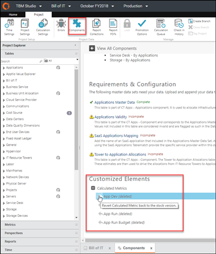
4. Verifique a mudança.
5. Abra o componente CT-Business Units.
6. Na seção Customized Elements (Elementos personalizados), procure as seguintes métricas:
   - CapEx Corrigido (excluído)
   - CapEx Variável (excluída)
   - Investimentos em projetos (excluídos)
7. Clique em cada métrica ausente para revertê-la para a versão original ou de estoque.
8. Verifique a mudança.

## Etapa 8: Revise o aplicativo atualizado na ramificação de upgrade

1. Na guia Projeto, clique em Fila de cálculo.

   A caixa de diálogo Builds é aberta.
2. Verifique se as compilações foram concluídas.

   Você verá uma lista dos check-ins individuais.

   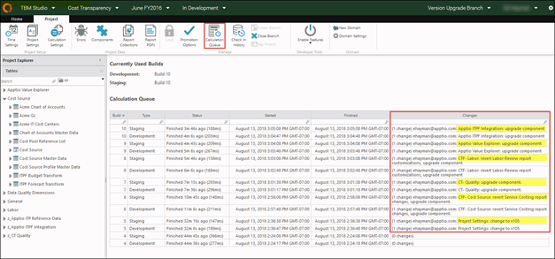
3. Na barra de navegação, selecione Costing Standard no menu Aplicativo.

   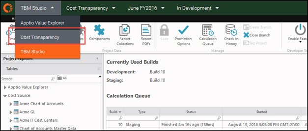
4. Selecione o ramo de upgrade, por exemplo, Ramo de upgrade de versão.

   A página inicial é aberta.

   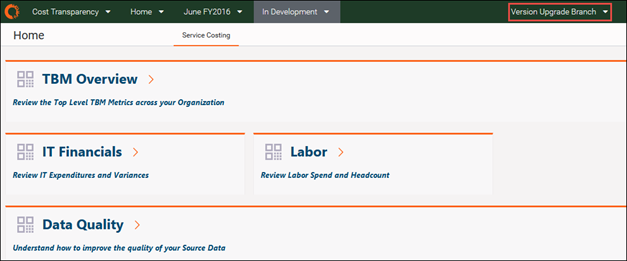

## Etapa 9: Compare a versão anterior com os relatórios da versão mais recente

1. Abra o projeto Costing Standard em um navegador.
2. Selecione Tronco para visualizar os relatórios do modelo mais antigo.
3. Abra o projeto Costing Standard em outro navegador.
4. Selecione a ramificação Upgrade de versão para visualizar os novos relatórios do modelo atualizado.
5. Revisar relatórios lado a lado.

   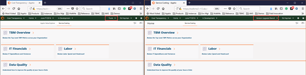
6. Se desejar, aplique novamente as alterações específicas do cliente aos relatórios diretamente na ramificação de upgrade de versão.

   Nota:
   - Evite fazer alterações em relatórios prontos para uso, para que você possa minimizar o esforço envolvido em atualizações futuras.
   - Se for necessário fazer personalizações de relatórios, aplique-as aos relatórios prontos para uso depois de concluir a Etapa 7 para mesclar as alterações de upgrade. Isso minimiza o tempo que você tem para trabalhar na ramificação de upgrade de versão. **Lembre-se** : não faça alterações, a não ser carregamentos de dados, no projeto principal (Trunk) depois de criar a ramificação de upgrade.
7. Depois de verificar a versão mais recente dos relatórios, prossiga para a próxima etapa para mesclar as alterações em seu projeto principal.

## Etapa 10: Mesclar alterações no projeto principal (Trunk)

Consulte [Práticas recomendadas: Ramificação de projetos](../../studio/admin/bp-branching-projects.htm "(Abre em uma nova guia ou janela)") para obter mais informações.

Observação: Não mescle todas as alterações em uma única etapa. Se você fizer isso, o processo de mesclagem falhará. A recomendação é mesclar pequenos lotes de registros de check-in - até 5 registros de uma só vez. Para isso, é necessário fazer anotações para garantir que todos os registros de check-in sejam mesclados no tronco na ordem correta.

1. Retorne ao site TBM Studio.
2. Selecione o ramo de upgrade, por exemplo, Ramo de upgrade de versão.
3. Na guia Projeto, clique em Check-in History.
4. Role para baixo até o final da lista, clique e comece com o primeiro item acima das entradas *de bootstrap*. Esse deve ser o check-in Configurações do projeto: alterar para [nova versão do modelo].

   OBSERVAÇÃO: Você pode selecionar itens adicionais para fazer o check-in como uma única mesclagem, mas não selecione mais do que 5 itens de uma só vez.

   CUIDADO A mesclagem de mais de 5 itens em um único check-in pode causar falha no aplicativo.
5. Clique com o botão direito do mouse no item de linha e selecione Mesclar alterações na ramificação.

   Este exemplo usa o item de fusão CT-F Cost Source.
6. Selecione Tronco como o destinatário da mesclagem.

   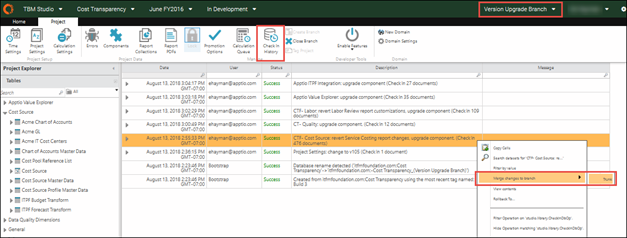

   A caixa de diálogo Mesclar conjuntos de alterações é aberta.
7. Selecionar todos os itens para mesclagem (padrão).

   OBSERVAÇÃO: não desmarque nenhum item individual.
8. Clique em OK.

   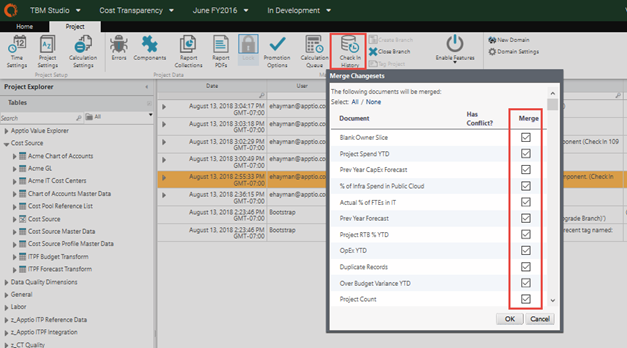

   RECOMENDAÇÃO: rastreie manualmente as etapas mescladas à medida que você atualiza os componentes, pois a caixa de diálogo Check-in History não indica quais itens foram mesclados. Se você tentar fazer o check-in de um item duas vezes e a seguinte mensagem for exibida, clique em Cancelar e, em seguida, prossiga com um componente diferente.

   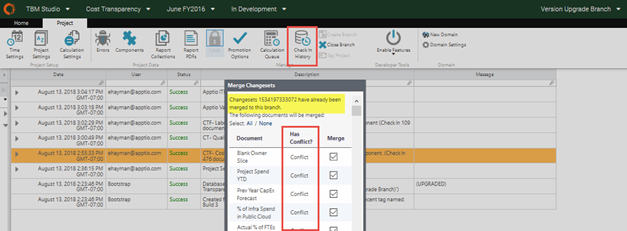
9. Depois de concluída, a janela deverá mudar para Tronco. Caso contrário, mude para Trunk para verificar o item mesclado em seu projeto.
10. Para verificar se a alteração foi propagada para o ambiente de desenvolvimento:
    1. Na barra de navegação, selecione o ambiente In Development.
    2. Clique na guia Projeto.
    3. Clique em Components (Componentes).
    4. Verifique se o componente não exibe mais a seta de atualização, como neste exemplo, para o componente CTF- Cost Source.

    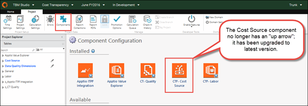
11. No menu Environment (Ambiente) da barra de navegação, selecione Staging (Preparação).
12. Na faixa de opções Projeto, verifique se o ícone Bloqueado está acinzentado (não bloqueado).

    Você precisa fazer isso apenas uma vez.
13. No menu Ambiente da barra de navegação, selecione Em desenvolvimento e clique em Check-in.

    A caixa de diálogo Check-in é aberta.
14. Selecionar todos os itens no painel esquerdo (padrão).

    Isso deve ser limitado aos itens mesclados.
15. Digite uma descrição dos itens no painel Mensagem.

    RECOMENDAÇÃO: use uma descrição útil, como Merge - CTF-Cost Source: revert Service Costing report customizations, upgrade component.
16. Clique em Check In.

    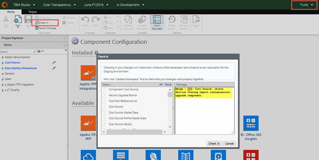

    Aguarde a conclusão da compilação.

    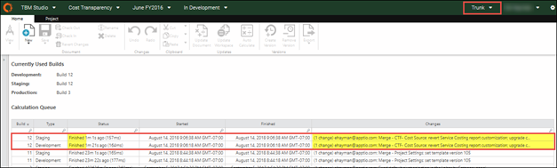
17. Verifique se a alteração esperada da etapa de mesclagem de ramificação é aplicada ao ambiente de preparação.

    Neste exemplo, na guia Projeto, clique em Componentes para verificar se a nova versão do modelo está ativa.

    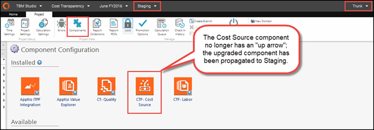
18. Retorne ao ramo de upgrade, por exemplo, Ramo de upgrade de versão, para prosseguir com o próximo item a ser mesclado.
19. Repita as etapas acima para continuar mesclando até 5 ramificações de upgrade individuais (de uma só vez) e os check-ins de tronco subsequentes (em desenvolvimento) até que todos tenham sido mesclados.

## Etapa 11: Validar os relatórios da versão mais recente no projeto principal (Tronco)

1. Abra o projeto Costing Standard em um navegador.
2. Selecione Tronco para visualizar os relatórios atualizados.
3. Abra o projeto Costing Standard em um segundo navegador.
4. Selecione Branch de upgrade de versão para comparar.
5. Comparar e revisar relatórios lado a lado.

   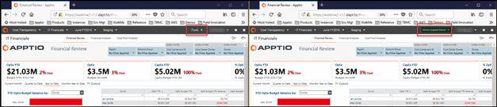
6. Se desejar, aplique novamente as alterações específicas do cliente aos relatórios diretamente na filial principal, por exemplo, Tronco.

   RECOMENDAÇÃO Evite fazer alterações nos relatórios prontos para uso para minimizar o esforço envolvido em atualizações futuras.

## Etapa 12: Atualizar o ambiente de produção

Depois de concluir a verificação dos relatórios, envie o aplicativo atualizado para a produção.

1. AcesseTBM Studio.
2. Selecione o ambiente de teste.
3. Na faixa de opções Projeto, clique em Bloquear.

   Uma breve mensagem pop-up indicará que o ambiente está bloqueado. O ambiente agora está pronto para ser promovido à produção.

   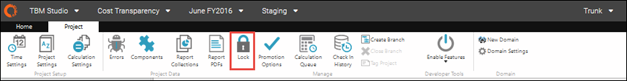
4. Na faixa de opções Projetos, clique em Opções de promoção e siga um destes procedimentos:
   - Clique em Promote Now (Promover agora). A atualização é enviada para a produção imediatamente.
   - Clique em Promote Later (Promover mais tarde) para programar quando o upgrade será publicado na produção.

   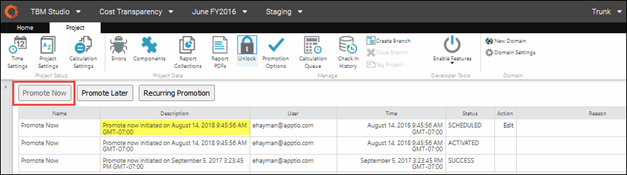
5. Na faixa de opções Projeto, clique em Fila de cálculo para verificar a compilação de produção.
6. Compare os números de compilação dos ambientes de desenvolvimento, preparação e produção.

   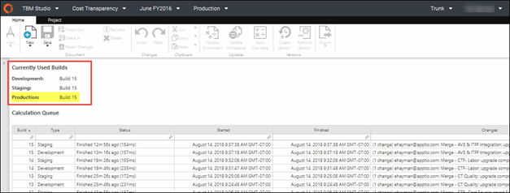

## Etapa 13: Fechar a ramificação de upgrade

1. Selecione a ramificação de upgrade de versão.
2. Na faixa de opções Projeto, clique em Fechar ramificação.

   A caixa de diálogo Confirmar fechamento é aberta.
3. Clique em OK para fechar a ramificação.

   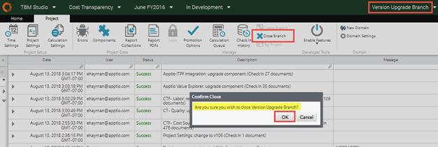
4. Confirme que Tronco não é mais exibido na barra de navegação.

   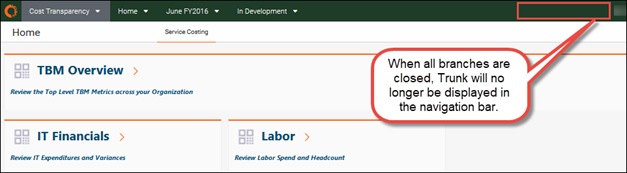

   RECOMENDAÇÃO: feche a ramificação de upgrade o mais rápido possível. A ramificação consome a mesma quantidade de recursos que o projeto principal do tronco. O fechamento da ramificação de upgrade libera recursos e melhora o desempenho geral.

## Etapa 13: tornar visíveis os relatórios de infraestrutura

A partir de TBM Studio 12.6 (e Template v106 ), os relatórios Infra Server e Storage foram transferidos para a coleção de relatórios Infrastructure Insights. Devido a essa alteração, o padrão em Enhanced Access Administration mostra que os relatórios podem ser visualizados por Ninguém, o que pode gerar confusão quando você tenta acessar seus relatórios antigos. Para corrigir a navegação, consulte [Atualizar a visibilidade dos relatórios de infraestrutura após a atualização do site v106](ct-upgrade-inf-visibility-after-v106.html "A partir do TBM Studio 12.6 (com o Template v106 ), os relatórios Infra Server e Storage foram transferidos para a coleção de relatórios Infrastructure Insights da coleção de relatórios Infrastructure & Cloud no Costing Standard. Devido a essa alteração na navegação, o padrão no Enhanced Access Administration mostra que os relatórios podem ser visualizados por Nobody, o que pode gerar confusão quando você tenta acessar os relatórios antigos.").

## Informações relacionadas

- [Enviar comentários sobre a Central de Ajuda](productfeedback@apptio.com "(Abre em uma nova guia ou janela)")
