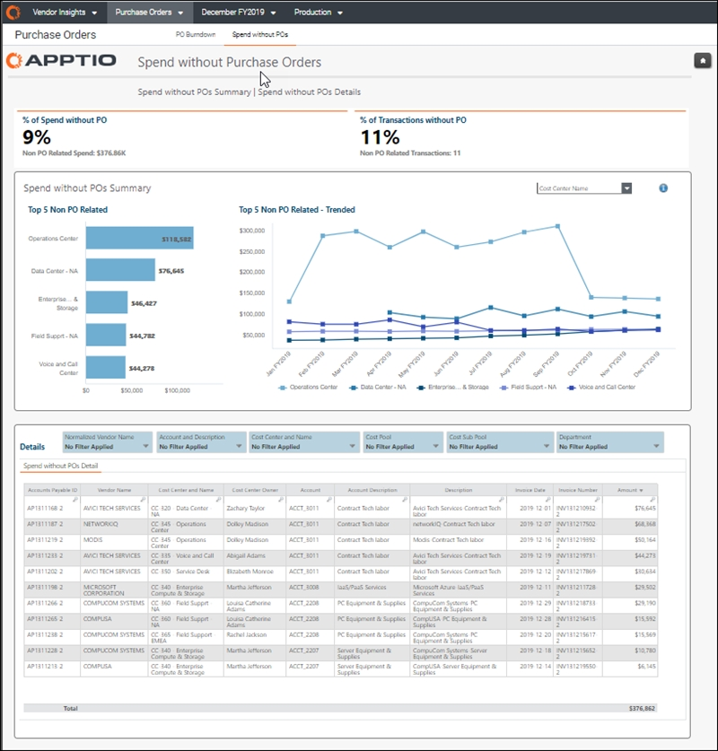

# Gastar sem ordens de compra

◆ Aplica-se a: Vendor Insights no TBM Studio 12.8 e posterior ( v107 )

Use o relatório **Gastos sem ordens de compra** para analisar os pagamentos a fornecedores sem ordens de compra (POs).

Este relatório foi elaborado para:

- CIO e liderança sênior de TI
- Proprietários de aplicativos
- Proprietários de serviços
- Gerentes de Finanças de TI
- Gerentes de fornecedores

**Exibir o relatório Gastos sem ordens de compra**

No menu Aplicativo, selecione Vendor Insights .

1. Navegue até Coleções de relatórios > Ordens de compra.
2. Na barra na parte superior da página, selecione Gastar sem ordens de compra.
3. Opcionalmente, filtre o relatório usando as opções na parte superior do relatório.
4. Para exportar ou enviar seus dados por e-mail, selecione Exportar (  ) no canto superior direito da página e selecione um formato de exportação.

Perguntas respondidas

Use as informações apresentadas neste relatório para responder às seguintes perguntas:

- Quais fornecedores estou pagando que não constam na lista de fornecedores?
