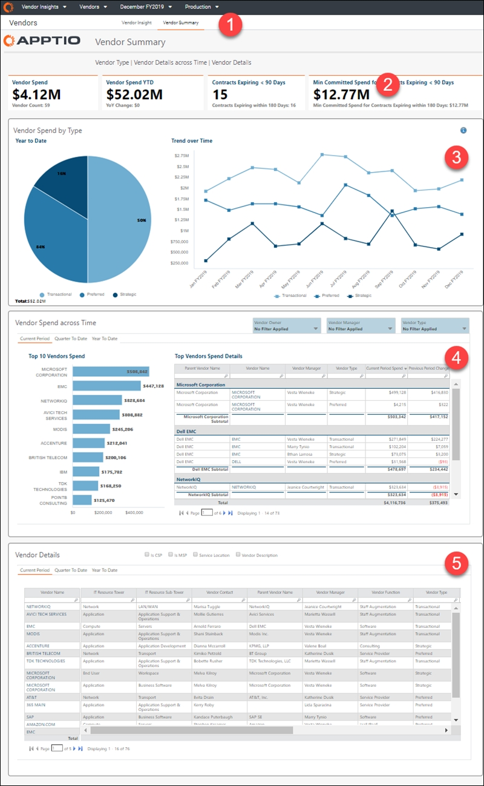

# Resumo do fornecedor

◆ Aplica-se a: Vendor Insights no TBM Studio 12.8 e posterior ( v107 )

Use o relatório **Resumo do fornecedor** para analisar o gasto total do portfólio de fornecedores por tipo de fornecedor e período. Este relatório foi elaborado para:

- CIO e liderança sênior de TI
- Proprietários de aplicativos
- Proprietários de serviços
- Gerentes de Finanças de TI
- Gerentes de fornecedores

**Exibir o relatório Resumo do fornecedor**

No menu Aplicativo, selecione Vendor Insights .

1. Navegue até Coleções de relatórios > Fornecedores.
2. Na barra na parte superior da página, selecione Resumo do fornecedor.
3. Para exportar ou enviar seus dados por e-mail, selecione Exportar (  ) no canto superior direito da página e selecione um formato de exportação.

Os relatórios **de resumo do** fornecedor contêm os seguintes elementos:

**(1) Coleta de relatórios**

Esta coleção de relatórios fornece os detalhes necessários para analisar os gastos do seu portfólio de fornecedores por tipo de fornecedor e período:

- Resumo do fornecedor (descrito neste artigo)

**(2) KPIs**

Os KPIs fornecem uma visão geral dos gastos com fornecedores e do vencimento dos contratos:

- **Gastos com fornecedores** - Este KPI mostra o total de gastos no período atual e o número de fornecedores com gastos no período atual. O gasto é a soma de todas as contas a pagar no período atual.
- **Gastos com fornecedores no acumulado do ano** - Este KPI mostra o total de gastos com fornecedores no acumulado do ano e a diferença nos gastos acumulados entre o ano anterior e o atual.
- **Contratos com vencimento em menos de 90 dias** - Este KPI mostra o número de contratos com vencimento em menos de 90 dias e em menos de 180 dias.
- **Despesa mínima comprometida para contratos com vencimento em menos de 90 dias** - Este KPI mostra a despesa mínima comprometida para contratos com vencimento em menos de 90 dias e em menos de 180 dias.

**(3) Gastos com fornecedores por tipo**

Use esta seção para entender se os gastos com fornecedores estão alinhados com a estratégia de fornecedores, conforme categorizada no tipo de fornecedor. Por exemplo, considerando que os fornecedores são categorizados em tipos estratégicos, transacionais e preferenciais, se a estratégia da empresa for gastar mais com menos fornecedores estratégicos, esta seção mostrará o progresso dessa estratégia com base nos gastos reais.

- Use o gráfico **Acumulado no ano** para ver os gastos com fornecedores acumulados no ano como uma porcentagem dos gastos totais por tipo de fornecedor. Visualize os gastos do fornecedor para o tipo de fornecedor passando o cursor sobre o tipo de fornecedor.
- Use o gráfico **Tendência ao longo do tempo** para ver a tendência dos gastos mensais por tipo de fornecedor nos últimos 12 meses.

**(4) Gastos com fornecedores ao longo do tempo**

Use esta seção para entender os gastos de fornecedores específicos. Use o gráfico de barras para ver os fornecedores com os maiores gastos. Use a tabela para visualizar os detalhes dos principais fornecedores durante o período selecionado, classificados pelos fornecedores com maior gasto no topo.

Clique nas guias para visualizar os gastos do período atual, do trimestre atual e do acumulado no ano. Os filtros para proprietário do fornecedor, gerente do fornecedor e tipo de fornecedor permitem que você refine os resultados conforme necessário.

Para obter detalhes adicionais sobre um fornecedor específico, clique no gráfico ou clique na coluna **Nome do fornecedor principal** na tabela para abrir o [relatório Detalhes do fornecedor](report-vendor-detail.html).

**(5) Detalhes do fornecedor**

Use esta tabela para analisar mais detalhadamente o portfólio de fornecedores e os gastos com fornecedores. Você pode filtrar a tabela por vários atributos do fornecedor e ver seus gastos no período atual, no trimestre atual e no acumulado do ano.

Use as opções acima da tabela para adicionar detalhes específicos à sua análise, incluindo torre de TI, fornecedor principal, serviço do fornecedor, subtorre, função, serviço, tipo de dependência e localização.

Para obter detalhes adicionais sobre um fornecedor específico, clique na coluna **Nome do** fornecedor para abrir o [relatório Detalhes do fornecedor](report-vendor-detail.html).

Perguntas respondidas

Use as informações apresentadas neste relatório para responder às seguintes perguntas:

- Quais tipos de fornecedores compõem os meus custos com fornecedores?
- Como estamos progredindo em relação à estratégia do fornecedor? Os gastos refletem a estratégia do fornecedor?
- Que mudanças devemos fazer para reequilibrar os gastos com fornecedores?
- Qual é o grau de fragmentação/concentração dos gastos entre os fornecedores?
- Temos fornecedores redundantes?
- Onde temos variações nos gastos?
