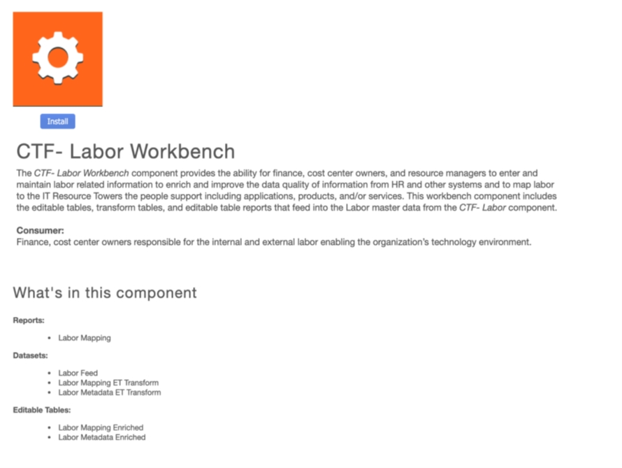
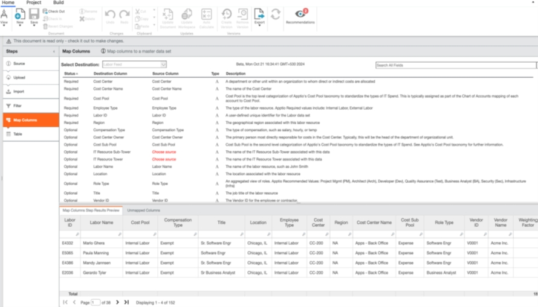
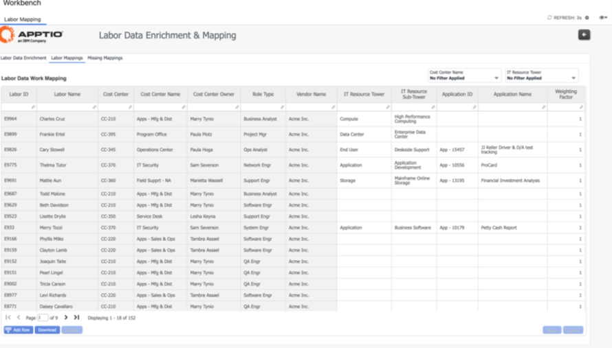
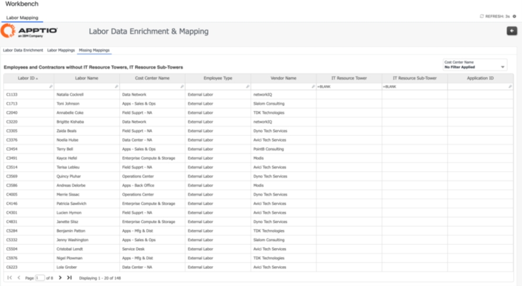
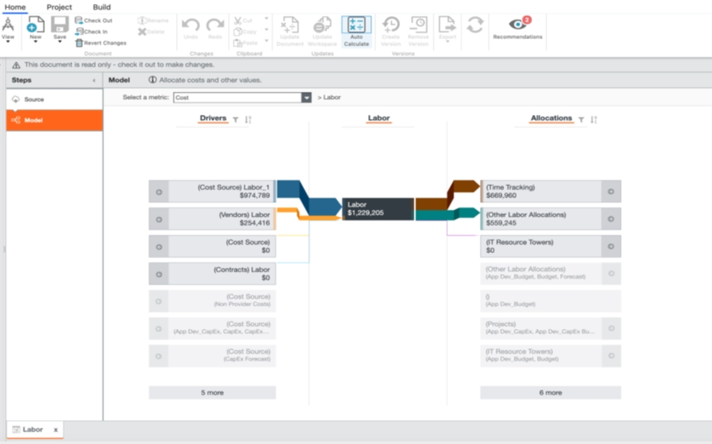
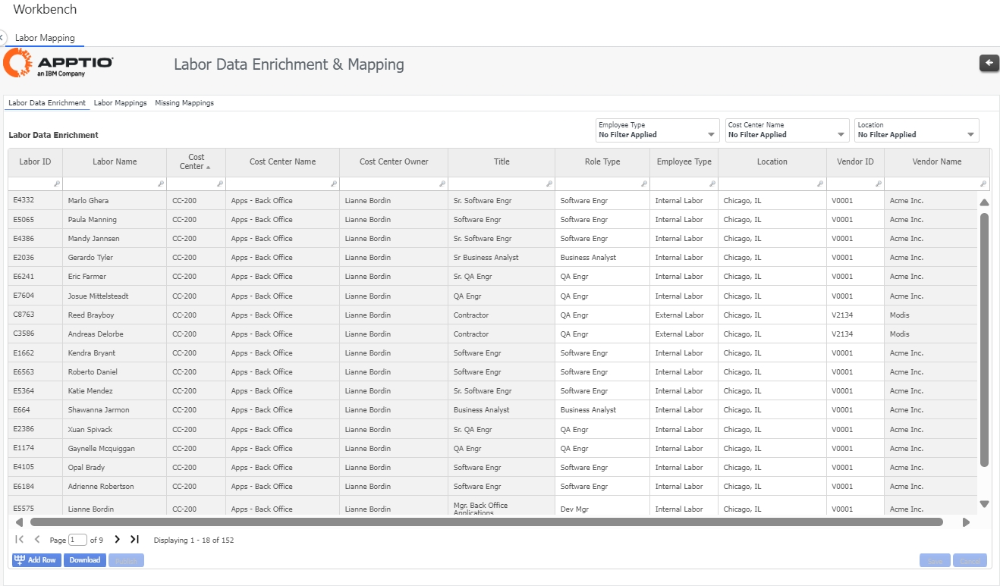
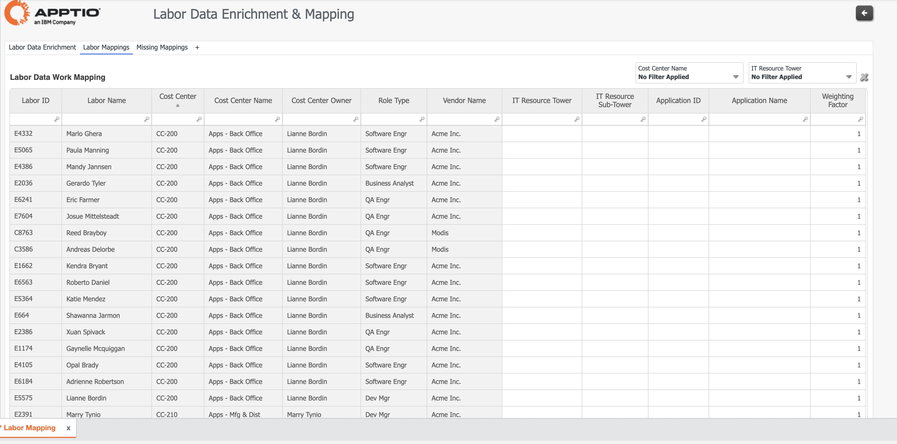
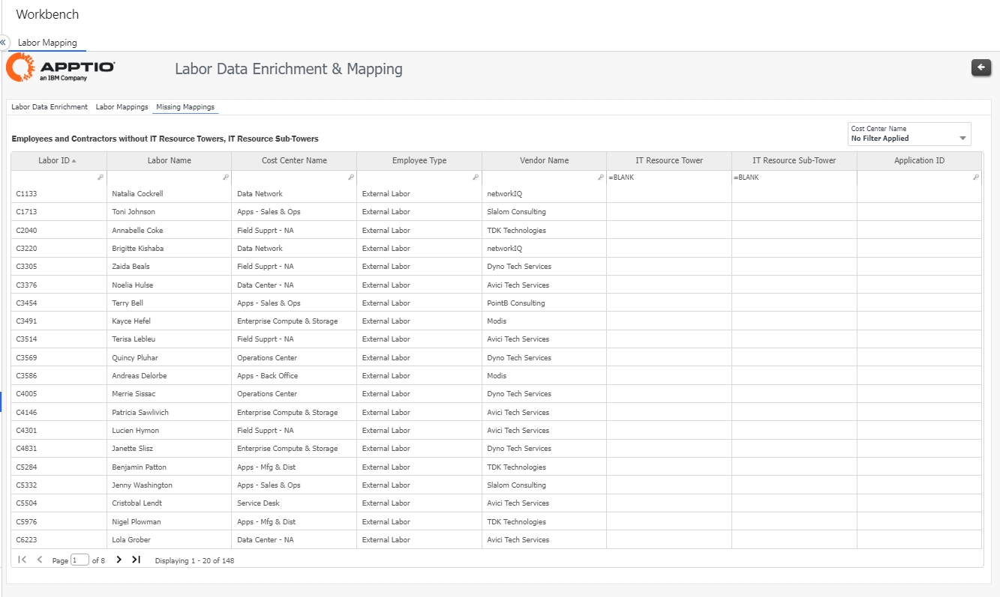

# Mapeamento de mão de obra

O Labor Workbench permite que o departamento financeiro, os proprietários de centros de custo e os gerentes de recursos insiram e mantenham informações relacionadas à mão de obra para enriquecer e melhorar a qualidade dos dados das informações do RH e de outros sistemas e para mapear a mão de obra para as Torres de Recursos de TI que as pessoas suportam, incluindo aplicativos, produtos e/ou serviços.

****Labor Workbench - Configuração****

1. (TBM Studio): Instalar o componente CTF-Labor Workbench.

   
2. (TBM Studio): Carregar conjunto de dados de trabalho do cliente. Faça as transformações necessárias, se for o caso.
3. (TBM Studio): Mapear o conjunto de dados do cliente para o Labor Feed.

   
4. (TBM Studio): Salvar e registrar as alterações.

   **Bancada de trabalho**
5. (Visualização de relatório): Navegue até Workbench > Relatório de mapeamento de mão de obra > Guia Enriquecimento de dados de mão de obra. Verifique se os dados trabalhistas são exibidos e atualize as colunas, incluindo Tipo de função, Tipo de funcionário, ID do fornecedor e Local, conforme necessário.

   
6. (Visualização do relatório): Navegue até Workbench > Relatório de mapeamento de mão de obra > guia Mapeamento de mão de obra e mapeie cada linha de mão de obra para uma ou mais torres de recursos de TI, subtorres de recursos de TI e ID de aplicativo, conforme necessário. Além disso, você também pode verificar o fator de ponderação da coluna, conforme necessário. Salve as alterações e publique o arquivo de transformação do ET de mapeamento de trabalho downstream.

   **Recomendações** :

   "O fator de ponderação pode ser usado para capturar o custo real da mão de obra nos cenários em que eles fizeram parte de uma ou mais torres/subtorres de recursos de TI.

   

   Nota:
   - Os menus suspensos Torres de recursos de TI e Subárvores de recursos de TI dependem dos Dados mestre das Torres de recursos de TI.
   - O menu suspenso ID do aplicativo depende dos Dados mestre de aplicativos.
7. (Visualização do relatório): Navegue até Workbench > Relatório de mapeamento de mão de obra > guia Mapeamentos ausentes e verifique se há linhas de mão de obra sem atribuições para Torres de recursos de TI e Subtorres de recursos de TI.

   
8. (TBM Studio): Abra o objeto do modelo Labor e verifique as alocações de custo de Labor para Time Tracking e Other Labor Allocations.

   

## Relatórios

**Enriquecimento de dados trabalhistas**

Fornece a capacidade de aprimorar os metadados dos recursos de mão de obra interna e externa, ingeridos a partir dos dados da força de trabalho do IDP, e permite uma análise mais rica dos gastos com a força de trabalho:

- Equipe (exemplo: esquadrões)
- Função
- Tipo de funcionário
- ID do fornecedor (se aplicável)
- Local

**Mapeamentos de mão de obra**

Os usuários podem atualizar sua lista de trabalho mapeando um recurso de trabalho para:

- Tipo de solução e categoria de solução
- Endereçável
- ID da oferta
- ID de Projeto
- Ponderação de alocação
  - Fornece a capacidade de determinar em qual tipo de solução/categoria de solução/projeto o recurso trabalha. A ponderação padrão é 1 (100%) para cada funcionário; no entanto, os usuários podem ajustar ou dividir as porcentagens de recursos em suas áreas apropriadas.

  

**Mapeamentos ausentes**

Identifica os recursos de mão de obra que não foram mapeados para as soluções.

