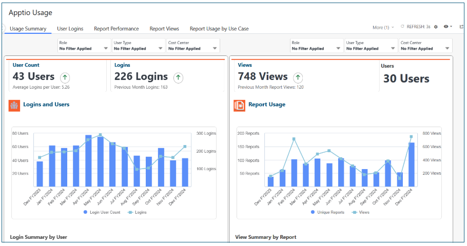
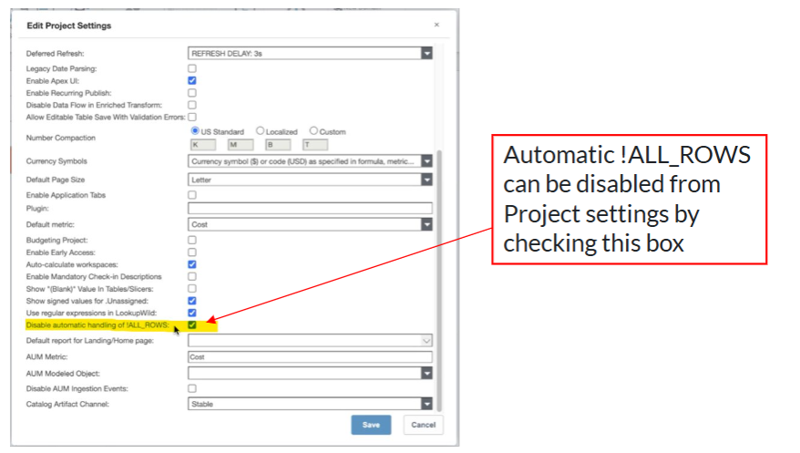
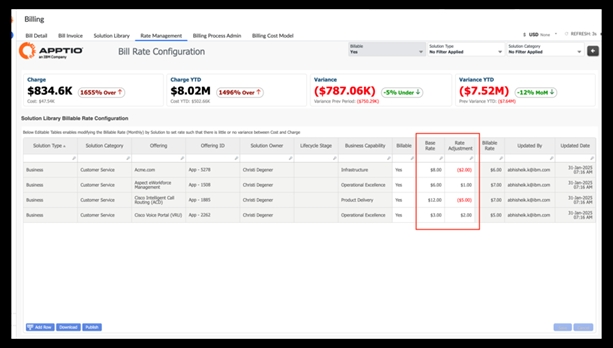
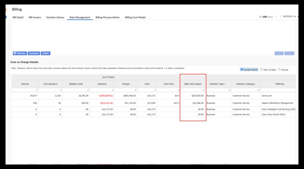
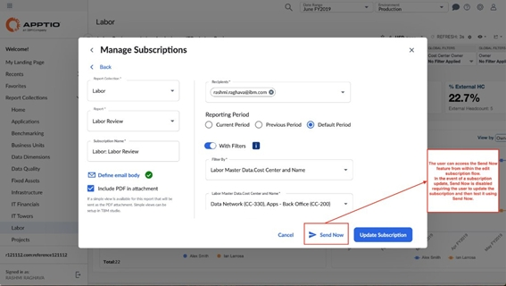
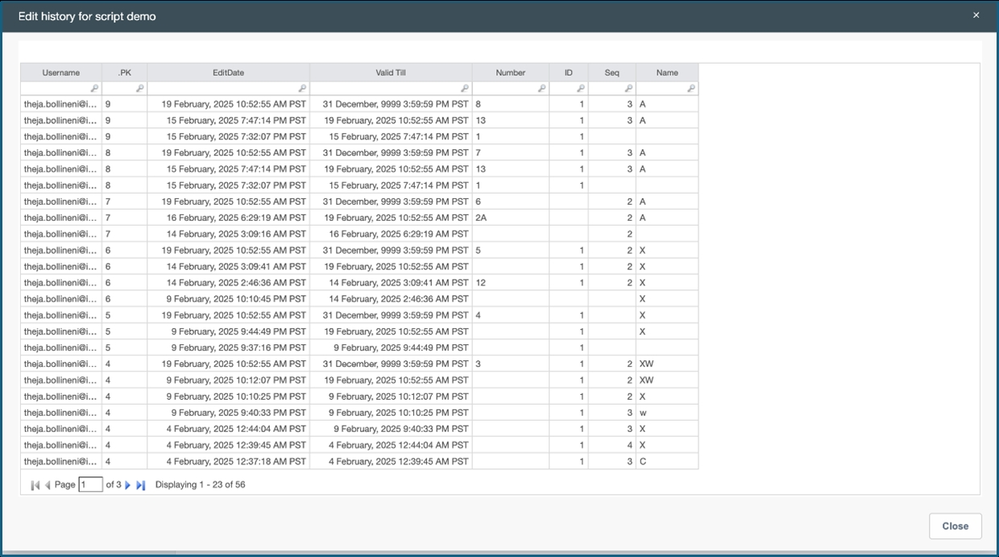
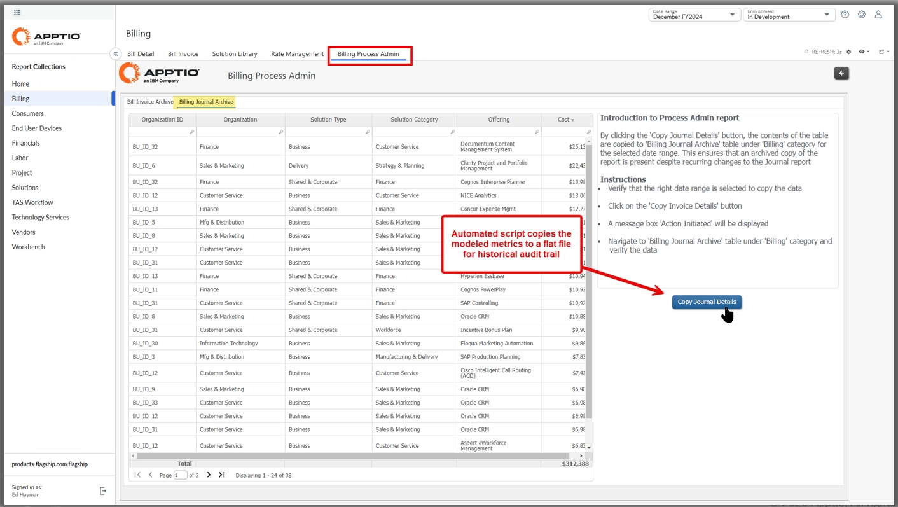
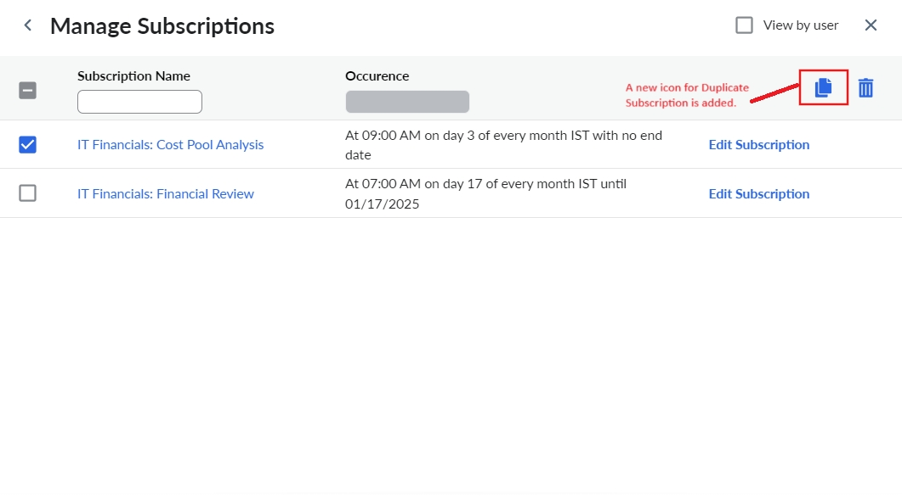
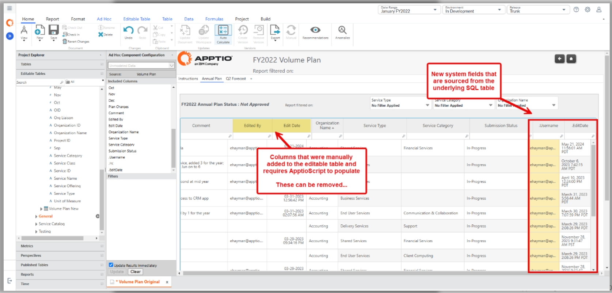

# Lançamentos recentes

## Cliente 2.16 - 15 de agosto de 2025

- Prevenção de erro de tabela editável quando somente o esquema é registrado.
- Introduziu o recurso [Calc Management Scheduler](admin/cacl-mgmt-scheduler.html "Aplica-se a: 2.16 e posterior. Esse recurso automatizará os cálculos de preparação em nível de projeto e de filial.") para automatizar os cálculos de preparação em nível de projeto e de filial.

## Servidor 12.11.16 - 15 de agosto de 2025

- A detecção de [anomalias](admin/build-anomaly-detection.html "O recurso de detecção de anomalias foi projetado para ajudá-lo a identificar alterações incomuns no esforço de cálculo, o que pode ajudá-lo a otimizar seus relatórios e transformações. Esse recurso é baseado nos dados coletados pelo Calc Explorer, que fornece informações detalhadas sobre o esforço de cálculo para cada compilação.") de compilação agora é GA.
- [Análise aprimorada do Excel](reports/tables/enhanced-excel-parsing.html)
- Costing Standard (modelos v120 )
  - [AI TCO & Usage](../cost-transparency/configuration/ai-tco-overview.html "A inteligência artificial (IA) é uma prioridade fundamental para muitas organizações, com os CIOs sendo cada vez mais encarregados de liderar as estratégias de IA em toda a organização. À medida que os gastos com IA se aceleram, o mesmo acontece com a complexidade. Os CIOs admitem que o gerenciamento de custos limita sua capacidade de liberar o verdadeiro valor da IA. Para que as organizações adotem, dimensionem e gerenciem as iniciativas de IA de forma sustentável e liberem todo o seu valor, elas precisam de visibilidade clara dos custos, do uso e da adoção da IA.") - adicionada uma nova guia Definition (Definição).
  - [Impacto do TCO da TI híbrida](../cost-transparency/reports/hyb-it-sum.html) - Novo pop-up de tendência detalhada no relatório de análise e adição da métrica de custo médio por aplicativo ao relatório de resumo
  - Mainframe TCO - Adicionado um relatório detalhado e um relatório de fatura.
  - Adição de tag de aplicativo aos relatórios [de TCO da nuvem pública](../cost-transparency/reports/pub-cloud-tco-overview.html).
  - Adição do novo campo "Código" nas tabelas de dados mestre da Integração do Planejamento.
- Aprimoramentos do Costing Essentials (modelos v200 )
  - Adicionados novos campos no Relatório de bancada [de mapeamento ausente](../apptio-cost-management/workbench/labor-mapping.html) de mão de obra e no Relatório de bancada de [mapeamento ausente de fornecedor](../apptio-cost-management/workbench/vendor-mapping.html).
  - Inclusão de novos campos no relatório do [Organization Mapping](../apptio-cost-management/workbench/organization-mapping.html "Oferece a capacidade de completar o enriquecimento de dados para suas organizações de TI (unidades de negócios).") Workbench.
  - A fórmula de contagem de linhas foi atualizada para TS Infrastructure e TS Platform.
  - Adição de tag de aplicativo aos relatórios [de TCO da nuvem pública](../cost-transparency/reports/pub-cloud-tco-overview.html).
  - Adição do novo campo "Código" nas tabelas de dados mestre da Integração do Planejamento.
  - Adição de métricas de depreciação ao Modelo de Serviços de Tecnologia.

**Corrigido nesta versão**

- Foi corrigido o problema de não exibição dos KPIs no idioma japonês.

## Servidor 12.11.15.1 - 25 de julho de 2025

- Corrigido o problema de desempenho ao configurar a JVM para usar a configuração padrão G1 GC.

## Servidor 12.11.15 - 4 de julho de 2025

- Introduziu o IBM Maximo **Maintenance Cost Insights** (MCI), desenvolvido pelo IBM Apptio Costing ( v200 ). Essa solução oferece aos clientes do Maximo uma integração bidirecional pronta para uso entre o IBM Maximo e o IBM Apptio Costing. Ele permite que os gerentes de manutenção do Maximo tenham visibilidade do custo total de manutenção em ordens de serviço, ativos e locais. Identificando os principais geradores de custos, como mão de obra, materiais, ferramentas e serviços, a solução permite a responsabilização financeira e o planejamento aprimorado das operações de manutenção.consulte [Visão geral](https://www.ibm.com/docs/en/masv-and-l/maximo-manage/cd?topic=applications-integrating-maximo-maintenance-cost-insights-apptio "(Abre em uma nova guia ou janela)") para obter mais informações
- Cálculo de custos padrão (Modelos v120 )
  - Aprimoramentos no relatório de uso e TCO de IA; solução adicionada aos projetos de referência
  - Aprimoramentos do TCO do mainframe (BETA)
  - Localização em japonês para Impacto do TCO da TI híbrida e TCO e uso de IA
- Melhorias no Costing Essentials ( v200 ) - A opção "Global" foi removida de [todos os segmentadores](https://www.ibm.com/docs/en/apptio-commercial/costing-essentials/saas?topic=reports-labor-review "(Abre em uma nova guia ou janela)") para melhor aproveitar as visualizações salvas, alguns [relatórios avançados de dispositivos de usuário final](https://www.ibm.com/docs/en/apptio-commercial/costing-essentials/saas?topic=started-end-user-devices-reports "(Abre em uma nova guia ou janela)") foram removidos e a estratégia de alocação de contagem de funcionários FTE foi adicionada.
- O Calc Explorer agora carrega na rolagem, melhorando o tempo de carregamento inicial.
- Os painéis foram atualizados com os dados de benchmarking mais recentes.

**Corrigido nesta versão**

- Corrigido o erro no Calc Explorer ao pesquisar em Show Dev Builds.
- Foi corrigido o problema em que o Diagrama Sankey no Calc Explorer era interrompido ao pesquisar ou paginar antes de perfurar.
- Correção de vulnerabilidades de segurança.

## Cliente 2.15 - 4 de julho de 2025

- Aprimoramentos do Costing Essentials ( v200 ) - Removida a opção "Global" de [todos os fatiadores](https://www.ibm.com/docs/en/apptio-commercial/costing-essentials/saas?topic=reports-labor-review "(Abre em uma nova guia ou janela)") para aproveitar melhor as exibições salvas

## Servidor 12.11.14.1 - 20 de junho de 2025

- Foi corrigido o problema em que os trabalhos recorrentes agendados não eram acionados.

## Servidor 12.11.14 - 30 de maio de 2025

**Novos recursos**

- Introduziu a solução de **TCO e uso de IA** da IBM Apptio, capacitando CIOs, líderes de negócios e soluções e equipes de IA e ciência de dados com visibilidade de ponta a ponta do custo total de propriedade e uso de IA. Ao desbloquear insights em modelos e soluções de IA, ele gera decisões mais inteligentes para investimentos em IA, permite o dimensionamento responsável e estabelece a base para conversas sobre o valor da IA. Consulte [Visão geral](../cost-transparency/configuration/ai-tco-overview.html "A inteligência artificial (IA) é uma prioridade fundamental para muitas organizações, com os CIOs sendo cada vez mais encarregados de liderar as estratégias de IA em toda a organização. À medida que os gastos com IA se aceleram, o mesmo acontece com a complexidade. Os CIOs admitem que o gerenciamento de custos limita sua capacidade de liberar o verdadeiro valor da IA. Para que as organizações adotem, dimensionem e gerenciem as iniciativas de IA de forma sustentável e liberem todo o seu valor, elas precisam de visibilidade clara dos custos, do uso e da adoção da IA."), [Guia de configuração](../cost-transparency/configuration/ai-tco-configguide.html) e [Coleta de relatórios](../cost-transparency/reports/ai-tco-report-collection.html) para obter mais informações.
- *Costing Standard (v120)*
  - Introduziu relatórios [de visão geral do modelo](../cost-transparency/reports/pub-cloud-model-views-cs.html) para visualizar os fluxos de custos, fornecendo percepções detalhadas e aumentando a transparência.
  - Adição de novos relatórios [Hybrid IT Impact Admin](../cost-transparency/reports/hyb-tco-imp-admin.html "Essa é uma substituição do conector mensal Apptio Datalink usado para \"congelar\" todos os aplicativos migrados com seu TCO, volume e custo unitário. As instruções estão disponíveis no relatório do administrador.") com o botão Copy Table (Copiar tabela) para simplificar a configuração e eliminar a necessidade de conectores de datalink Apptio para Apptio.
  - Atualizado o relatório [Public Cloud TCO](../cost-transparency/reports/pub-cloud-tco-overview.html) com a guia Definition (Definição), gráficos de eixo duplo para taxas unitárias, uma tabela Attributes (Atributos) redimensionada e uma ordem revisada do seletor de colunas que segue uma hierarquia de taxonomia.
- *Projeto de uso* - Adicionadas novas fórmulas para Tipo de usuário, Função e Persona na versão de março de 2025.
- *Fluxos de trabalho de recomendação*
  - Introduziu um novo fluxo de trabalho de [métricas não utilizadas](troubleshooting/studio-unused-metrics.html "Esse recurso fornece recomendações automáticas sobre métricas calculadas não utilizadas, oferecendo visibilidade das métricas criadas pelo usuário que não são utilizadas em outras métricas ou relatórios. O sistema verificará automaticamente as alterações e marcará os problemas como resolvidos.") (Beta) para otimizar o sistema.
  - Introduziu o fluxo de trabalho de [pesos positivos e negativos](troubleshooting/positive-and-negative-recom.html "Esse recurso ajuda a corrigir problemas de peso, encontrando e alertando sobre pesos positivos e negativos misturados, para que você possa corrigi-los e obter resultados precisos.")
- *Detecção de anomalias de construção (Beta)* - Introduziu um novo recurso para detectar [anomalias de construção](admin/build-anomaly-detection.html "O recurso de detecção de anomalias foi projetado para ajudá-lo a identificar alterações incomuns no esforço de cálculo, o que pode ajudá-lo a otimizar seus relatórios e transformações. Esse recurso é baseado nos dados coletados pelo Calc Explorer, que fornece informações detalhadas sobre o esforço de cálculo para cada compilação.") para melhorar os tempos de cálculo e o desempenho.

**Aprimoramentos**

- [Public
  Cloud TCO](../cost-transparency/reports/pub-cloud-tco-overview.html) o relatório para Costing Essentials foi aprimorado com a guia Definition (Definição), gráficos de eixo duplo para taxas unitárias, uma tabela Attributes (Atributos) redimensionada e uma ordem revisada do seletor de colunas que segue uma hierarquia de taxonomia.
- Aprimoramentos [do relatório de visão geral do modelo](../apptio-cost-management/out_of_the_box_reports/model-views-ce.html) em Costing Essentials

**Correções**

- Correção do problema com a função Ano anterior em Métricas calculadas paraCosting Essentials
- Correções de vulnerabilidades e segurança

## Cliente 2.14 - 30 de maio de 2025

**Novos recursos**

- Recursos adicionados para melhorar a experiência do usuário [de assinatura de e-mail](reports/email-subscription.html), incluindo ativar/desativar assinaturas, funcionalidade de pesquisa e aumento do limite de caracteres do corpo do e-mail.
- As colunas Change Set e Changes do Calc Explorer agora podem ser filtradas (pesquisadas) para qualquer coisa que apareça nas caixas de diálogo que elas abrem.
- Tabelas editáveis - Adicionada a capacidade de fazer download, editar e carregar dados [da tabela de transformação](data_studio/create-table-from-et.html) para um período específico para corrigir erros anteriores.

**Correções**

- Foi corrigido o problema de erro no relatório de tabela editável após adicionar ou excluir um valor de coluna e salvá-lo.
- Foi corrigido o problema do script “cellEdit“ que ignorava o erro de validação das células existentes.
- Correção da validação de valor exclusivo no script de botão/carregamento de arquivo

## Servidor 12.11.13.1 - 25 de abril de 2025

- Atualização trimestral do Java.
- Foi corrigido o problema com o pool de conexões MySQL que causava a exaustão de instruções preparadas.

## Servidor 12.11.13 - 11 de abril de 2025

**Costing Standard (v120)**

Esta versão inclui os seguintes aprimoramentos importantes para melhorar a experiência e a funcionalidade do usuário.

- Projeto de uso - relatórios baseados em funções com base na persona do Frontdoor.
- IBM Apptio A Integração Turbonômica agora é GA. Para saber mais, assista a este [vídeo](https://youtu.be/-FY7WfDBK1g?si=20-TTKhVDBaPRo0v "(Abre em uma nova guia ou janela)").
- Suporte ao idioma japonês para Public Cloud TCO.
- Public Cloud TCO adicionado ao projeto de referência Costing Standard

**Costing Essentials(v200)**

Essa versão inclui dois aprimoramentos importantes:

- Suporte ao idioma japonês para Public Cloud TCO.
- Public Cloud TCO adicionado ao projeto de referência Costing Essentials

**Projeto de uso - relatórios baseados em funções sobre a persona do Frontdoor**

Esta versão apresenta relatórios baseados em funções sobre as personas do Frontdoor, proporcionando aos administradores maior visibilidade do envolvimento e da adoção do usuário. O painel de controle Apptio Usage agora permite que os administradores monitorem o envolvimento do relatório, a atividade do usuário e o desempenho do relatório, segmentados por funções de usuário e personas definidas no Frontdoor. Esse recurso permite que os administradores entendam quem está se envolvendo com o site Apptio e identifiquem as áreas em que devem ser concentrados os esforços de adoção, promovendo a capacitação direcionada.

**Automático!Configurações de ALL\_ROWS ativadas por padrão**

A partir dessa versão, o Automatic!ALL\_ROWS é ativado por padrão em todos os projetos, aumentando a precisão dos relatórios. Se ocorrerem problemas, os administradores do Apptio podem desativá-lo temporariamente por meio das configurações do projeto, mas são incentivados a revisar e reconciliar os projetos para ativar o!ALL\_ROWS por padrão. Ativação da função automática!ALL\_ROWS pode ter um pequeno impacto no desempenho do cálculo. Essa substituição pode ser removida em versões futuras para melhorar a precisão do relatório e reduzir os erros para uma melhor experiência do usuário.

**Corrigido nesta versão**

- Foi adicionado suporte a várias dimensões por linhas, colunas e quadrante de valores em consultas de dados de tabela.
- O suporte a dados de tabela no biit-server agora aceita vários valores.
- Correção de problemas de segurança e vulnerabilidade.

## Cliente 2.13 - 11 de abril de 2025

Modelo de aplicativo: 8314

**Tabela Upload de assinaturas de e-mail filtradas**

A distribuição de e-mail foi projetada para simplificar o processo de gerenciamento de várias exibições filtradas com destinatários exclusivos. Essa atualização é particularmente benéfica para os administradores que precisam enviar visualizações personalizadas e filtradas de relatórios por e-mail para muitos usuários sem esforço manual.

Para usar esse recurso, selecione o ícone **Exportar** no modo "Exibir" e selecione **Assinatura de e-mail**. Ative o botão de alternância **Bulk Upload XLS** para fazer o download de um modelo. Esse modelo lista todos os filtros disponíveis para o relatório no contexto e fornece um espaço para adicionar destinatários em cada linha. Adicione combinações de filtros exclusivos para cada conjunto de destinatários, salve o arquivo e carregue-o novamente. Ao fazer upload de um arquivo válido, você observará duas alterações importantes: o arquivo de regras de assinatura é ativado, indicando que você fez upload de um arquivo que pode ser baixado para visualização ou edição, e uma mensagem de upload bem-sucedido é exibida. O recurso de upload de tabelas suporta um AND lógico dos filtros aplicados a cada linha. O sistema de validação de dados verifica se há adições corretas de colunas, colunas de destinatários de e-mail sem espaços em branco e outros campos essenciais para garantir a integridade dos dados. O campo *Recipients (Destinatários* ) é obrigatório, enquanto apenas um dos outros campos é necessário para filtrar o conjunto de dados. A validação de dados se concentra principalmente nos metadados da tabela (por exemplo, colunas corretas) e não necessariamente nos valores das colunas.

Para saber mais, consulte [Assinaturas de e-mail](reports/email-subscription.html).

**Corrigido nesta versão**

- Foi resolvido o problema de formatação dinâmica que causava atualização/carregamento indesejado da tabela no componente de relatório.
- O problema foi resolvido no novo visualizador de relatórios.
- Correção de problemas de vulnerabilidade.

## Servidor 12.11.12 - 28 de fevereiro de 2025

Modelo de aplicativo: 8191

**Novos recursos do aplicativo**

**Impacto do TCO da TI híbrida para IBM Apptio Costing Standard ( v120 )**

A solução Hybrid IT TCO Impact foi projetada para ajudar as organizações a medir e entender o impacto financeiro de seus ambientes de TI híbrida em evolução. Ele capacita os usuários finais, como os executivos da C-Suite e os proprietários de aplicativos, a tomar decisões informadas e a garantir que as migrações proporcionem o valor financeiro pretendido.

Essa solução oferece vários benefícios importantes (conforme demonstrado nos relatórios abaixo), incluindo a capacidade de comparar a pegada de TI híbrida atual com a pretendida, avaliar o benefício financeiro da migração e realizar uma análise detalhada antes e depois da migração. Esses recursos permitem que os usuários tomem decisões informadas sobre a migração de aplicativos e otimizem seus ambientes de TI híbridos.

Relatório da Level 100: Resumo do impacto do TCO da TI híbrida

Relatório da Level 200: Informações sobre o impacto do TCO da TI híbrida

Relatório da Level 300: Análise do impacto do TCO da TI híbrida

Para habilitar essa nova solução, comece da seguinte forma:

Para obter mais detalhes sobre a configuração, acesse [aqui](../cost-transparency/configuration/hybrid-it-tco.html).

**Public Cloud TCO para Costing Standard ( v120 ) e Costing Essentials ( v200 )**

A versão Public Cloud TCO para Costing Standard ( v120 ) e Costing Essentials ( v200 ) oferece vários benefícios para os usuários primários, principalmente para as equipes financeiras de TI. Essa versão fornece uma visão financeira simples e transparente dos custos mensais da nuvem pública, ajudando a evitar choques inesperados nas contas. Além disso, permite que as equipes promovam a responsabilidade e garantam a eficiência ideal dos serviços de nuvem pública, minimizando o desperdício.

A nova versão inclui a instalação de novos componentes, comoPublic
Cloud TCO em v120 ePublic Cloud TCO ePublic
Cloud TCO Reporting em v200. Os usuários podem se conectar aos dados da nuvem e utilizar recursos como Nome da conta, Unidade de negócios e Tabela de mapeamento da torre de nuvem para personalizar relatórios e obter insights sobre as práticas de nuvem de sua organização. Com essa versão, os usuários podem avaliar se sua organização está aplicando as "melhores práticas de nuvem", incluindo cobertura de RI e taxas de utilização, para otimizar seus serviços de nuvem.

Para obter mais informações sobre configuração, consulte [aqui](../cost-transparency/reports/public-cloud-config.html).

**Costing Essentials (v200)**

Os relatórios de visão geral do modelo são um novo recurso criado para oferecer aos usuários uma visão abrangente dos fluxos de custo dentro do modelo. Essa versão inclui relatórios sobre mão de obra, fornecedor, soluções, consumidores e modelo de custos e está disponível para todos os usuários com acesso a relatórios. Os relatórios são projetados para aumentar a transparência e a clareza para os usuários, fornecendo uma visão clara e detalhada dos fluxos de custo dentro do modelo. A visualização do modelo de mão de obra está incluída no componente Relatório de custo e mão de obra, enquanto a visualização do modelo de custo está na coleção Visualização do modelo. Os Relatórios de Fornecedores, Soluções e Consumidores estão localizados em suas respectivas coleções.

Os usuários podem clicar nos campos para selecionar e ver como o custo está fluindo entre diferentes objetos, proporcionando uma maneira clara e intuitiva de navegar pelos relatórios. Os relatórios podem ser acessados por qualquer pessoa com acesso a relatórios, sem necessidade de acesso a TBM Studio . Os principais usuários dos relatórios de visão geral do modelo são o administrador e o usuário avançado, para refinar as alocações de custos, tomar decisões informadas e otimizar seus processos de gerenciamento de custos.

Para visualizar todos os modelos de custo do relatório, consulte [aqui](../apptio-cost-management/out_of_the_box_reports/model-views-ce.html).

**Billing Essentials (v200)**

Os seguintes aprimoramentos foram feitos no site Billing Essentials V200.

- O suporte ao idioma japonês foi adicionado para melhorar a acessibilidade dos usuários.
- O relatório de gerenciamento de tarifas agora inclui uma nova métrica de impacto de ajuste de tarifas, fornecendo informações adicionais sobre alterações de tarifas.

  

  

  Para saber mais, veja a configuração [aqui](../billing-essentials/configure-billing-essentials/configuration.html).
- Um novo Relatório de Visão Geral do Modelo foi adicionado para fornecer um resumo das principais informações de faturamento.

  

  Para saber mais, veja [aqui](../billing-essentials/reports/model-views-be.html).

**Corrigido nesta versão**

- Resolvido o problema de análise de números de strings contendo 'e'.
- Alocações não utilizadas agora é GA.
- Correção de problemas de vulnerabilidade.

## Cliente 2.12 - 28 de fevereiro de 2025

**Dependência**

\*O cliente v2.12 é compatível com o servidor 12.11.12 e 12.11.11.x

**Novos recursos do cliente**

**Aprimoramentos na assinatura de e-mail**

A funcionalidade de assinatura de e-mail foi aprimorada para melhorar a usabilidade, a personalização e a experiência geral do usuário. Os administradores agora podem definir e personalizar as configurações de e-mail, enquanto os usuários finais receberão relatórios claros e interativos por e-mail. e clareza no gerenciamento e recebimento de relatórios enviados por e-mail.

**Nomeação dinâmica de arquivos PDF** : O arquivo PDF anexado às assinaturas de e-mail agora inclui o nome do relatório e o período do relatório no nome do arquivo. Essa alteração facilita a identificação e a organização dos relatórios para os destinatários.

**Assunto de e-mail e corpo de e-mail personalizáveis** : Os administradores agora podem personalizar a linha de assunto do e-mail usando campos dinâmicos, como o nome do relatório, o período do relatório e os filtros do relatório para obter assuntos de e-mail mais relevantes e específicos ao contexto. O corpo do e-mail também pode ser personalizado com campos dinâmicos, como nome do relatório, período do relatório e filtros do relatório, para fornecer contexto ou instruções adicionais diretamente no e-mail.

**Botão de chamada para ação atualizado** : O botão "View Report" (Exibir relatório) no e-mail foi atualizado para "View Full Report in Apptio " (Exibir relatório completo em ) para que os destinatários entendam para onde o link os levará.

**Enviar agora** : Esse recurso oferece aos administradores uma maneira conveniente de verificar se a assinatura de e-mail está funcionando como pretendido, garantindo que os assinantes recebam o conteúdo esperado. Ao usar o Send Now, os usuários podem testar com segurança suas assinaturas de e-mail, facilitando o gerenciamento e a manutenção das assinaturas.

O recurso Send Now pode ser acessado em dois locais: em Manage Subscriptions (Gerenciar assinaturas) para cada assinatura de e-mail e na tela de edição de uma assinatura de e-mail individual. Para usar o Send Now na tela de edição, os usuários devem primeiro salvar as alterações feitas nos detalhes da assinatura. Se forem feitas alterações, mas não forem salvas, o recurso Enviar agora será desativado até que as alterações sejam salvas. Depois de salvos, os usuários podem clicar em Send Now (Enviar agora) para enviar um e-mail de teste para os assinantes, fornecendo uma maneira rápida e fácil de testar e verificar suas assinaturas de e-mail.

Para saber mais, consulte [Assinaturas de e-mail](reports/email-subscription.html).

**Tabelas editáveis**

**editCell agora funciona somente em uma coluna específica** : Nesta versão, a função cellEdit foi atualizada para permitir notificações por e-mail mais precisas. Os administradores agora podem configurar a função SendMail( ) para ser acionada exclusivamente quando a coluna "Status do envio" for alterada de "Em andamento" para "Enviado", garantindo que os aprovadores sejam notificados somente quando o status for atualizado. Anteriormente, as edições em outras colunas também acionavam e-mails se o status permanecesse "Enviado" Essa atualização introduz a sintaxe cellEdit(“column\_name” ), que garante que as ações sejam acionadas somente quando a coluna especificada for modificada.

**Aprimoramentos no Show Changes** : O recurso Mostrar alterações foi atualizado com os seguintes aprimoramentos:

A chave primária (PK) agora é exibida na visualização Show Changes, o que facilita a identificação dos registros modificados.

Para tabelas editáveis enriquecidas, a visualização Show Changes (Mostrar alterações) exibe apenas as alterações feitas na tabela de origem subjacente. Isso é indicado pela presença de um valor para campos modificados e pela ausência de um valor para campos não modificados.

**Corrigido nesta versão**

- as exibições "Mostrar alterações" agora se alinham com a etapa Pipeline de dados > Tabela editável.
- Correção de vulnerabilidades de segurança.

## Servidor 12.11.11.2 - 27 de fevereiro de 2025

- Correção de vulnerabilidades de segurança.

## Servidor 12.11.11.1 - 5 de fevereiro de 2025

- Atualização trimestral do Java.
- Foi corrigido o problema de ambiente "não encontrado" em Apptio BI.

## Servidor 12.11.11 - 17 de janeiro de 2025

Modelo de aplicativo: v120-8191

**Novos recursos do aplicativo**

**Billing Essentials GA ( v200 )**

Esta versão oferece os seguintes aprimoramentos para melhorar a experiência geral do usuário e proporcionar um gerenciamento mais eficiente dos processos de faturamento e upload de dados.

- **Relatórios aprimorados** : O Relatório do Administrador do Processo de Faturamento foi integrado à coleção de Faturamento, com permissões de controle de acesso baseado em função (RBAC) configuradas para restringir o acesso aos Proprietários do Processo de Faturamento autorizados.
- **Exportação e arquivamento de lançamentos contábeis:** A guia Billing Journal Archive agora permite que os usuários exportem lançamentos de diário para um arquivo do Excel (.xlsx) e criem uma tabela nivelada para fins de relatório de auditoria, utilizando um script CopyTable para garantir a integridade dos dados.
- **Arquivamento de faturas** : A guia Arquivo de faturas apresenta um script de botão Copiar detalhes da fatura, que facilita o arquivamento de faturas criando uma cópia duplicada da fatura original, garantindo um registro permanente para fins de auditoria e conformidade.

  

  

**Corrigido nesta versão**

- Dados excluídos permanentemente para uma tabela no pipeline de dados.
- Correção de problemas de vulnerabilidade.
- Otimizações de cálculos de precisão

## Cliente 2.11 - 17 de janeiro de 2025

**Dependência**

\*O cliente v2.11 é compatível com o servidor 12.11.11 e 12.11.10.x

\*Alguns recursos do Client v2.11 dependem de novos recursos do Server 12.11.11.

**Novos recursos do cliente**

**O recurso Upload de tabelas agora é GA**

O componente Table Upload foi lançado há dois anos e a visibilidade na faixa de opções do Studio foi controlada pelo recurso Enable Features (Ativar recursos). Com a mudança para o GA, não haverá impacto em nenhum projeto existente.

**Aprimoramentos na distribuição de e-mails**

- **Assinaturas de visualizações filtradas** : Esse recurso permite que os usuários compartilhem relatórios filtrados com destinatários específicos por meio de um sistema de assinatura. Os destinatários receberão um hiperlink para acessar o relatório com seleções de segmentação pré-aplicadas, o que lhes permitirá visualizar o relatório com as configurações de filtro desejadas. Além disso, os destinatários têm a opção de receber um documento PDF anexado, que pode ser configurado para incluir ou excluir a visualização simples vinculada, mantendo as configurações de filtro selecionadas. Esse recurso oferece uma maneira flexível e segura de compartilhar relatórios com outras pessoas, garantindo que os destinatários recebam as informações de que precisam em um formato fácil de consumir.

  

  Para saber mais, consulte [Assinaturas de e-mail com visualização filtrada](reports/email-subscription.html).
- **Assinatura duplicada** : Esse recurso permite que os usuários criem uma cópia de uma assinatura de e-mail existente e simplifica o processo de gerenciamento de assinaturas. Para implementar esse recurso, um novo ícone "Duplicar assinatura" foi adicionado à caixa de diálogo Gerenciar assinatura, que permite aos usuários criar uma cópia de uma assinatura existente. A assinatura duplicada é nomeada automaticamente com o prefixo "Cópia de" seguido do nome da assinatura original, e os usuários podem editar os detalhes da assinatura duplicada, incluindo o nome, a frequência e o modelo de e-mail anexado.

  

  Para saber mais, consulte [Duplicate Email Subscriptions (Assinaturas de e-mail duplicadas](reports/email-subscription.html) ).

**Barra de rolagem horizontal para abas de documentos abertos do Studio**

Para melhorar o gerenciamento de várias guias inferiores abertas no estúdio, foi introduzida uma barra de rolagem horizontal. Ele permite que os usuários naveguem facilmente por várias guias abertas. Além disso, a última guia aberta será destacada, fornecendo um indicador visual claro da guia atual em foco.

Anteriormente, as guias desapareciam se não houvesse espaço e, portanto, era tedioso abri-las novamente.

**Tabelas editáveis**

- **Criar filial tem a opção de fazer a verificação automática de todas as tabelas editáveis** : Um novo recurso foi introduzido para aprimorar o gerenciamento de tabelas editáveis em filiais. Esse aprimoramento oferece um fluxo de trabalho mais simplificado e eficiente para gerenciar alterações de esquema e dados nas ramificações e ajuda a evitar alterações não intencionais no tronco.

  Ao criar uma ramificação, o usuário agora pode selecionar a opção de verificar automaticamente todas as tabelas editáveis, o que as atualizará no espaço de trabalho de desenvolvimento. Não é necessário fazer o checkout manual de tabelas individuais, o que reduz o risco de inconsistências e erros nos dados. O processo de checkout agora é automatizado, garantindo que todas as tabelas editáveis sejam devidamente atualizadas na filial.

  Anteriormente, quando os dados eram atualizados em uma ramificação, eles eram automaticamente atualizados no tronco. Não havia controle para validar ou confirmar as alterações em uma filial. Para saber mais, consulte [Criar filial com a opção Auto-Checkout](admin/bp-branching-projects.html "Aplica-se a: TBM Studio 12.1 e posterior").
- **Exponha o nome de usuário e a data de edição do histórico de alterações** : O processo de configuração da solução de tabela editável foi aprimorado com a exposição de duas novas colunas de relatório - as colunas do sistema.Username e.Edit Date. Os administradores agora podem acessar facilmente essas colunas no Project Explorer quando uma tabela editável é aberta e arrastá-las para o painel de configuração ad hoc de um componente de relatório de tabela editável. Além disso, essas colunas agora estão visíveis no modo de visualização do relatório, permitindo que os usuários as ordenem e redimensionem conforme necessário. Essa atualização elimina a necessidade de criar colunas separadas e usar o site ApptioScript para preencher as informações, simplificando o processo de configuração e melhorando a experiência geral do usuário.

  

  

  

  Anteriormente, essas duas colunas estavam disponíveis apenas em Show Changes (Mostrar alterações). Para evitar confusão, os nomes das colunas na tabela Mostrar alterações foram renomeados para Nome de usuário e EditDate.

  Para saber mais, consulte [Mostrar/ocultar.Nome de usuário e .EditDate](reports/tables/component-config-panel.html "Aplica-se a: TBM Studio 12.0 e posterior").
- **Melhoria no desempenho de salvar/atualizar em massa** : Foi feita uma melhoria significativa no desempenho da funcionalidade de salvar e fazer upload em massa, resultando em um processamento mais rápido e eficiente de grandes conjuntos de dados.

  | Número de linhas atualizadas | Número de colunas atualizadas | Tempo antigo (em segundos) | Nova hora (em segundos) |
  | --- | --- | --- | --- |
  | 10.000 | 3 | 179 | 2 |
  | 20.000 | 3 | 578 | 4 |
  | 30.000 | 3 | 1189 | 7 |
  | 1 lakh | 1 | tempo limite | 47 |
  | 2 lakhs | 5 | tempo limite | 110 |

**Corrigido nesta versão**

- Foi corrigido o problema de os menus suspensos não respeitarem a segurança de nível de linha da tabela padrão.
- Foi corrigido o problema em que o dimensionamento automático da tabela não funcionava corretamente com a opção Árvore.
- Corrigido o problema das pseudo-traduções de strings ausentes.
