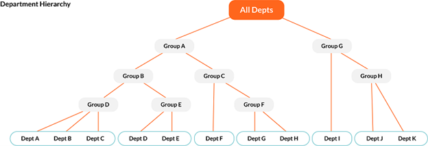

# Approval Workflows Overview

Approval Workflows in Apptio Planning control how submitted plans move through review
and approval stages, ensuring that plans are routed to the appropriate stakeholders for
sign-off. These workflows provide flexibility to align with your organization’s structure and
governance process.

Apptio Planning supports two types of approval workflows:

- **Hierarchical Approvals** - Routes plans through the Department hierarchy for review
  and approval.
- **Multi-Level Approvals** - Defines a custom, sequential approval chain (e.g., L1 → L2
  → L3) for each Department, independent of the organizational hierarchy.

Administrators can choose the workflow type for a planning cycle based on the organization’s
structure and decision-making process.

## Hierarchical Approvals

Hierarchical Approvals route submitted plans according to the Department hierarchy,
requiring approvals to progress upward through each level until the overall plan is
finalized. This approach is best suited when approvals should follow the organizational
reporting structure.

**Key Characteristics:**

- **Department hierarchy-based routing:** Approvals flow from leaf Departments upward
  to their parent Departments.
- **Plan Status:** A plan’s status progresses from **In Progress** to
  **Submitted**, and then to either **Approved** or **Returned**.
- **Multiple Owners per level:** You can assign multiple Owners at a Department or
  Group level, with only one approval required for the plan to advance.
- **Group Department submissions:** A Group Department can submit all its child
  Departments together for approval, and submitting a Group Department auto-approves all
  child Departments within it.
- **Rejection behavior:** Rejecting a plan sends it back one level in the hierarchy.
  The owner at that level would need to reject it again to continue moving it back toward
  the leaf Department for revisions.
- **Skip nodes supported:** You can configure hierarchy nodes to be skipped by leaving
  the Owner unassigned at that level, causing approvals to roll up to the next higher-level
  Owner.

**Example**

In the example below, Groups D and E can be configured as "skip" nodes. Plans from
Departments A, B, C, D and E will bypass the intermediate levels and are approved directly
by the owner of Group B.

**Hierarchical Approvals – Edit Level Permissions**

Hierarchical Approvals uses
**Edit Level** to control who can view, edit, submit, and approve within an approval
workflow. You can configure a user's **Edit Level** in **Cost Object Permissions**.
See [Manage Cost Object Permissions reference data](https://www.ibm.com/docs/en/apptio-commercial/planning-standard/saas?topic=configuration-cost-object-permissions "(Opens in a new tab or window)") for
more information.

Note: Enable **Send Email Notifications for Planning Process
Events** in the Company Profile to trigger email alerts when plans are opened,
submitted, approved, or returned. See [Email
Notifications](manage-email-notifications.html) for more information.

|  |  |  |  |  |  |  |
| --- | --- | --- | --- | --- | --- | --- |
| **Edit Level** | **View** | **Edit** | **Submit/Unlock Plans** | **Approve** | **Return** | **Email Alerts** |
| Owner | Yes | Yes | Yes | Yes | Yes | Yes |
| Edit & Submit | Yes | Yes | Yes | No | No | Yes |
| Edit | Yes | Yes | No | No | No | Yes |
| View Only | Yes | No | No | No | No | No |

Note: Budget approval is hierarchical. Users with **Owner** permission at a leaf department level
cannot approve or return budgets for that department; these actions must be performed by an
**Owner** of the parent department.

## Multi-Level Approvals

Multi-Level Approvals allow administrators to configure a custom, sequential approval chain
(e.g., L1 → L2 → L3) for each Department, independent of the organizational hierarchy. This
is useful when:

- Approvals must come from specific roles or named approvers across departments.
- The approval process does not align strictly to the organizational structure.

**Key Characteristics:**

- **Sequential approvals:** Configure up to 10 approval levels per Department, with
  approvals progressing in order from Level 1 to Level 2, Level 3, and so on.
- **Plan Status:** A plan’s status moves from In Progress to Submitted, then progresses
  through **L1 Approved**, **L2 Approved**, and so on, until all required approvals
  are completed and the final approver changes the status to **Approved**.
- **Multiple Owners per level:** You can assign multiple Approvers per level, with only
  one approval required for the plan to advance.
- **Rejection behavior:** If a Department is rejected at any level, the plan returns to
  the beginning of the approval chain, requiring the Department Owner to re-submit starting
  from Level 1.
- **Asynchronous planning:** Departments can submit and advance independently through
  the approval chain.

**Multi-Level Approvals – Edit and Approval Permissions**

In Multi-Level
workflows, **Edit Level** and **Approval Level** are separate permissions, allowing
administrators to define edit rights independently of approval authority.

- **Edit Level:** Controls whether a user can view, edit, or submit plan data.
- **Approval Level:** Determines whether the user is part of the approval chain
  (L1–L10). A user may have edit access without being an approver, or be an approver
  without edit rights.

You can configure a user's **Edit Level** and **Approval Level** in **Cost
Object Permissions**. See [Manage Cost Object Permissions reference data](https://www.ibm.com/docs/en/apptio-commercial/planning-standard/saas?topic=configuration-cost-object-permissions "(Opens in a new tab or window)") for
more information.

Note: Enable **Send Email Notifications for Planning Process
Events** in the Company Profile to trigger email alerts when plans are opened,
submitted, approved, or returned. See [Email
Notifications](manage-email-notifications.html) for more information.

|  |  |  |  |  |
| --- | --- | --- | --- | --- |
| **Edit Level** | **View** | **Edit** | **Submit/Unlock Plans** | **Email Alerts** |
| Owner | Yes | Yes | Yes | Yes |
| Edit & Submit | Yes | Yes | Yes | Yes |
| Edit | Yes | Yes | No | Yes |
| View Only | Yes | No | No | No |

|  |  |  |  |
| --- | --- | --- | --- |
| **Approval Level** | **Approve** | **Return** | **Email Alerts** |
| Level 1- Level 10 | Yes | Yes | Yes |
| None | No | No | No |

## Workflow Comparison

|  |  |  |
| --- | --- | --- |
|  | **Hierarchical Approvals** | **Multi-Level Approvals** |
| **Approval Path** | Follows the Department hierarchy, progressing level by level through parent Departments. | Custom-defined per Department, with sequential approvals flowing in order (L1 → L2 → L3, etc.). |
| **Approval Levels** | Multiple Owners can be assigned per Department or Department Group, with only one approval required to advance. | Supports up to 10 approval levels per Department. Multiple approvers can be assigned per level, with only one required to approve. |
| **Group Submission** | Supports Group Department submissions, where submitting a Group automatically submits and approves all child Departments together. | Not applicable. |
| **Planning Flow** | Requires synchronous planning and submission (child Departments must submit before the parent Group can advance). | Supports asynchronous planning and review. Departments can submit and advance independently through the approval chain. |
| **Rejection Behavior** | Rejecting sends the plan back one level in the hierarchy. The Owner at each level must continue rejecting to push it down to the leaf Department. | Rejecting a Department sends it back to the beginning of the workflow, requiring the Department to re-submit to Level 1. |
| **Skip Nodes** | Supported by leaving the Owner unassigned at a level, rolling approvals up to the next higher-level Owner. | Not applicable. |
| **User Permissions** | Edit Level Permission:  - **Owner:** Can edit, submit and approve or return plans. Receives email   notifications when plans are approved or returned. - **Edit & Submit** – Can edit and submit plans. - **Edit** – Can edit plans but cannot submit. - **View Only** – Can view plans but cannot edit or submit. | Edit Level Permissions:  - **Owner:** Can edit and submit plans. Receives email notifications when   plans are approved or returned. - **Edit & Submit** – Can edit and submit plans. - **Edit** – Can edit plans but cannot submit. - **View Only** – Can view plans but cannot edit or submit.  Approval Level permission:  - Approval Level: Set an approval level (1–10) to define the user’s position in   the approval workflow. |

## Configuration Steps

1. **Navigate to:** Company Profile > **Approval Workflows**.
2. **Select Workflow Type:** Choose either **Hierarchical Approval** or
   **Multi-Level Approval**.
3. **Group Submission Option (Hierarchical only):** You can disable group submit by
   selecting **Disable Group Cost Object Plan Submit**. Selecting this option removes the
   ability for Group Departments to submit at the group level. If you require more granular
   control over submissions and approvals, consider using Multi-Level Approvals instead.
4. **Email Notifications:** To notify users of key events during the planning process,
   select **Send Email Notifications for Planning Process Events**.
5. **Save and Exit** the Company Profile.
6. **Assign Approvers:** Navigate to Configuration > **Cost Object Permissions** and
   assign users based on the chosen workflow type:
   - **Hierarchical Approval:** Assign approvers to each Department or Department
     Group according to your organizational structure. Set Edit Level = Owner for users who
     can approve or reject submissions.
   - **Multi-Level Approval:** Assign users an Edit Level to define their ability to
     view, edit, or submit plans, and an Approval Level (L1–L10) to include them in the
     approval chain.
