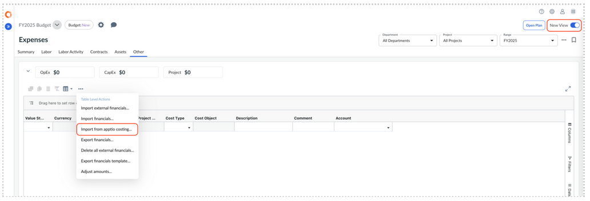

# Import Baseline Plans from Apptio Costing

This feature allows you to import baseline plan data from Apptio Costing into Apptio
Planning. This is useful when you want to bring an existing dataset from Apptio Costing as a
starting point for budgeting or forecasting.

Note: These tasks require the Admin role with the DataOrchestrationServiceFeatureFullAccess
permission.

Remember: Automated Data Management (ADM) is enabled

## Before you begin

Make sure the following prerequisites are met:

- **Automated Data Management (ADM)** is provisioned in your environment
- ADM is enabled in Apptio Planning:
  - Go to **Settings (⚙) → Company Profile**
  - Select **Enable Automated Data Management Integration**
- Required **Planning Integration datasets** are installed in Apptio Costing
- You have Admin role with the **DataOrchestrationServiceFeatureFullAccess**permission.

## Entity Management

When Automated Data Management (ADM) is enabled, the Entity Mapping page in ADM is
automatically updated with the following new entities:

- **Import Plan Labor** – Represents labor line items in **Expenses > Labor**
- **Import Plan Contract** – Represents contract line items in **Expenses > Contracts**
- **Import Plan Asset** – Represents asset line items in **Expenses > Assets**
- **Import Plan Financials** – Represents financial line items in **Expenses > Other**
- **Import Plan Labor Activity** – Represents labor activity line items in **Expenses > Labor
  Activity**

These entities enable mapping to the corresponding datasets in Apptio Costing. Once mapped,
data from Apptio Costing can be imported directly into the appropriate Expenses tabs for the
selected plan in Apptio Planning.

## How to Import a Baseline Plan

1. In Apptio Planning, navigate to **Plan → Expenses**.
2. Enable the **New View** (Importing baseline plans from Apptio Costing is supported
   only in the New View).
3. Select the **Expenses tab** you want to import into (Labor, Labor Activity,
   Contracts, Assets, or Other).
4. Open the **ellipsis table actions menu** and select **Import from Apptio
   Costing…**
5. Choose how the data should be applied:
   1. **Replace All Data** to overwrite existing data, or
   2. **Update Data** to merge updates into the existing plan using Line Item Code.
6. Select the **Apptio Costing time period** to import data from.
7. Click **Import**. The baseline data is imported into the plan using the mapped entity
   dataset from Apptio Costing.

Note: The *Import with* ***Update Data*** option is available only when the **External
Code** feature is enabled. This option updates existing Plan lines by matching a unique identifier
in the imported data. Since Plan data originates from Costing, a user-defined unique identifier is
required to ensure accurate alignment between Costing and Planning records.

To learn more about
External Code, visit [External Codes](https://www.ibm.com/docs/en/apptio-commercial/planning-standard/saas?topic=administration-external-codes "(Opens in a new tab or window)")

**Parent topic:** [Connect to Apptio Costing](../../../it-planning/planning/adm/adm_capabilities.html "Apptio Planning integrates with Apptio Costing using Automated Data Management (ADM). ADM is a shared platform service designed to provide a unified, secure, and scalable data exchange experience across Apptio applications.")
