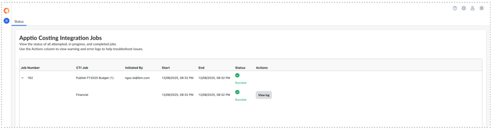
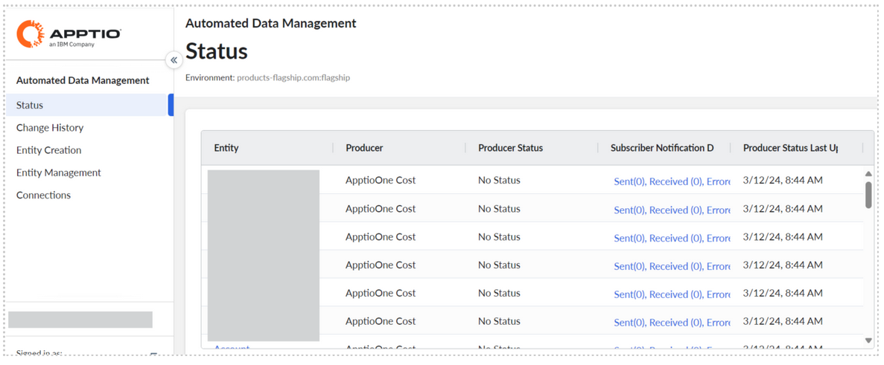

# Integration Status

The Integration Status page provides visibility into the progress of data exchanges
between Apptio Planning and Apptio Costing using Automated Data Management (ADM). This view
helps administrators monitor imports, publishes, and troubleshoot integration issues.

Note: These tasks require the Admin role with the DataOrchestrationServiceFeatureFullAccess
permission.

Remember: Automated Data Management (ADM) is enabled

## What You Can Monitor

The Apptio Costing Integration Status page shows the status of Planning-related ADM
activities, including:

- Reference data imports from Apptio Costing
- Actuals imports
- Baseline plan imports
- Plan data publishes to Apptio Costing
- Scheduled and manual integration jobs
- Success, in-progress, and failed executions

Each record includes timestamps, execution status, and error details (when applicable).

## Where to Access Integration Status

You can view integration status
from either of the following locations:

**From Apptio Planning** 

1. Go to **Settings (⚙)**
2. Select **Apptio Costing Integration**
3. Open the **Status** tab

This view shows only Apptio Planning–related ADM integration activity.

**From
Automated Data Management (ADM)**

1. Go to **Settings (⚙)**
2. Select **Automated Data Management**
3. Navigate to **Status**

This view displays all ADM integration activity across applications. Learn
more:[ADM Status](https://www.ibm.com/docs/en/apptio-platform/adm/saas?topic=management-status "(Opens in a new tab or window)")

**Parent topic:** [Connect to Apptio Costing](../../../it-planning/planning/adm/adm_capabilities.html "Apptio Planning integrates with Apptio Costing using Automated Data Management (ADM). ADM is a shared platform service designed to provide a unified, secure, and scalable data exchange experience across Apptio applications.")
