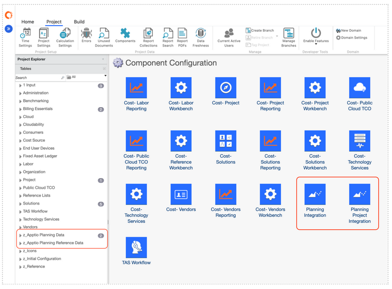

# Connect to Apptio Costing

Apptio Planning integrates with Apptio Costing using Automated Data Management (ADM). ADM
is a shared platform service designed to provide a unified, secure, and scalable data exchange
experience across Apptio applications.

This integration allows Apptio Planning customers to both import data from Apptio Costing and
publish plans back to Costing for reporting and analysis.

## What is Automated Data Management (ADM)

Automated Data Management (ADM) is Apptio’s standardized data integration framework that:

- Supports automated, repeatable data exchanges across Apptio products
- Manages datasets, entities, and integration schedules centrally
- Ensures consistent identifiers and mappings between Planning and Costing
- Reduces manual effort and improves data reliability

Learn more: [Automated Data Management](https://www.ibm.com/docs/en/apptio-platform/adm/saas?topic=automated-data-management "(Opens in a new tab or window)").

## Supported Apptio Costing Integrations

Using ADM, Apptio Planning supports the following integrations with Apptio Costing:

**Import from Apptio Costing into Apptio Planning** 

- **Reference Data**

  Import Reference Data dimensions from Apptio Costing to ensure consistent masters
  across applications.

  Learn more: [*Import Reference Data from Apptio
  Costing*](https://www.ibm.com/docs/en/apptio-commercial/planning-standard/saas?topic=costing-import-reference-data-from-apptio "(Opens in a new tab or window)")
- **Actuals**

  Import actual spend data from Apptio Costing to support forecasting and variance
  analysis.

  Learn more: [*Import Actuals from Apptio
  Costing*](https://www.ibm.com/docs/en/apptio-commercial/planning-standard/saas?topic=costing-import-actuals-from-apptio "(Opens in a new tab or window)")
- **Baseline Plans**

  Create plans based on Apptio Costing data to accelerate plan setup and ensure
  alignment with current financials.

  Learn more: [*Import Baseline Plans from Apptio
  Costing*](https://www.ibm.com/docs/en/apptio-commercial/planning-standard/saas?topic=costing-import-baseline-plans-from-apptio "(Opens in a new tab or window)")
- **Project Listing Data**

  Import plan-level Project List from Apptio Costing.

  Learn more: [*Import Projects
  List from Apptio Costing*](../import-pl-acost.dita "(Opens in a new tab or window)")

**Publish from Apptio Planning to Apptio Costing**

- **Publish Plan Data**

  Push budget or forecast plan data from Apptio Planning into Apptio Costing.

  Learn more: [*Publish Plan Data to Apptio
  Costing*](https://www.ibm.com/docs/en/apptio-commercial/planning-standard/saas?topic=costing-publish-plan-data-apptio "(Opens in a new tab or window)")
- **Schedule Plan Publishes**

  Automate recurring plan publishes on a defined schedule to keep Apptio Costing
  continuously aligned with Planning updates.

  Learn more: [*Schedule Plan Publishes to Apptio
  Costing*](https://www.ibm.com/docs/en/apptio-platform/adm/saas?topic=administration-schedule-plan-publishes "(Opens in a new tab or window)")
- **Project Listing Data**

  Push plan-level Project List from Apptio Planning into Apptio Costing.

  Learn
  more: [*Publish
  Projects List to Apptio Costing*](../pub-pl-ac.dita "(Opens in a new tab or window)")

## Automated Data Management Entities

|  |  |  |  |
| --- | --- | --- | --- |
| **Entity Name** | **Producing App** | **Consuming App** | **Description** |
| Publish Financial Budget | Apptio Planning | Apptio Costing | Publishes financial line items for budget-type plans |
| Publish Financial Forecast | Apptio Planning | Apptio Costing | Publishes financial line items for forecast-type plans |
| **Publish Asset Budget** | Apptio Planning | Apptio Costing | Publishes asset line items for budget-type plans |
| Publish Asset Forecast | Apptio Planning | Apptio Costing | Publishes asset line items for forecast-type plans |
| Publish Contract Budget | Apptio Planning | Apptio Costing | Publishes contract line items for budget-type plans |
| Publish Contract Forecast | Apptio Planning | Apptio Costing | Publishes contract line items for forecast-type plans |
| Publish Labor Budget | Apptio Planning | Apptio Costing | Publishes labor line items for budget-type plans |
| Publish Labor Forecast | Apptio Planning | Apptio Costing | Publishes labor line items for forecast-type plans |
| Publish Labor Activity Budget | Apptio Planning | Apptio Costing | Publishes labor activity line items for budget-type plans |
| Publish Labor Activity Forecast | Apptio Planning | Apptio Costing | Publishes labor activity line items for forecast-type plans |
| Publish Project List | Apptio Planning | Apptio Costing | Publishes Plan level Project List |
| Actuals | Apptio Costing | Apptio Planning | Imports financial Actuals from Costing into Planning Spend Management |
| Import Plan Financial | Apptio Costing | Apptio Planning | Imports financial line items |
| Import Plan Asset | Apptio Costing | Apptio Planning | Imports asset line items |
| Import Plan Contract | Apptio Costing | Apptio Planning | Imports contract line items |
| Import Plan Labor | Apptio Costing | Apptio Planning | Imports labor line items |
| Import Plan Labor Activity | Apptio Costing | Apptio Planning | Imports labor activity line items |
| Import Plan Project List | Apptio Costing | Apptio Planning | Imports plan level Project List |
| Account | Apptio Costing | Apptio Planning | Imports Account reference data |
| Account Category | Apptio Costing | Apptio Planning | Imports Account Category reference data |
| Department | Apptio Costing | Apptio Planning | Imports department reference data |
| Cost Center | Apptio Costing | Apptio Planning | Imports Cost Center reference data |
| Vendor | Apptio Costing | Apptio Planning | Imports Vendor reference data |
| Location | Apptio Costing | Apptio Planning | Imports location reference data |
| Role | Apptio Costing | Apptio Planning | Imports role reference data |
| Labor Rates | Apptio Costing | Apptio Planning | Imports labor rates reference data |
| Labor Allocation Rules | Apptio Costing | Apptio Planning | Imports labor allocation rules reference data |
| Asset Class Defaults | Apptio Costing | Apptio Planning | Imports asset class reference data |
| Contract Type Defaults | Apptio Costing | Apptio Planning | Imports contract type reference data |
| Variance Driver | Apptio Costing | Apptio Planning | Imports variance driver reference data |
| Project Group | Apptio Costing | Apptio Planning | Imports project group reference data |
| Project | Apptio Costing | Apptio Planning | Imports project reference data |
| Project Labor Role | Apptio Costing | Apptio Planning | Imports project labor role reference data |
| Labor Activity Type | Apptio Costing | Apptio Planning | Imports labor activity type reference data |

## Configuration Overview

Before using the integrations, ADM must be configured for your environment. Configuration
typically includes:

1. **Enable Automated Data Management**
   1. Confirm that Automated Data Management (ADM) is provisioned for your environment.
      You can verify this by checking that ADM appears as an application in Frontdoor.
   2. In Apptio Planning, go to **Settings (Gear icon) → Company Profile**, and select
      **Enable Automated Data Management Integration**.
2. **Configure Export Settings**

   Configure **Export Settings** to define default export behavior for all plan
   datasets.

   1. In Apptio Planning, go to **Settings (Gear icon) → Apptio Costing Integration →
      Export Settings**
   2. Configure the settings and save the configurations.
      - **Export Layout:** Choose to publish either the full schema (Export All) or a
        re-importable format.
      - **Sensitive Data Filters:** Enable or disable filtering of sensitive labor
        and financial details during publishing.
      - **Export Format:** The option to publish months as rows or columns has been
        moved from the Configure section into this new Export Settings configuration.
      - **Currency Settings:** Publish using the organization’s default currency or
        in original currency.
      - **Decimal Precision:** Decimal precision defaults to organization settings
        defined in the Company Profile. You can select a different decimal precision and
        decimal icon (period or comma) to export data to Apptio Costing.
      - **Date Format:** Configure the date format used when publishing to Costing.
3. **Configure Integration Datasets in Apptio Costing**
   1. Install the Apptio Costing integration components based on the Planning capabilities
      you want to enable.
   2. Available integration components:
      1. **Planning Integration**

         Installs core reference, actuals, budget, and forecast datasets required for
         Apptio Planning.
      2. **Planning Project Integration**

         Installs additional datasets required for Project and Labor Activity planning
         in Apptio Planning.

   

## Datasets installed by Planning Integration Component

|  |  |  |  |
| --- | --- | --- | --- |
| **Category** | **Dataset** | **Table Group** | **Description** |
| Account & Financial Structure | Planning Account Master | Z\_Apptio Planning Reference Data | Master list of financial accounts used for planning, including account attributes required by Apptio Planning. |
| Planning Account Category Master | Z\_Apptio Planning Reference Data | Defines high-level financial categories used to group and analyze accounts in Planning. |
| Planning Account Hierarchy | Z\_Apptio Planning Reference Data | Hierarchical structure that organizes accounts into parent/child relationships for rollups and reporting. |
| Planning Account Level 1–5 | Z\_Apptio Planning Reference Data | Flattened views of the account hierarchy at each level to support integrations and reporting. |
| Cost Centers & Departments | Planning Cost Center Master | Z\_Apptio Planning Reference Data | Authoritative list of cost centers available for budgeting and forecasting. |
| Planning Cost Center Hierarchy | Z\_Apptio Planning Reference Data | Hierarchical structure that organizes cost centers into parent/child relationships for rollups and reporting. |
| Planning Cost Center Level 1–5 | Z\_Apptio Planning Reference Data | Flattened views of the cost center hierarchy at each level to support integrations and reporting. |
| Planning Department Master | Z\_Apptio Planning Reference Data | Master dataset defining departments used in Apptio Planning. |
| Planning Department Hierarchy | Z\_Apptio Planning Reference Data | Hierarchical structure that organizes departments into parent/child relationships for rollups and reporting. |
| Planning Department Level 1–5 | Z\_Apptio Planning Reference Data | Flattened views of the department hierarchy at each level to support integrations and reporting. |
| Actuals | Planning Actuals Master | Z\_Apptio Planning Data | Master dataset of actual financials used by Apptio Planning. The Planning Actuals dataset is mapped to this table for Planning consumption. |
| Planning Actuals | Z\_Apptio Planning Data | Transformed dataset derived from Cost Source Master Data, filtered to include only actuals for import into Apptio Planning. |
| Financial Plans | Planning Budget | Z\_Apptio Planning Data | Budgeted financial line items published from Apptio Planning. |
| Planning Forecast | Z\_Apptio Planning Data | Forecasted financial line items published from Apptio Planning. |
| Asset Plans | Planning Asset Budget | Z\_Apptio Planning Data | Asset financial line items published from Apptio Planning budget plans. |
| Planning Asset Forecast | Z\_Apptio Planning Data | Asset financial line items published from Apptio Planning forecast plans. |
| Planning Asset Class Master | Z\_Apptio Planning Reference Data | Reference data defining asset classes and capitalization behavior used in Planning. |
| Contract Plans | Planning Contract Budget | Z\_Apptio Planning Data | Budgeted contract line items published from Apptio Planning. |
| Planning Contract Forecast | Z\_Apptio Planning Data | Forecasted contract line items published from Apptio Planning. |
| Planning Contract Type Master | Z\_Apptio Planning Reference Data | Reference data defining contract types used in Planning. |
| Labor Plans | Planning Labor Budget | Z\_Apptio Planning Data | Budgeted labor line items published from Apptio Planning. |
| Planning Labor Forecast | Z\_Apptio Planning Data | Forecasted labor line items published from Apptio Planning. |
| Planning Labor Rates | Z\_Apptio Planning Reference Data |  |
| Planning Labor Role Master | Z\_Apptio Planning Reference Data | Labor rate definitions by role, location, or vendor used to calculate labor costs in Apptio Planning. |
| Reference Data | Planning Location Master | Z\_Apptio Planning Reference Data | Location reference data used for labor rates, reporting, and analysis in Apptio Planning. |
| Planning VAT Rates Master | Z\_Apptio Planning Reference Data | Reference dataset defining VAT rate definitions used to calculate tax-inclusive contract line items in Apptio Planning. |
| Planning Variance Driver | Z\_Apptio Planning Reference Data | Reference dataset defining variance categories used in variance analysis and commentary in Apptio Planning. |
| Planning Vendor Master | Z\_Apptio Planning Reference Data | Master list of vendors used in Apptio Planning. |

## Datasets installed by Planning Project Integration Component

|  |  |  |  |
| --- | --- | --- | --- |
| **Category** | **Dataset** | **Table Group** | **Description** |
| Projects | Planning Project Master | Z\_Apptio Planning Reference Data | Master list of projects available for project and investment planning in Apptio Planning. |
| Planning Project Group Master | Z\_Apptio Planning Reference Data | Hierarchical grouping of projects used for portfolio management and reporting. |
| Labor Activity | Planning Project Labor Role Master | Z\_Apptio Planning Reference Data | Project-specific labor roles and associated rates used for project labor activity in Apptio Planning. |
| Planning Labor Activity Type Master | Z\_Apptio Planning Reference Data | Defines labor activity types and mappings for charge and cross-charge accounting in Apptio Planning. |
| Project Plans | Planning Labor Activity Budget | Z\_Apptio Planning Data | Budgeted labor activity line items published from Apptio Planning. |
| Planning Labor Activity Forecast | Z\_Apptio Planning Data | Forecasted labor activity items published from Apptio Planning. |
| Targetprocess Integration | Targetprocess Labor Activity Actuals | Z\_Apptio Planning Data | Actual project labor activity imported from Targetprocess. |
| Targetprocess Labor Activity Plan | Z\_Apptio Planning Data | Planned project labor activity sourced from Targetprocess for comparison and alignment with Planning. |

## Best Practice for Data Management

The recommended approach is to import and publish master datasets from Apptio Costing,
rather than overwriting or directly integrating with raw source data files.

Raw source feeds should first be transformed, normalized, and mapped in Apptio Costing into
standardized master datasets. These master datasets represent cleansed, categorized, and
business-aligned financial data, and are designed to be reused consistently across Apptio
applications, including Apptio Planning.

While you can build your own custom integration tables instead of using the out-of-the-box
(OOTB) datasets, keep in mind that Apptio continuously maintains and enhances the OOTB
schemas. When data model or schema updates are released, Apptio will update the OOTB
datasets and integration components, and you can upgrade those components to automatically
take advantage of the latest enhancements and fixes. Custom tables, by contrast, must be
maintained and updated manually.

- **[Import Reference Data from Apptio Costing](../../../it-planning/planning/adm/adm_import_reference_data.html)**  
  Reference Data in Apptio Planning defines the core dimensions used for planning, forecasting, and reporting, such as Accounts, Cost Centers, Departments, Vendors, Projects, and Labor Roles. Using Automated Data Management (ADM), you can import trusted, governed reference data directly from Apptio Costing to ensure consistency across financial workflows.
- **[Import Actuals from Apptio Costing](../../../it-planning/planning/adm/adm_import_actuals.html)**  
  Importing Actuals brings historical spend data from Apptio Costing into Apptio Planning, where it can be used for forecasting, variance analysis, and plan comparisons.
- **[Import Baseline Plans from Apptio Costing](../../../it-planning/planning/adm/adm-import-baseline-data.html)**  
  This feature allows you to import baseline plan data from Apptio Costing into Apptio Planning. This is useful when you want to bring an existing dataset from Apptio Costing as a starting point for budgeting or forecasting.
- **[Import Projects List from Apptio Costing](../../../it-planning/planning/import-pl-acost.html)**
- **[Publish Plan Data to Apptio Costing](../../../it-planning/planning/adm/adm_publish_import_plan_data.html)**  
  Publishing plan data from Apptio Planning to Apptio Costing enables you to share finalized budget and forecast data with your cost-allocation and cost-transparency environment. Through the built-in integration and scheduling features of Automated Data Management (ADM), you can export financial line items (Financials, Labor, Labor Activity, Contracts, Assets) from Planning and push them directly into Apptio Costing.
- **[Publish Projects List to Apptio Costing](../../../it-planning/planning/pub-pl-ac.html)**
- **[Integration Status](../../../it-planning/planning/adm/adm-status.html)**  
  The Integration Status page provides visibility into the progress of data exchanges between Apptio Planning and Apptio Costing using Automated Data Management (ADM). This view helps administrators monitor imports, publishes, and troubleshoot integration issues.
- **[Cost Transparency Integration (Legacy)](../../../it-planning/planning/integrate-ct.html)**  
  If your organization runs both Apptio Costing Standard and an Apptio Planning application, you can integrate them to share data.
