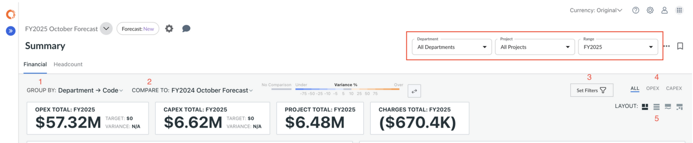
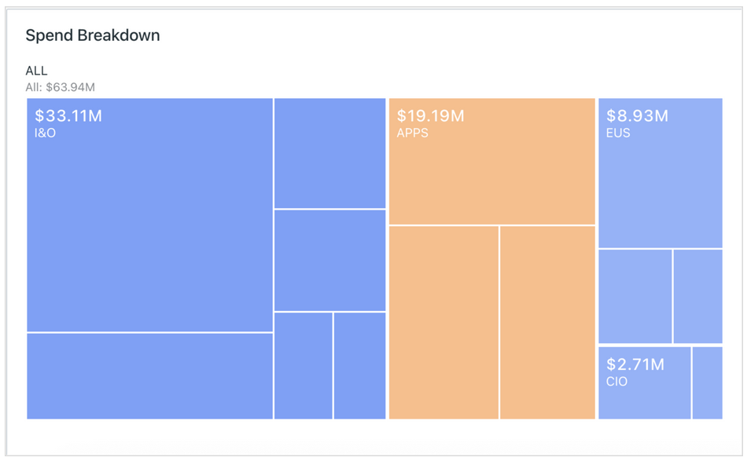
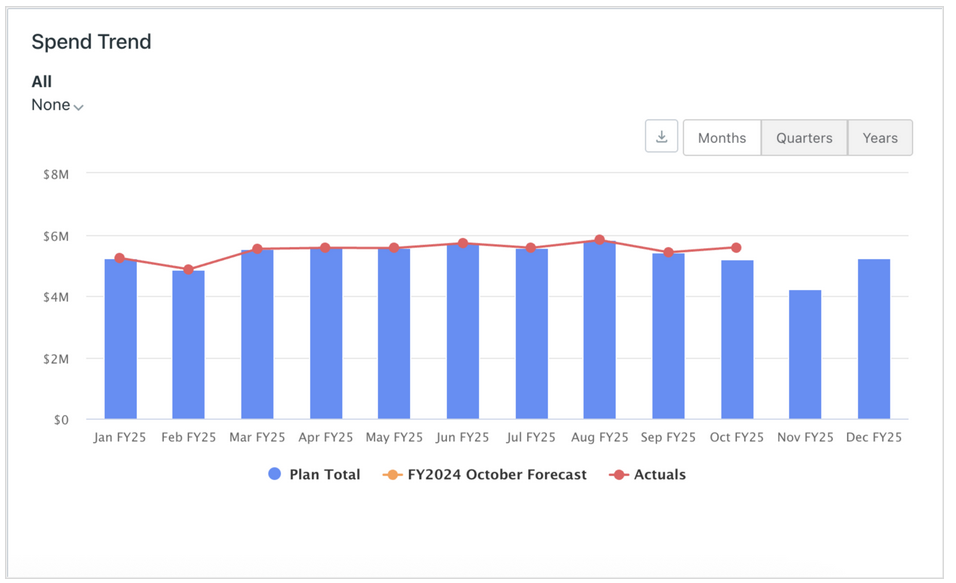
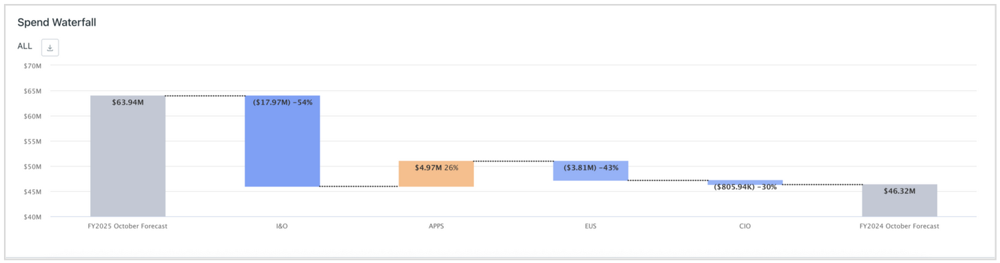

# Analyze a plan

The Summary pageprovides interactive visualizations of your plan—displaying direct and
indirect expenses, and if enabled, project labor charges tied to headcount data. Use this page
to explore financial performance, identify trends, and uncover variances.

## Open the Summary Page

1. Select a **Plan** from the plan menu
2. Navigate to **Planning** **→ Summary**
3. Choose the appropriate view:
   1. **Financial** tab — to view financial summaries
   2. **Headcount** tab — to view labor and FTE summaries

## Filter and Configure Your View

Use the **Department**, **Project**, and **Date Range** dropdowns to control the
scope of what’s displayed.

You can further refine the view using the following options:

1. **Group By** — Pivot the analytics by a specific dimension or attribute (e.g.,
   Department, Account Category, Vendor).
2. **Compare To** — Select **Targets**, **Actuals**, or another **Plan** to
   enable variance comparisons in the Spend Breakdown (treemap) and Spend Waterfall charts.
   Compare to Targets is only available when the Group By option is set to Department Code
   or Department Name.
3. **Filters** — Apply additional filters to narrow the data being analyzed.
4. **All / OpEx / CapEx** — Filter results by expense type.
5. **Layout** — Change the layout of the charts to suit your preferred analysis view.

Note: Filters impact charts and tables, but do not adjust KPIs.

## Understanding Key Visuals

*Spend Breakdown - Tree Map Chart*

Displays proportional representation of spend by your selected **Group By** dimension.

- Blocks are color-coded by variance status (under target = blue, over target = orange).
- Click a block to load deeper insights in the Spend Trend chart.
- Click **Flip Comparison** (arrow icon) to reverse the variance direction.

*Spend Trend Chart*

Shows trends over time for the selected group or overall plan.

- Use the **dimension selector** to further break down spend within the selected time
  period by another dimension.
- Use the ti**me period selector** to switch between points of analysis (Months,
  Quarters, Years).
- Includes an overlay of Actuals if imported and available (months view only).
- Click the **download button** to export the chart details to csv.

*Spend Waterfall Chart*

If you’ve selected a comparison plan, target, or actuals, the waterfall shows “puts and
takes” of variance.

- The left bar is your current plan; the right bar is the comparator (plan, target,
  actuals).
- Bars are color-coded by variance status (under target = blue, over target = orange).
- Click **Flip Comparison** (arrow icon) to reverse the variance direction.
- Click the **download button** to export the chart details to csv.

