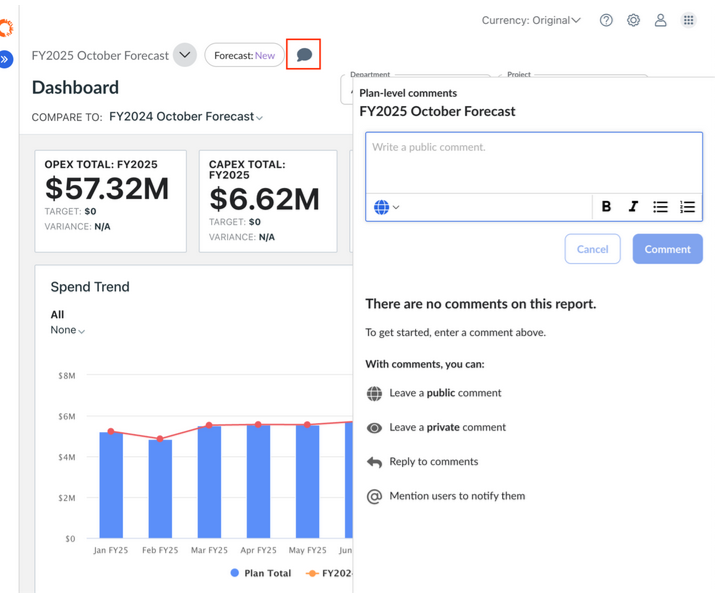
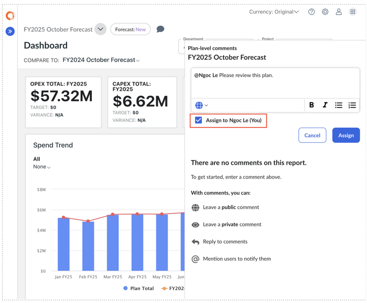

# Comments

The Comments feature allows users to collaborate directly within Apptio Planning by
starting discussions on variances, plan status, data issues, next steps, or other
planning-related topics. You can create public threads, open private conversations, assign
follow-up tasks, or simply leave personal notes for future reference.

Comments are saved per plan, ensuring context is preserved.

Users receive email notifications when they are mentioned or when someone replies in a thread
they’re part of.

## Adding a Comment

1. Click the **Comments** icon within a Plan.
2. In the comment pane, type your message and click **Comment**.
3. To direct a comment to someone, type **@username t**o notify them.

   

## Replying to & Managing Threads

1. Click Reply under any existing comment to respond.
2. Use the **@username** mention to bring someone into the discussion.
3. To edit or delete a comment:
   1. Click the **Ellipsis menu** next to that comment.
   2. Choose **Edit comment** or **Delete thread**.
   3. You can only delete your own comments unless you are an admin.

## Private vs Public Threads

**Public Threads**

- Visible to all users who have access to the plan.
- Ideal for broad collaboration and shared discussions.

**Private Threads**

- Only visible to the specific users or roles you add to the thread.
- Best for sensitive conversations or restricted collaboration.

## How to Start a Private Thread

1. Create a **new comment**.
2. Click the **Globe icon** and switch the thread to **Private**.
3. Choose one of the following:
   1. **Add Members** — allow specific users or roles to view and contribute to the
      thread.
   2. **Add Notes** — add personal notes visible only to you.

Note: Private and public threads are permanent — they cannot be converted into each other
after creation.

## Assigning & Resolving Comments

**To assign a comment to someone:** 

1. Type @username to notify the user.
2. Check the Assign to [username] option.
3. Click Assign to confirm the assignment.

**To resolve a comment:** 

1. Click the ellipsis menu next to the comment.
2. Select Resolve comment to mark it as completed or no longer requiring action.

   
