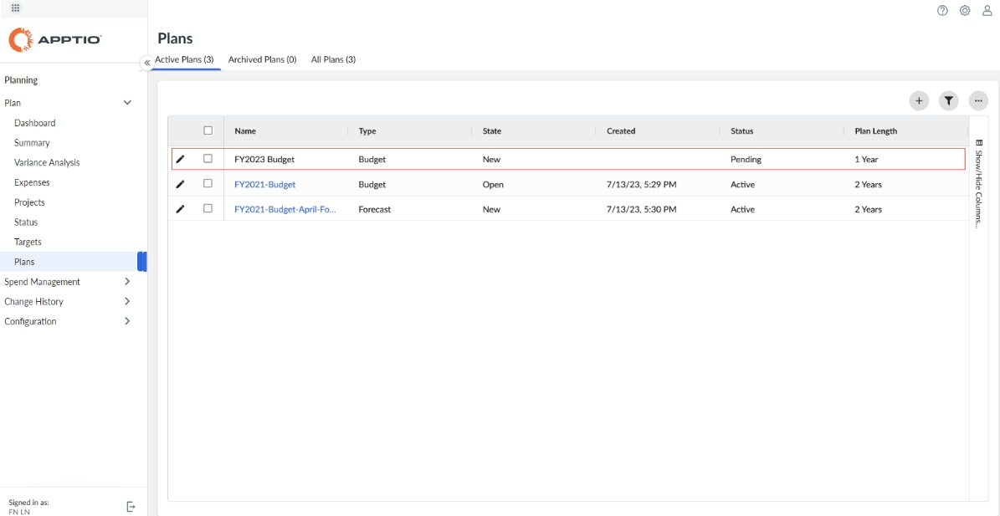
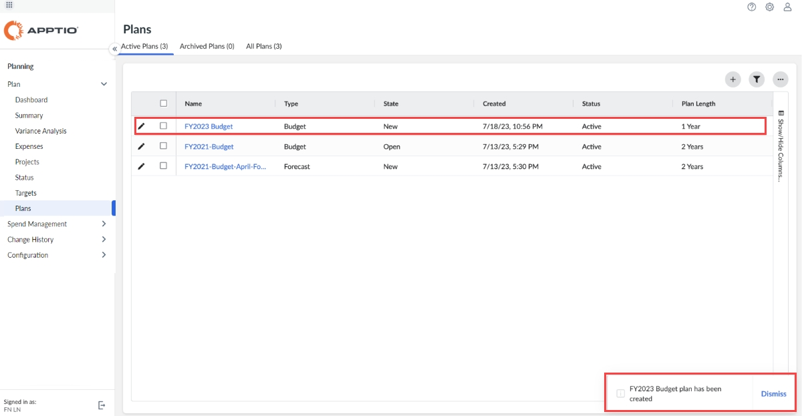

# Create a budget plan or forecast

## About this task

Watch this video from Apptio Education Services: [Creating and Opening Plans](https://community.ibm.com/community/user/viewdocument/creating-and-opening-plans-9-min "(Opens in a new tab or window)").

## Create a budget plan

A Budget Process Owner creates a new budget plan at the beginning of the planning cycle.

1. Select Planning > Plans > .
2. In Plan Type, select Budget.
3. Enter the following:

   | Item | Description |
   | --- | --- |
   | Plan Start Year | Select the year for the new budget (typically, the fiscal year). The definition is driven by your fiscal calendar setting.  For more information, see [Edit the Company Profile](edit-company-profile.html "The Company Profile allows Admin and Budget Process Owner users to configure application-wide settings that customize the display, enable or disable features, and define workflow behavior across Apptio Planning."). |
   | Plan Length (years) | Select the plan duration.  For more information, see [Plan for multiple years](plan-multiple-years.html "Use multiple-year planning features to plan and track your IT financials in a continuous, multi-year time horizon. You can support long-range plans and rolling forecasts across fiscal year boundaries."). |
   | Baseline Reference | To include baseline data in your budget, select an existing budget plan or a prior forecast. This allows you to baseline data from different fiscal years or for plan for multiple years.  Creating a plan from baseline should have the following behavior for different data types: - Other Financials, Labor Demand, Labor Allocations - copy periodic values based on the actual   calendar date, for example Jan FY18. - Expenses > Labor - for periods with values diferent than null, it behaves the same as Other   Financials. Periods with null values are populated using the Start Date, End Date, and Quantity   fields. - Contracts, Assets - generate all periodic values from metadata. - Contracts (Manual Amortization), Assets (Manual Depreciation) - behaves the same as Other   Financials.  Copy Over Line Item Codes  If you select this option, you can choose to either copy over Line Item Codes from the baseline or generate new Line Item Codes for the copied line items.  [Learn more about Line Item Codes](line-item-codes.html)  Auto Fill Plan Data  This option appears if the baseline plan does not contain the same fiscal dates as the newly created plan. The Auto Fill Plan Data feature populates the period values in the new plan that would be empty with the same value for that month in the final year of the baseline plan. For example, Feb FY21 is copied into Feb FY22 and FY22.  - The Auto Fill Plan Data feature doesn't work for Expenses > Labor. - If the new plan starts in an earlier FY than the baseline plan, the preceding years will have   the Other Financials and Labor Demand fields blank. If you enabled Integrated Investment Planning  Project Groups are not brought into a new plan, but they use the latest published reference data. Project Groups in a baselined plan that are not in the latest published Project Group reference data are not carried over to the new plan. |
   | Plan Name | Enter the unique name of the budget.  To help distinguish budget plans from forecasts in your list of plans, indicate the plan type in the name. |
4. Select Create Plan.

Once the plan creation is started after submitting Create Plan form, a new
entry is created in the Plans page with new plan name and status is marked as
Pending.

Note: If the plan creation status is Pending, then plan can neither be
selected either from the plans page nor from the plans picker from other pages.

Once the plan creation is complete, the toast dialog indicating plan creation complete is
displayed. Plan can now be selected from the plans page as well as plan picker on other pages.

Thus the plan creation is asynchronous process now.

Plan creation, especially using baseline plan can take several minutes if there is huge amount of
data to be copied over from the baseline plan to new plan. Synchronous plan creation process blocks
the user from doing other tasks while the plan is getting created. This time can be effectively
utilized by the administrator for doing other tasks in planning application until the plan creation
is complete.

Starting March 4th, 2024 and release 3.64, this feature is available in all main environments.
Plan creation process is now asynchronous. You can start the plan creation process, that will keep
running in the background, enabling the user to do other tasks.

If Integrated Investment Planning is Enabled, the projects will be copied into the new plan with
one of the following methods. To learn more about Integrated Investment Planning, please see [Get started with the
Integrated Investment Planning](iip/gs-integrated-investment-planning.html).

- Create Plan without Baseline Plan – If you are creating a plan without a
  baseline plan, projects from reference data dimension “Project” will be added in the plan.
- Create Plan with Baseline Plan – If you are creating a plan with a
  baseline plan, projects from the baseline plan will be added to the new plan.

After you create a budget plan, do the following:

1. Adjust the baseline values (optional).

   For more information, see [Enter financial details and adjust
   baseline values](enter-financial-details.html)
2. [Set financial
   targets](set-financial-targets.html)
3. Open the plan so budget owners can edit line items.

For more information, see [Open
a plan or a forecast.](open-plan-forecast.html "After you create a budget plan or forecast, optionally adjust the baseline values, set the targets, and open the plan so that the budget owners can edit line items. Budget owners cannot see a plan when it is in the New state. When you open a plan, an email notification is sent to budget owners and all users who have the Edit & Submit permission associated with the Cost Objects in that plan.")

Budget owners cannot see a plan when it is in the New state. When you open a plan, an email
notification is sent to budget owners and all users who have the Edit & Submit permission
associated with the Cost Objects in that plan. See [Manage Cost Object Permissions reference data](manage-cost-object.html "Cost Object Permissions determine which users can view, edit, submit, or approve Department-level plans (Cost Objects). Each Department can have one or more users assigned with edit-level permissions and, for Multi-Level Approvals, approval-level permissions.").

## Create a forecast

Before creating a forecast, check the dimensions and attributes from your actuals that you want
to bring into the forecast.

To check dimensions and attributes of your company:

1. Select 
   > Company Profile.
2. You can find the dimensions and attributes in Enable Capabilities > Summarize financial actuals
   down to the following dimensions and/or attributes.

To create a forecast:

1. Select Planning > Plans > .
2. In Plan Type select Forecast.
3. Enter the following:

   | Item | Description |
   | --- | --- |
   | Plan Start Year | Select the year for the new forecast (typically the fiscal year). The definition is driven by your fiscal calendar setting.  For more information, see [Edit the Company Profile](edit-company-profile.html "The Company Profile allows Admin and Budget Process Owner users to configure application-wide settings that customize the display, enable or disable features, and define workflow behavior across Apptio Planning."). |
   | Plan Length (Years) | Select the length of the plan. |
   | Forecast Start Period | Select the month for the new forecast. |
   | Baseline Reference | if you want to include baseline data in your forecast, in Baseline, select an existing budget plan or a prior forecast. |
   | Plan Name | enter a unique name of the forecast. |

   The New Plan dialog opens.
4. Select Create Plan.

Note: Actuals will be pulled from Spend Management into the forecast plan on a per-period basis.
Actuals will only appear on the Expense > Summary view. For more information,
see [Open and view the actuals](import-publish-actuals.html).Project Financial Planning -Integrated Investment Planning: Actuals
will only pull in within All Plan Sections if a project is Approved. Projects in Proposed status
will not have actuals pulled in within All Plan Sections.

After you create a forecast plan, do the following:

1. Adjust the baseline values (optional).

   For more information, see [Enter financial details and adjust
   baseline values](enter-financial-details.html).
2. [Set financial
   targets](set-financial-targets.html)
3. Open the forecast so Cost Center Owners can edit line items.

For more information, see [Open
a plan or a forecast.](open-plan-forecast.html "After you create a budget plan or forecast, optionally adjust the baseline values, set the targets, and open the plan so that the budget owners can edit line items. Budget owners cannot see a plan when it is in the New state. When you open a plan, an email notification is sent to budget owners and all users who have the Edit & Submit permission associated with the Cost Objects in that plan.")
