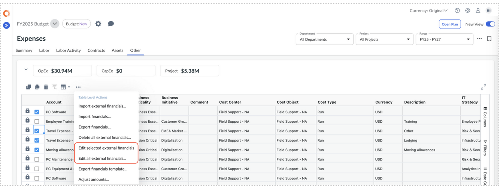
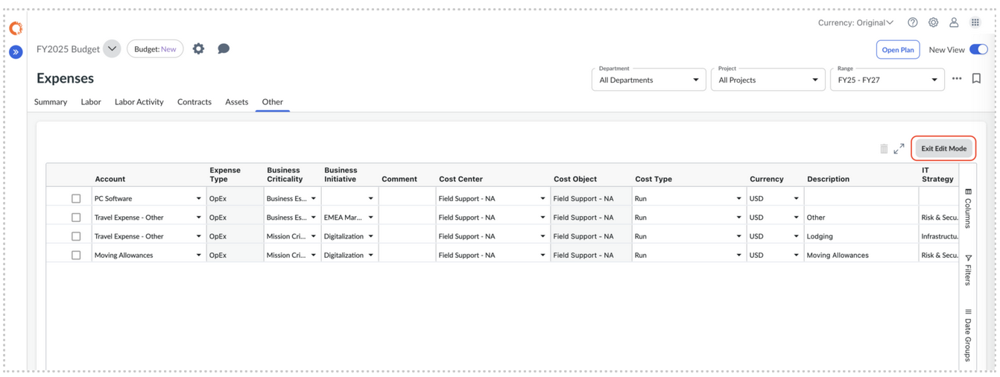

# External Line Items

External Line Items allow you to manage plan data that originates from external systems
and bring it into Apptio Planning for visibility and analysis — without allowing end users to
edit it.

Note: Admin or Budget Process Owner roles are required to manage External Line Items.

**Key Features**

- External line items can be imported into the **Financials** (Summary and Other),
  **Contracts**, **Assets, Labor** and **Labor Activity** tabs.
- They are marked with **Is External = true** upon import.
- **Cost Center Owners cannot edit** external line items — they are read-only.
- Only **Admins or Budget Process Owners** can import external line items.
- Only users with **ExternalLineEdit** permission can edit external line items.

## Import External Line Items

You can import external data from either the **Legacy View** or the **New View**.

1. Navigate to Expenses and select the tab to import External Lines to (**Summary**,
   **Contracts**, **Assets, Labor, Labor Activity, or Other)**
2. **Choose the appropriate View:**
   1. **Legacy View** → Click the **Actions** menu
      1. Select **Import External Financials...**, **Import External
         Contracts...**, or **Import External Assets...**
   2. **New View** → Click the **ellipsis (... ) menu** on the table
      1. Select **Import External Financials...**, **Import External
         Contracts...**, or **Import External Assets...**
3. Choose **Replace All** (overwrite all existing external data) or **Update Data**
   (update matching line item codes).
4. Complete the upload to commit the external line items.

## Edit External Line Items

External line items can only be edited in the **New View**.

Users must have the **ExternalLineEdit** permission (granted by default to Admin and
Budget Process Owner roles).

**Edit a single external line**

1. Right-click the external line.
2. Select **Edit External Line** to enable edit mode.
3. Click **Exit Edit Mode** to return to all line items.

**Edit a multiple external lines**

1. Select one or more external lines using the checkboxes.
2. Open the **ellipsis (...) menu** on the table.
3. Choose **Edit selected external <line item type>...**, depending on the tab you
   are editing.
4. Click **Exit Edit Mode** to return to all line items.

**Enable Edit Mode for All External Lines**

1. Open the **ellipsis (…) menu** on the table.
2. Select **Edit all external <line item type>…**
3. All external lines enter edit mode.
4. Select **Exit Edit Mode** to save all changes and return to all line items.

**Deleting External Lines** 

1. While in Edit Mode, select one or more external lines using the checkboxes.
2. Either:
   1. Right-click and choose **Delete**, or
   2. Use the **Delete** button on the table toolbar.
