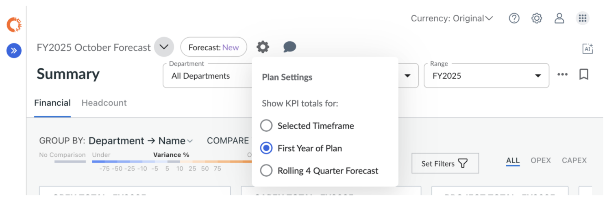

# KPI Settings

By default, KPIs ignore date range filters and always display totals for the first year
of the plan, unless configured otherwise.

If you want KPIs to update based on the selected date range — or change the default time
period they reflect — you can adjust the KPI time settings.

## How to Adjust KPI Totals

1. Navigate to the **Summary** or **Expenses** view.
2. Click the **Gear** icon next to the plan selector.
3. Choose how KPIs should update based on the following options:
   1. **Selected Timeframe** — KPIs update according to the currently selected date
      range.
   2. **First Year of Plan** — KPIs always display totals for the plan’s first fiscal
      year.
   3. **Rolling 4 Quarter Forecast** — KPIs display a rolling 4-quarter view starting
      from the plan’s Forecast Start Period (Forecast plans only).

