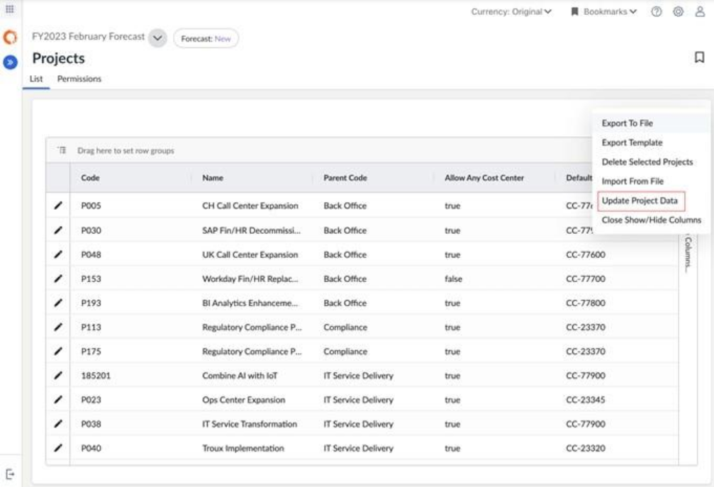

# Manage Projects

Note: Available with the Apptio Planning Standard subscription

Remember: *Integrated Investment Planning (IIP) feature is enabled*

Investment planning is an ongoing process driven by shifting priorities, market conditions,
and organizational needs. Although customers typically build their annual budget during
planning season, they must retain the flexibility to:

- Add newly approved or funded projects throughout the year
- Remove projects that are no longer relevant
- Update project attributes as plans evolve

The **Project List** feature enables this flexibility by allowing select users to manage
projects directly within each plan.

## Who Can Manage Projects?

The following roles can add, edit, or delete projects in a plan:

1. **Admin**
2. **Budget Process Owner**
3. **IIP Portfolio Manager**
4. Users with the **IIPProjectManage** permission

Projects are treated as a **plan-level dimension**, meaning they can be managed
independently within each plan without modifying global reference data.

## Global Projects vs. Plan-Level Project List

Apptio Planning supports project management at two levels:

**Global Project Dimension (Reference Data)** 

The **global Project
dimension** is your system-wide master list of projects. It represents the official
source of truth used across Apptio Planning.

**Key behaviors:**

- When creating a plan **without a baseline**, all global projects are copied into
  the new plan.
- Actuals uploaded in Spend Management validate against this global dimension.
- If a project code in the actuals does **not** exist in the global Project
  dimension, its value is cleared during upload.
- Any updates to the global Project dimension are **not** automatically pushed into
  existing plans.

**Plan-Level Project List**

Each plan contains its own **Project List**, which is a local copy of projects used
**only within that plan**. This allows budget owners and admins to customize the
project set for each annual or forecast plan without affecting the global master list.

**Key behaviors:**

- The Project List is created during plan creation (either from the global dimension
  or the baseline plan).
- You can **add**, **edit**, or **delete** projects at the plan level without
  impacting the global Project dimension.
- Custom changes made directly in a plan (e.g., new project codes) are scoped only to
  that plan unless added separately to the global dimension.
- Plan-level Project Lists follow the same schema as the global dimension, ensuring
  consistency across all plans.

## Managing Projects

The plan level **Project List** allows select users to add, edit, or delete projects
within a plan. These actions help maintain an up-to-date project portfolio throughout the
planning cycle.

**Add a Project** 

1. From the left navigation panel, select **Plan** > **Projects**.
2. This opens the **Project List** page.
3. From the **Plans** dropdown, select the plan for which you want to add a new project.
4. Select **Add Project** (+ icon). A **New Project** dialog appears.
5. Enter the project details:
   1. **Code** – A unique project identifier within the selected plan.
      *(Required)*
   2. **Name** – Project name.
   3. **Parent Code** – Parent project group code. This field is sourced from the
      **Project Group** reference data.
   4. **Allow Any Cost Center** – Enable this option to allow all cost centers to
      charge to the project.
   5. **Default Cost Center****Code** – Select the default cost center associated
      with the project.
   6. **Cost Center****Code** – Select the cost centers available for use with the
      project.
6. Click **Add** to create the new project.

**Edit Project Attributes** 

1. In the Project List, select **Edit** (pencil icon) next to the project you want to
   modify.

   A **Project Edit** dialog appears.
2. Update the required attributes. Changes are auto saved.

**Delete a Project** 

1. In the Project List, select one or more projects to delete.
2. Either:
   1. Right-click to open the context menu and select **Delete**, or
   2. Select **Delete Selected Projects** from the Ellipses menu.

      *To
      multi-select projects, hold the Command key on Mac or Control key on Windows
      while selecting rows.*
3. If any selected projects are used in expense lines, a confirmation dialog will appear.
4. Select **Confirm** to proceed.

**Important Notes About Deleting Projects**

- Deleting a project removes it from the plan-level **Project List**.
- Any expense lines where **Project** is a *mandatory attribute* (e.g.,
  **Labor Activity**) will be deleted.
- For expense lines where Project is *not mandatory* (e.g., **Contracts**,
  **Assets**, **Other Expenses**, and **Labor**), the project value will be
  cleared, but the expense line will remain.

**Import Project List** 

You can import project data using a .csv file.

1. Select **Import From File** from the Ellipses menu.
2. Upload the .csv file.

   **Important:**
   - Import supports **adding new projects** and **updating attributes of
     existing projects**.
   - **Deleting projects via import is not supported.**

   To import Project List from Apptio Costing, refer to [Import Projects List from Apptio Costing](../import-pl-acost.html).

**Export Project List** 

To export the project list:

1. Select **Export to File** from the Ellipses menu.
2. The system downloads the Project List as a .csv file.

**Publish Project List to Reference Data**

To publish plan level Project list to Configuration > Reference Data > Project:

1. Select **Publish To Reference Data** from the Ellipses menu.
2. Project List gets imported into Project reference data.
3. Publish Project reference data to make updated reference data available to plans.

## Synchronizing Global and Plan-Level Projects

Because plans reference their own local Project List:

- Changes to global Projects **do not automatically propagate** into existing plans.
- To pull global updates (adds/deletes/attribute changes), use **Projects > List >
  Update Project Data**.
- The update process will add, remove, or modify plan-level projects depending on what
  changed in global Project reference data.

This ensures each plan remains stable throughout the planning cycle while still giving
administrators control when project definitions evolve.

**How Project Changes Are Applied**

When you run **Update Project Data** in a plan, Apptio compares the plan’s Project List
with the global **Reference Data > Project** dimension and applies changes according to the
rules below.

1. **A project was deleted from global Reference Data but exists in the plan**

   If a
   project is removed from the global Project dimension, the following changes occur when
   the update is applied:
   - **Labor Activity lines** associated with that project are deleted, including
     all related Labor Activity financials.
     - These appear as *Lines to be deleted* in the confirmation dialog.
   - For **Labor, Contract, Asset, and Other** expense lines where Project is
     *not* a required attribute, the Project value is cleared.
     - These appear as *Lines to be updated*.
   - The project is removed from the plan’s Project List.
2. **A new project is added to global Reference Data**

   If a project exists globally but not in the plan:
   - The new project is added to the plan’s Project List.
3. **A project was created only in the plan (not globally)**

   If a project exists in the
   plan but not in global Reference Data:
   - That project is removed from the plan during the update.
   - Any impact on expenses follows the same rules described in **Scenario 1**
     (deletion of projects).
4. **A Cost Center is removed from a project in global Reference Data**

   If a cost center is removed from a project globally but still assigned in the plan:
   - All **Labor Activity lines** using that project/cost center combination are
     deleted, along with their financials.
   - For any other expense types where cost center is required, the Project value is
     cleared and the expense is reassigned under Department.
   - These actions appear as *Lines to be deleted* or *updated* in the
     confirmation dialog.

   Important: If you want to preserve expenses associated with a cost
   center before removing it from a project, reassign those expenses to a valid cost center
   prior to applying the update.
5. **Conflicts with other pending reference data updates**

   If there are outstanding
   updates for other reference data dimensions (such as Cost Center or Project Group), the
   project update will be **blocked** to prevent conflicts. A message will prompt you to
   apply those updates first.
