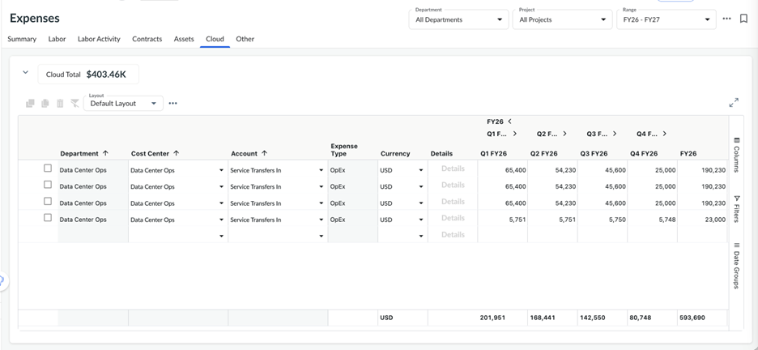

# Manage Cloud Expenses (without CFP Integration)

Important: Available with the ***Apptio Planning Standard****subscription*

Remember: The New View is enabled.

The **Cloud** tab in **Expenses** view can be used independently without the CFP
Integration to manage and track the cloud spend within budgets and forecasts.

To add or update cloud expenses:

1. Open your plan and navigate to the **Cloud** tab within the **Expenses** page.
2. Add a new cloud expense by either:
   - Using the **empty row** at the bottom of the table, or
   - **Right-clicking** and selecting **Insert Row**
   - **Importing** the data using CSV file from the Table Level Actions menu (*3-dot
     button)* → **Import cloud lines** option.
3. Provide required information for each cloud expense line:
   - **Cost Center (Required)** – Identifies the department or organizational unit
     financially responsible for the cloud spend.
   - **Account (Required)** – The ledger account to which the cloud expense will be
     recorded.
   - **Vendor (Optional)** – Cloud service provider or supplier. This field is useful
     for vendor‑level reporting and spend analysis.
   - **Location (Optional)** – The geographical location where the cloud spend was
     incurred.
   - **Cost Type (Optional)** – Available when Integrated Investment Planning is
     enabled. Classifies the spend as **Build** or **Run**. If left blank, the system
     automatically assigns **Run** as the default.
   - **Project (Optional)** – Available when Integrated Investment Planning is enabled.
     Use this field to associate cloud spend to a specific project for tracking and
     reporting.
   - **Description and Comment** – Additional context or metadata about the cloud
     expense line.

Once entered, Apptio Planning automatically generates the corresponding financial entry for
each cloud expense in the **Summary** tab. Manually entered Cloud tab lines can coexist
seamlessly alongside cloud expense lines imported from Cloud Financial Planning (CFP).

**Parent topic:** [Connect to Cloudability Financial Planning](../../it-planning/planning/connect-cfp.html)
