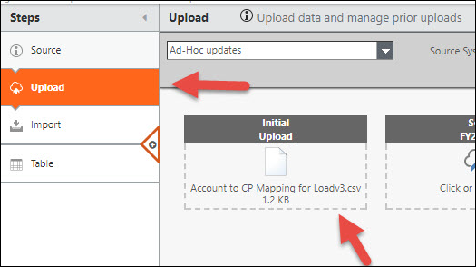

# Manage reference data in TBM Studio

◆ Applies to: Planning

The tasks below can only be performed by users assigned to the Admin or Budget Process Owner
roles. For additional information on roles, see Frontdoor permissions and roles.

Dimensions are the essential data categories in budget line items. Many built-in dimensions have
dependencies on other dimensions. See [Reference data attribute and dimensions dependencies](manage-reference-data.html) for information. In Apptio Planning applications, you can work with TBM Studio data in Microsoft Excel, work with master data
sets, and update reference data.

## Overwrite TBM Studio reference data

You can modify TBM Studio reference data in Data Studio. Download existing reference data in TBM Studio, modify it in Excel, then overwrite the data in TBM Studio using the following steps:

1. In **TBM Studio**, select the In Development
   environment view.
2. In the Project Explorer, open and edit your table information as needed, then click
   Export.
3. Open and modify the reference data in Excel, then save the file as a .csv file.
4. In the Project Explorer, select the table and click Check Out. The table name
   changes to orange to indicate it is checked out.
5. In the Steps pane, click Upload.

   
6. Right-click Initial Upload and select Overwrite.
7. Browse to and select your saved .csv file.
8. In the Steps pane, click Table to inspect the data and confirm your changes.
9. Repeat this process as needed.

## Confirm Master data

Confirm the data in the integrated Master data sets and promote the data to Production using the
following steps. Note that the integrated Master data sets are grouped together.

1. In Project Explorer, open the ITP Account Master and inspect the data. If new data
   contained a column name that differed from the initial column name, the data may not open. In this
   case, check out the Master data set and rerun the Append step to correct this issue.
2. Click Check In.
3. Click the Project tab, then click Calculation Queue to view the status of your
   most recent check in. When the Staging calculation is complete, the status displays as
   Finished, indicating you can promote the changes to Production.
4. Change the environment view from In Development to Staging.
5. Click Lock to prevent check ins.
6. Click Promotion Options.
7. Click Promote Now to promote your Staging calculation to Production.
8. Click Unlock.

## Update dimensions and attributes

The following table provides information on where to update dimensions (data that Planning pulls into the columns) and configuration attributes (calculations that
Planning uses to calculate price or cost).

| Associated module | Required or optional | Update in TBM Studio then push to Planning | Update in Planning then push to TBM Studio |
| --- | --- | --- | --- |
| Planning | Required | Account | Cost Object Permissions |
| Planning | Required | Cost Center | Labor Allocation Rules |
| Planning | Required | Department |  |
| Planning | Required | Labor Rates |  |
| Planning | Required | Role |  |
| Planning | Optional | Location |  |
| Planning | Optional | Vendor |  |
| Planning | Optional | Contract Type |  |
| Planning | Optional | Asset Class |  |
| Multi-Currency | Required | Actuals Currency Rate |  |
| Multi-Currency | Required | Plan Currency Rate |  |
| Project Financial Planning | Required | Project |  |
| Project Financial Planning | Required | Project Group |  |
| Project Financial Planning | Required | External Labor Pool |  |
| Project Financial Planning | Required | Internal Labor Pool |  |

Note: Cost Object Permissions and Labor Allocation Rules are optional manual processes to export to
Excel and upload it into TBM Studio.

The following table shows where to update the plan, forecast, and Actuals data:

| Associated module | Required or optional | Update in TBM Studio then push to Planning | Update in Planning  and push to TBM Studio |
| --- | --- | --- | --- |
| Planning | Required | Actuals | Plan data |
| Planning | Required |  | Forecast data |

SEE ALSO:

- [Manage Cost Center reference
  data](manage-cost-center.html)
- [Update Department
  hierarchy](update-department-hierarchy.html)
- [Force a plan to use updated
  reference data](force-plan-use.html)
