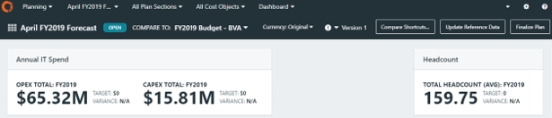
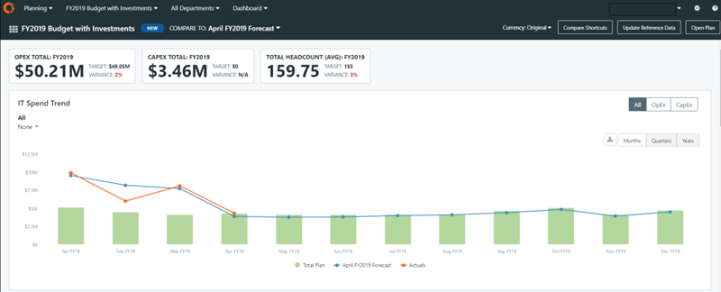
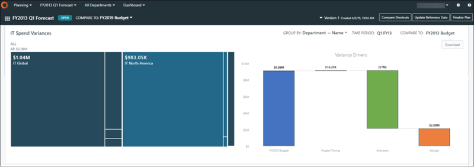
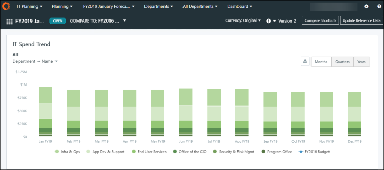
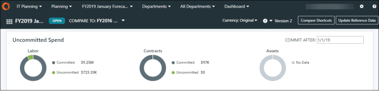
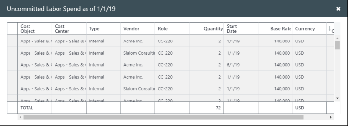
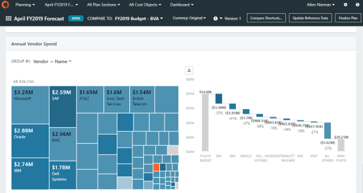

# Monitor key performance indicators on the Dashboard

The Dashboard provides an at-a-glance, yet comprehensive view of key plan performance
indicators. Specifically, the Dashboard shows actuals performance against budget, and current
forecast against the budget for the year and year to date. This consolidated view summarizes the key
elements and current planning state.

Note: The Dashboard must be made visible in the interface. See [Edit the Company Profile](edit-company-profile.html "The Company Profile allows Admin and Budget Process Owner users to configure application-wide settings that customize the display, enable or disable features, and define workflow behavior across Apptio Planning."). Once that is done, the Dashboard is
accessible by all users. The content of the Dashboard is limited. However, it is based on the user’s
role permissions.

The Dashboard's content is populated by a selected plan. Comparisons, when available, are against
the Compare To: selected plan.

## Open the Dashboard

1. In the plan menus at the top right, select a plan, a Cost Object category, and a cost object or
   cost object group.

   [Learn more about
   navigating in Planning](navigate-apptio-planning.html)
2. Navigate to Planning > Dashboard.

## Dashboard elements

Key Performance Indicators (KPIs) - The following three KPIs appear at the top of the
Dashboard. Only direct transaction type values are included. Variance is calculated against a
Target, if set. See [Set
financial targets](set-financial-targets.html). The KPIs include the following:

- OpEx Total for the year of the plan
- CapEx Total for the year of the plan
- Average Headcount for the year of the plan

IT Spend Trend- Graphs the selected plan and available actuals for the current year against the
selected Compare To plan. Use the quick filter to toggle between All, OpEx, and CapEx values.

TIP: Click on a bar to see line-item details. The KPIs can be shown by months, quarters,
and years, and downloaded.

IT Spend Variance - Charts the variance drivers discovered by Cost Center Owners and
identified as part of variance analysis. Summary by variance driver is cascaded from the original
budget to the actuals. You can drill down using the tree control, similar to other planning charts.
Use the Download button to export a .csv file of all variance driver information captured, including
free-form text entries.

Annual Labor Plan - Graphs the labor headcount identified in the selected plan against a
trendline of the Compare To: plan. You can group or pivot the data by multiple dimensions, such as
Cost Center > Code, or Department > Code.

Tip: You can click on a bar to see line-item details and download the data.

Uncommitted Spend - Charts potential cost savings in future periods by spend category in
donut charts. The calculation is based on the default Commit After input date:

- For a forecast plan, the input date is the first day of the forecast start month if that day is
  in the first year of the plan. Otherwise, it is treated like a budget plan.
- For a budget plan, today's date if it is in the first year of the plan. Otherwise, the first day
  of the first year of the plan.

Calculations for each donut chart value are as follows: the Start Date values for each
item in the following list are found on the corresponding tab of the Expenses page.

For example, Labor Item Start Date is found on the Expenses view, Labor tab.
If the Streamlined Labor Planning Experience is enabled in the Company Profile, the values
can be found on the Expenses page, Activities tab. See [Edit the Company Profile](edit-company-profile.html "The Company Profile allows Admin and Budget Process Owner users to configure application-wide settings that customize the display, enable or disable features, and define workflow behavior across Apptio Planning.").

- Uncommitted Labor Spend - Sum of financial line items where the Labor Line Item Start
  Date is greater than or equal to the input date.
- Uncommitted Contracts Spend - Sum of financial line items where the Contract Line Item
  Start Date is greater than or equal to the input date. Note that sophisticated handling of contract
  extensions is currently excluded and contracts that are extended past their listed end date are
  considered committed.
- Uncommitted Assets Spend - Sum of financial line items where the Asset Line Item Purchase
  Date is greater than or equal to the input date.

Click a donut slice value to display a detailed line-item table associated with that value. These
details allow you to identify specific opportunities for cost savings from within your plan.

Annual Vendor Spend - Charts planned vendor spend (where the vendor value is not null),
comparing the selected plan against the Compare to: plan. Selected Group By is cascaded in the
Waterfall chart from compare to selected.

