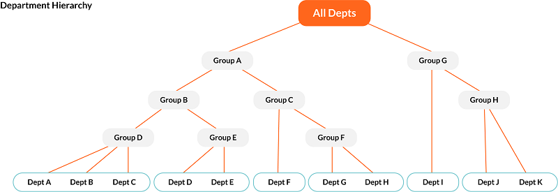

# Review, approve, or return plans or Cost Objects

Watch this video from Apptio Education Services: [Checking Status,
Approving, or Returning Plans](https://community.apptio.com/videos/1616 "(Opens in a new tab or window)")

When Department Owners, Business Unit Owners, and (if enabled) Project Owners, or Service Owners
submit their plan or forecasts for their respective Cost Objects, the submitted plans are
immediately visible on the All Plan Sections pages. See [Edit the Company Profile](edit-company-profile.html) and [Submit a plan or forecast](submit-plan-forecast.html "After you enter your plan or forecast information, you can submit it for approval. The budget owner can submit their plan from the Status or the Expenses page.") for
more information. Owners can then review the Cost Center plan and approve it or return it to the
budget owner for further work.

## Approval process

The Cost Object Permissions dimension determines who can perform actions with Cost Objects. See
[Manage Cost Object Permissions
reference data](manage-cost-object.html) for more information. The Cost Object Permissions edit levels include the
following:

| Edit Level | View | Edit | Submit | Approve | Reject |
| --- | --- | --- | --- | --- | --- |
| Owner | Yes | Yes | Yes | Yes, if the Owner is at a Group Cost Object | Yes, if the Owner is at a Group Cost Object |
| Edit and Submit | Yes | Yes | Yes | No | No |
| View Only | Yes | No | No | No | No |

If Permissions are granted at a group cost object level, all permissions apply to any child Cost
Objects.

Note: Admin and Budget Process Owner role have "Owner" edit level at the highest level of the
hierarchy even if they are not listed in the Cost Object Permissions hierarchy. Users must have at
least the Cost Center Owner role to have Owner or Edit & Submit edit levels.

Example

If your department hierarchy includes multiple levels, you may want to flatten the approval
workflow. You can configure the approval hierarchy to skip certain levels, so that the departments
within the node you skip will roll up to the next-level owner. In the following image, Group E,
Group F, and Group H are "skip" nodes. The departments within those groups would be approved by the
next level owner: plan for Department D and Department E would be approved by the owner of Group
B.

## View and manage submitted plans

Cost Center Owners can approve or reject plans at any time. If multiple users are assigned as
owners, only one user needs to approve plans. If a higher-level owner approves a plan, lower levels
are then auto approved.

1. In the plan menus at the top right, select a plan, a Cost Object category, and a cost object or
   cost object group.

   [Learn more about
   navigating in Planning](navigate-apptio-planning.html)
2. Navigate to Planning > Status. Select Include View-Only Cost
   Objects to include Cost Objects with view-only permissions.

   Note: The Enforce View
   Permissions option must be enabled. See [Edit the Company
   Profile](edit-company-profile.html).

   From the Status view, users can submit, approve, and return the cost
   objects. There are two ways to perform those actions:
   - Actions column - In the Status view, in the Actions column, in a row of a cost object or a group
     cost object, select Approve, Return, or Submit.

     These actions can be performed from the leaf cost
     object level and the group cost object level. When an action is performed at the group cost object
     level, both leaf cost object and group cost object are updated.

     [Read more about how certain actions affect leaf and group cost
     objects](#ReviewapproveorreturnplansorCostObjects__ApprovalHierarchyActions)
   - Bulk actions – In the Status view, in the first column, select cost objects using the
     checkboxes. From the Actions dropdown above the table, select Approve Selected, Return Selected, or
     Submit Selected to perform bulk action on the selected cost objects.

     Group level cost objects are
     not affected by the bulk actions.
   - To submit plans to the budget owner or Cost Center Owner, select the items, select Actions, and
     select Submit Selected. You can also select Submit in the row for each individual line item.
   - To approve plans, select the items, select Actions, and select Approve Selected.
   - To request the budget owner or Cost Center Owner to modify a submitted plan or plans, select the
     items, select Actions, and select Return Selected.

When all budgets are submitted, select Finalize Plan.

Note:

- If multiple users share the same approval level, only one needs to approve plans.
- If a higher-level owner approves a plan, lower levels are automatically approved.

## Approval Hierarchy Actions

Note: Submitting at the group level will result in auto-approving all child cost objects, even
if the submitter does not have explicit approve permission.

The following table describes the Actions and the resulting behavior in Status for Cost
Objects:

| Action | Behavior at Leaf Cost Object | Behavior at Group Cost Object |
| --- | --- | --- |
| Submit | Marks the Cost Object as "Submitted"  Creates a new non-editable snapshot of the submitted Cost Object  Locks current Cost Object lines from being edited | Marks all child leaf Cost Objects as "Approved"  Creates a new non-editable snapshot of all child leaf Cost Objects  Any Child leaf Cost Object already in Approved Status will be unaffected |
| Approve | Marks the Cost Object as "Approved" Note: Only leaf Cost Objects in "Submitted" status will have this option | Marks the Group Cost Object as "Approved" Marks any child leaf Cost Object in "Submitted" status as "Approved" |
| Reject | Marks the Cost Object as "Rejected"or "Returned" Note: Only leaf Cost Objects in "Submitted" or "Approved" status will have this option | Marks the Group Cost Object as "Rejected" or "Returned"  Any child leaf Cost Object in "Submitted" or "Approved" status will be unaffected, unless the cost object owner decides otherwise. |

## Snapshots

A snapshot is a non-editable copy of a line item in an open plan. Users can compare a plan to a
snapshot.

A snapshot is taken automatically when one of the following occurs:

- A plan is submitted.
- The status of a plan changes from New to Open.

You can use snapshots when comparing plans.

See [Compare versions or
plans](compare-versions-plans.html)

When a snapshot is being taken at the cost object level, that cost object cannot be edited.

## Take a snapshot manually

1. Open the left-hand navigation pane and select Planning > Plans.
2. From the Plans list, select a plan.
3. In the top-right corner, in the section menu, select a cost object category.

   
4. In the top-right corner, in the sub-section menu, select a cost object.

   
5. Select a line-item table view.

   
6. From the snapshot dropdown, select Save Snapshot.

   
7. Enter the name of the snapshot.
8. Select Create.

## Access snapshots

1. Open the left-hand navigation pane and select Planning > Plans.
2. From the Plans list, select a plan.
3. In the top-right corner, in the section menu, select a cost object category.

   
4. In the top-right corner, in the sub-section menu, select a cost object.

   
5. Select the snapshot dropdown.

   
