# 2025 Release Notes

## Release 5.14 Sandbox: December 22-26, 2025 | Main: December 29, 2025 - January 2, 2026

**Forecast Plans Now Support More Actual Periods**

Forecast Plans now offer greater flexibility when working with actuals. Previously,
Forecast Plans were limited to a maximum of 12 actual periods, regardless of the plan’s
overall duration. With this update, Forecast Plans can include all available actual periods
within the plan timeframe, enabling more accurate historical context and better forecasting
over longer planning horizons.

For more details, see the help documentation on [Creating Plans](https://www.ibm.com/docs/en/SSKZJE8/it-planning/planning/create-plan.html "(Opens in a new tab or window)").

**Plan Import API**

We have introduced Plan Import APIs that allow programmatic import of plan data within
Apptio Planning. These APIs enable automated ingestion of plan data from third party tools,
automation scripts, and other systems by providing a standardized way to import plans.

**Key Capabilities**

- **Import plan expense data:** The POST endpoint imports plan data for all supported
  expense types (such as Labor, Labor Activity, Contracts, Assets, and Other) using either
  the Update or Replace option.
- **Export plan import error help file:** The GET endpoint exports a help file in CSV
  format that contains plan data import errors, enabling users to analyze and troubleshoot
  import failures.

For more details, see the help documentation [Plan APIs](https://www.ibm.com/docs/en/apptio-commercial/planning-standard/saas?topic=apis-plan-api "(Opens in a new tab or window)").

**Bug Fixes** 

- Added an option to automatically refresh the Apptio Costing Integration Status page
  when updates are available, eliminating the need for manual page refreshes.
- Fixed an issue where plan comparison variances were not displayed, even when the user
  had identical permissions across both plans.
- Updated help text in the finalize plan dialog to clearly communicate expected behavior
  once plan is finalized.

## 5.13.2 - All Environments: December 24, 2025

Plan-Level Access Control: Bulk Publish Enhancements

We’ve improved Plan-Level Permissions to make it easier for administrators and Budget
Process Owners to manage and apply user permissions across plans.

**What was the issue**

Previously, managing permissions at the plan level did not have an efficient way to publish
those permissions across all plans or sync them back to global Cost Object Permissions. This
often required manual updates, increased the risk of inconsistencies between plans, and made
it difficult to ensure users had the correct access at scale.

**What’s improved**

Admins and Budget Process Owners can now select one or more permission rows from Plan
Settings > User Permissions and publish them in bulk to all plans or to Reference Data. From
the overflow menu, select:

- **Publish selected permissions to all plans**
- Applies the selected user permissions across all plans
- Existing permissions for matching users and departments are updated.
- Permissions for new users in matching departments are added.
- **Publish selected permissions to reference data**
- Publishes the selected permissions to Cost Object Permissions reference data, keeping
  global permissions in sync with plan-level changes.

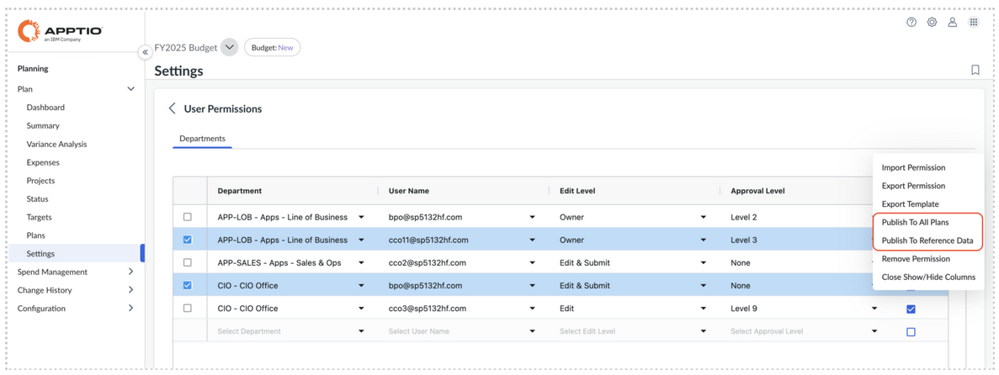

## 5.13 - Sandbox: December 8-12, 2025 | Main: December 15-19, 2025

**Extended Planning Horizon: Now up to 10 Years**

You can now create plans that span up to 10 years, expanding from the previous maximum of
6 years. This enhancement provides greater flexibility for long-range strategic financial
planning, multi-year investment forecasting, and scenario modeling.

**What’s
Changing?**

- You can now select a plan length of **up to 10 years** when creating a new plan.
- All Expenses views, Summary charts, and Plan-to-Plan comparisons fully support the
  extended 10-year timeframe.
- Additional layout options for controlling month, quarter, and year granularity in the
  Expenses table will be available in an upcoming release.

  For more details, see
  [Creating Plans](../planning/create-plan.html).

**Edit External Lines** 

Managing external line items is now much easier with
full in-product editing capabilities—no more exporting, modifying offline, and
reimporting.

**What’s New**

- **Edit or delete external lines directly in the UI** from **Expenses → New
  View**, without using the export/import workflow.
- **Available to users with the ExternalLineEdit permission**, included by default
  for Admins and Budget Process Owners.
- **Enable edit mode** for a single external line or for all external lines at once
  for faster, more efficient updates.
- **Delete external lines individually or in bulk**, removing the previous
  restriction that required deleting all lines at once.
- **Import External Line**remains available for adding new external line items.

  For
  more details, see [External Line Items](../planning/ext-li.html "External Line Items allow you to manage plan data that originates from external systems and bring it into Apptio Planning for visibility and analysis — without allowing end users to edit it.").

**Plan APIs** 

We have introduced new **Plan APIs** that allow
programmatic access to plans and plan data within Apptio Planning. These APIs enable
deeper integrations with BI tools, automation scripts, and downstream systems by providing
a standardized way to retrieve plans and export plan expenses.

**Key
Capabilities**

- **Retrieve all plans available to a user** - Use the new GET
  /planning/api/v1/plans endpoint to fetch a list of plans the authenticated user can
  access, including plan IDs and names.
- **Export plan expense data via API** - The POST
  /planning/api/v1/plans/{planId}/expenses/export endpoint allows exporting plan data
  (Summary, Labor, Contracts, Assets, etc.) in CSV format for external processing.

  For
  more details, see [Plan APIs](../planning/plan-api.html "The Apptio Planning REST APIs provide secure, programmatic access to plans, planning data, metadata, and related artifacts within Apptio Planning. These APIs are designed to support automation and system integrations for planning, forecasting, analysis, governance, and data exchange use cases.").

**New Company Profile UI**

The updated design introduces a cleaner, more intuitive design that organizes settings by
feature area, helping you more easily navigate various configurations, easily discover
features and capabilities to be enabled or disabled.

**Bug Fixes** 

- Fixed an issue where text in the Bookmarks dropdown was not fully visible.
- When the View Updated toggle is enabled, the Last Updated and Modified By columns are
  automatically shown and pinned to the left-hand side for better visibility.
- Fixed an issue that caused plan creation to fail when uploaded data exceeded character
  limits. Data that goes beyond the allowed limits is now automatically truncated, and a
  warning message is shown so users can decide whether to continue with the upload.

## 5.12 - December 1, 2025

Plan-Level Access Control 

Apptio Planning now supports
Plan-Level Access Control, enabling administrators to manage user access per plan. This
enhancement provides greater flexibility and security by ensuring that visibility and
editing rights are defined at the individual plan level.

**What's Changing**

1. **New Plan-Level User Permissions Page** - Each plan now includes a **User
   Permissions** page within Plan > Settings. Administrators can grant access to specific
   Departments directly at the plan level—replacing the previous reliance on global Cost
   Object Permissions. The new plan-level User Permissions page also includes search and
   filtering for easier management. Updates to User Permissions will be recorded in Change
   History.
2. **Global Cost Object Permissions Now Serve as a Template** - Global permissions no
   longer drive access automatically. Instead:
   1. **New Plan (No Baseline):** Global Cost Object Permissions are copied into the
      plan at creation.
   2. **New Plan (With Baseline):** User Permissions from the baseline plan are copied
      into the new plan.

   Important:
   - Users must now be granted access **explicitly at the plan level**.
   - Global Cost Object Permissions alone will *not* provide access to plans.
   - In a future release, we will add an option to copy permissions from either
     Global Cost Object Permissions or the baseline plan when creating a new plan.

   To bulk apply existing global permissions to a plan, admins can:
   1. Export from global Cost Object Permissions (Configuration > Cost Object
      Permissions)
   2. Import the CSV into the plan’s User Permissions page (Plan > Settings > User
      Permissions)

   An automated syncing option between global Cost Object Permissions and
   plan-level User Permissions will be delivered in an upcoming release.

**Comparison Behavior**

- If a user lacks access to the same Departments in both plans being compared, data for
  restricted Departments will be obfuscated (eye icon shown).
- For Expenses > Labor sensitive data fields, comparisons will only display values when
  the user has access to sensitive data in *both* plans.

**Upgrade Behavior**

- Existing plans will retain their current access.
- During upgrade, plan-level permissions will be automatically populated based on
  current Cost Object Permission settings.

For more details, see the Help Documentation on [Cost Object Permissions](../planning/manage-cost-object.html).

Hyperlink Fields 

You can now create custom columns of type
Link in Apptio Planning, allowing you to attach URLs—such as Jira tickets, documentation, or
external resources—directly to your line items for quick navigation.

- Add Link-type columns in your Schema configuration.
- Clicking a link opens it in a new browser tab.
- Link fields are fully supported in the New View and appear as read-only in the Legacy
  View.

This enhancement helps you keep external references tied to your planning data for
easier tracking and faster navigation. For more details, see the Help documentation on [supported attribute types](../planning/manage_schema.html "Schemas define the structure of data in Apptio Planning. They specify the tables, fields, and relationships that determine how information is stored, linked, and surfaced across Expense tabs such as Labor, Contracts, Assets, and Financials.").

Bug
Fixes 

- Fixed an issue where the Contract Extension Start Date in the New View began on the
  Contract End Date instead of the following day.

## 5.11 - November 17, 2025

Improved Department and Project Dropdown

It’s now easier to navigate plans with new dropdown enhancements.

**Department Dropdown:**

- Multi-select departments across hierarchy levels
- Edit expenses across multiple departments at once (when multi-select is used)
- Edit expenses for all owned departments from the “All Departments” view
- Clear visual indicators for view-only departments
- See group-level counts of departments at a glance

**Project Dropdown:**

- Expand or collapse project hierarchies for faster navigation
- New “Blank Value” option in the Project dropdown to filter non-project expenses
- Clear visual indicators for view-only departments
- See group-level counts of projects at a glance

Plan Comparisons Now Supported for All Years (Including 6-Year Plans)

We’ve removed a previous limitation that prevented adding plan comparisons to plans with a
6-year duration. You can now add comparisons across all years in your plan — including
6-year and multi-year plans.

Expanded Custom Dimension Capacity

You can now define up to 40 custom dimensions, an increase from the previous limit of 13 —
giving you significantly more flexibility to model and segment your data.

New View Enhancements

**Workflow Actions Moved to Top-Level UI**

In the New View, the Submit, Approve/Return, and Open/Finalize actions are now accessible
directly from the Expenses page, rather than being located in the ellipsis menu.

**Duplicate Multiple Rows in New View**

You can now select and duplicate multiple rows at once in the New View.

- Use the checkbox selection to pick multiple rows.
- Click the Duplicate icon to copy them.
- Duplicated rows are inserted directly below the originals, with all values copied
  except system-generated fields.

This enhancement makes it faster and easier to replicate multiple rows, saving time, and
reducing manual effort.

Bug Fixes 

- Plan folders in the Plan menu now default to a collapsed state.
- Fixed an issue that prevented empty Plan Folders from being deleted.
- Fixed an issue where dropdowns in the New View required a double-click to expand. The
  dropdown carat now expands with a single click, consistent with Legacy View behavior.
- Fixed an issue where the Duration field in Contracts displayed an incorrect value. It
  now correctly shows the contract duration in months, with two decimal places.

## 5.10 - October 27, 2025

Tag Plans as “Active”

Admins can now [tag plans as Active](https://www.ibm.com/docs/en/apptio-commercial/planning-standard/saas?topic=plans-tag-as-active "(Opens in a new tab or window)") to easily identify and
prioritize the most important plans.

- **Mark Active:** Tag plans as Active when creating a new plan or from the Plans
  page.
- **Easier Navigation:** Active plans display with an “Active” tag and always appear
  at the top of the Plan dropdown menu.
- **User Defaults:** When logging in, users are defaulted to an Active plan (if
  multiple exist, the most recent one is selected).
- **Archived Plans:** Archived plans cannot be marked Active; if an Active plan is
  archived, its tag is removed automatically.

This makes it faster and easier to find and work with the plans that matter most.

View Updated Line Items Now Supported for Group Department Views

The View Updated Line Items feature has been enhanced to support scenarios where users are
viewing Group or multiple Departments simultaneously.

Previously, the View Updated Line Items option only worked when viewing a single
department. With this release, the feature now functions when grouped departments are
selected, allowing users to identify changes across a broader scope.

New View - Comparisons Added to Contracts, Assets, and Labor
Activity

You can now add comparisons in the Contracts, Assets, and Labor Activity tabs using the New
View.

Previously, comparisons were only available in the Summary, Labor, and Other tabs. With
this enhancement, you can now analyze and compare data across all tabs, giving you a more
complete view of your plans and enabling deeper insights into cost trends and variances.

New View - Filter Menu Search Behavior Improvements

We have improved how the filter menu behaves when users perform a search to make filtering
more intuitive and aligned with common spreadsheet behavior (e.g., Excel). Previously, when
entering a search query, all items—including those that didn’t match the search—remained
selected by default. This often caused confusion and unexpected filter results.

**What’s Changed**

- **Smarter Search Filtering:**When a user types a search query in the filter box,
  Select All is automatically cleared, and only the items that match the search remain
  selected. To select all matching results, use the Select All Search Results option.
- **Accurate Selection Behavior:**Any changes you make after searching — such as
  checking or unchecking items — will now apply only to the items currently visible in the
  results. If desired, you can choose **Add current selection to filter** to add the
  new search results to your existing applied filter.
- **Empty Selection Handling:** Deselecting all items will now correctly display an
  empty result set.
- **Clear Search Reset:** Clearing the search query restores the full list with all
  items selected by default.

Bug Fixes 

- Fixed an issue where adding plan comparisons caused an error for customers using
  13-period calendars.
- Fixed an issue where date inputs in the New View were always enforced in MM/DD/YYYY
  format, ignoring the user’s locale setting. Date fields now correctly follow the user’s
  regional date format.
- Fixed an issue where filtering by Account Category Name did not return correct results
  when multiple Account Categories shared the same name.
- Resolved an issue where the system failed to display a warning message when required
  data was missing in a hidden column marked as a mandatory field.

## 5.9 - October 6, 2025

New View - Edit While Grouped in the Expenses Table

You can now add, delete, and duplicate rows in the New View even when it’s in grouped mode.
Previously, grouping limited editing actions, requiring you to ungroup before making
changes. With this update, you can edit directly in grouped mode, making it faster and more
efficient to manage your expenses without disrupting your workflow.

Bug Fixes 

- Fixed an issue where the line item filter displayed both Code and Name values when
  they were identical. The filter now shows only the Code in the options list if the Code
  and Name are the same.
- Fixed an issue where custom attributes configured as *Numeric* did not display
  totals in the Total row. The Total row now correctly aggregates and displays values for
  Numeric type dimensions.
- Resolved an issue where updating reference data in a plan could unintentionally remove
  existing variance drivers and explanations.
- Fixed an issue where custom attributes of type *Date* did not respect the user’s
  Locale setting. Date values now display in the correct format based on the configured
  Locale.
- Fixed an issue where the New View allowed users to enter more than 255 characters in
  the External Code field. Although the field saved, it would subsequently throw an error.
  External Code is now correctly limited to 255 characters.
- We fixed an issue where importing data into the Labor Activity tab sometimes flagged
  resources as duplicates when they were assigned to multiple cost centers. The root cause
  was that the import process evaluated Resource before Project Labor Role and Resource
  Cost Center, unlike the manual UI entry sequence. The import process now follows the
  same sequence as the UI, ensuring consistency and preventing false duplicate errors when
  a resource is associated with multiple cost centers.
- Corrected an issue where clicking the empty space between filter options did not
  properly select the nearest value to the mouse click.
- Fixed an issue where comparisons between a budget plan and a forecast plan failed to
  load and resulted in an error.
- Resolved an issue where the Summary page failed to load when a Group By option was
  applied.
- Fixed an issue where the Unlock button was not displayed for admin users at the leaf
  department level.
- Fixed an issue where expanding a group with an empty/null value in Planning hid its
  line items. Line items now display correctly when grouped by a column that contains
  blank values.
- Resolved an issue in Variance Analysis where expanding Cost Object groupings did not
  load as expected.

## 5.8 - September 22, 2025

**Plan Folders** 

Keep your workspace organized as the number of plans
grows. With Plan Folders, you can group related plans, streamline navigation, and manage
them more efficiently.

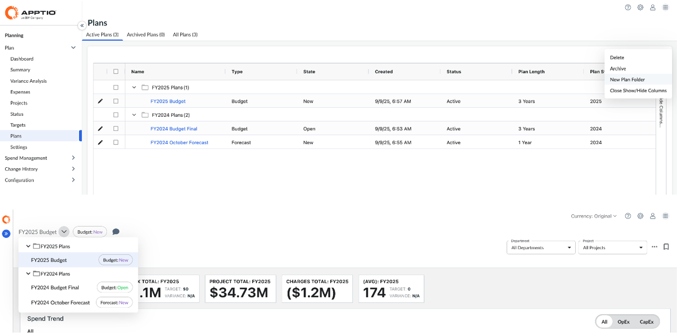

**Key
Features:**

- Admins can create a simple, one-level folder structure to group plans
- Plans and folders automatically sort alphabetically for easier navigation
- Archive, unarchive, or delete entire folders (with all their plans) in one action
- The folder structure is now reflected in the Plan dropdown throughout the app

**Make Currency Field Read-Only**

The Currency column in the Expenses
table can now be configured as Restricted Access from the Schema. When enabled, only users
with the **EditRestrictedDimensions** permission can modify currency values for line
items.

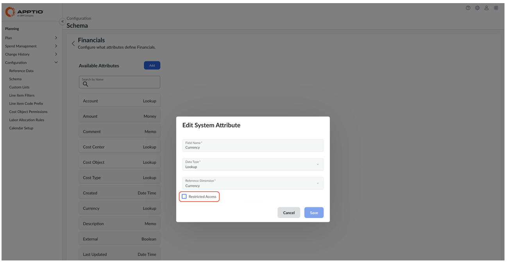

**Update Actuals Data – Multi-Month Selection**

Refreshing actuals is
now more flexible. In the Update Actuals Data modal, you can:

- Use the multi-select dropdown to choose multiple months at once
- Quickly select every available month with the new “Select All” option

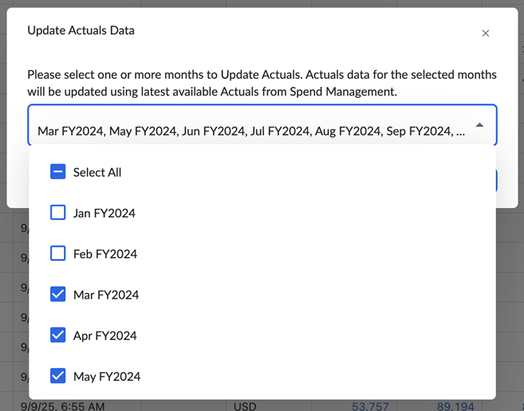

**Add Row in New View**

We have updated how you add rows in the New View
> Expenses table to better align with the old view.

Users can now:

- Add a new line using the empty row at the bottom of the table
- Use the right-click menu actions to insert a row above or below

See required fields highlighted directly in the table, including hidden fields
that must be completed

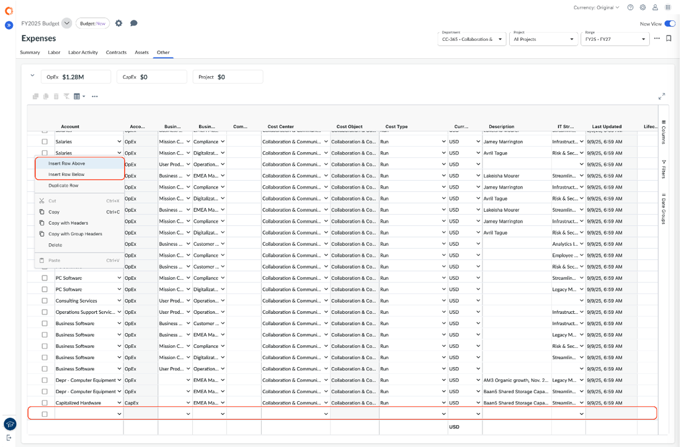

**Bug Fixes**

- Export All now correctly includes Month columns even when they are hidden in the table.
- Percent columns in grouped Expenses tables now display the correct aggregated values
  instead of 0% or NULL. If all rows share the same percentage, the group shows that
  percentage. If rows contain different percentages, the group shows the unique count of
  values.
- Project Names now import correctly when using the Japanese language setting.
- Spend Management now defaults to the current calendar month in the active fiscal year
  when navigating. Previously, tenants with non–Jan–Dec fiscal calendars were not defaulting
  correctly.
- Apptio BI now correctly respects Planning cost object permissions, ensuring users can
  view sensitive financial data (e.g., base compensation) when access is provisioned in
  Planning.
- The Submit All Changes and Finalize button now works as expected. When selected, all
  pending cost objects are automatically approved, and the plan is finalized.
- Fixed an issue where column filters on the Expenses page did not properly account for
  special characters or punctuation in values.

## 5.7 - September 8, 2025

**Code-Based Identifiers for Vendor, Location, Role, and Custom
Dimensions**

Vendor, Location, Role, and custom dimensions will now use Code instead of
Name as their unique identifier.

This change allows names to be updated without
impacting the unique identifier, reducing the risk of data mismatches when names change.

**Impact:**

- **Plan Data Imports:** You must import Code instead of Name for Vendor, Location,
  Role, and custom dimensions. This also applies to datasets that reference these
  dimensions, such as Labor Rates, Labor Allocation Rules, and Expense Line Items.
  - Plan imports will accept Vendor, Location, Role, and custom dimension fields using
    either [Dimension Name] (e.g., Vendor) or [Dimension Name] Code (e.g., Vendor Code).
    Since Code will be equal to Name, existing plan import files will continue to work
    without changes.
- **Plan Data Exports:** When exporting data, Code and Name fields can be exported as
  separate columns when using *Export All* or *Export Layout*. For example, the
  Vendor dimension will export as **Vendor** (for Code) and **Vendor Name** (for
  Name).
  - Note: *Export for Re-Import* will export Code for “Vendor,” “Location,” and
    “Role.”
- **Apptio Costing Integration:** If you are integrating with Apptio Costing via Cost
  Transparency Integration (CTI) or Automated Data Manager (ADM), review and update your
  configuration in Data Studio to ensure the **Code** field is mapped correctly. Plans
  published to Apptio Costing will now export **Code** for Vendor, Location, Role, and
  custom dimensions. If your transformations use these fields, please verify that your
  mappings are accurate.
- **Apptio Costing Datasets:**The out-of-the-box datasets to support integration with
  Apptio Planning have been updated to support code-based identifiers. This update is
  available in Apptio Costing Release r12.11.16.

Note: Existing dimensions will be automatically migrated by copying the current Name
value into the new Code column for Vendor, Location, Role, and custom dimensions, ensuring
existing integration tables continue to function. If a custom attribute named 'Code'
already exists, it will be renamed to 'Code2'.

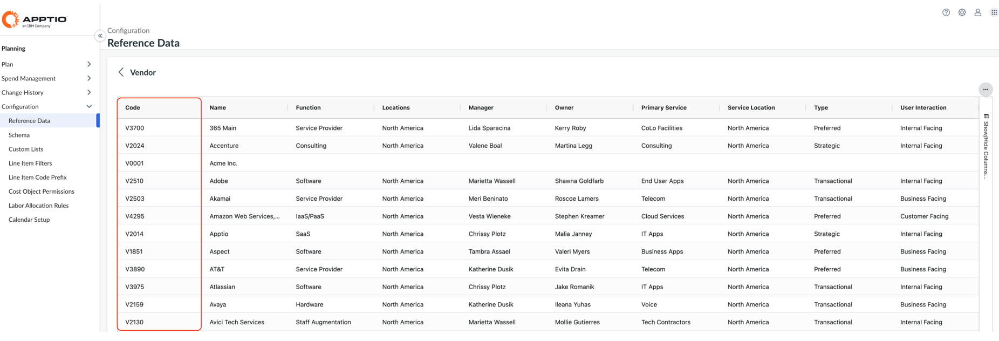

In the Expenses table dropdowns, dimension values will
now be displayed as **Code – Name** (e.g., 'LOC001 – New York'). If the Code and Name are
the same, the dropdown will show only the Code to avoid duplicate values.

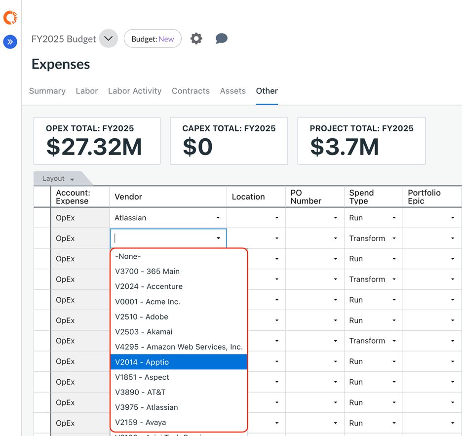

**Improved Grouping in New View**

Grouped columns
appear in a single column with clear hierarchy, totals, and sortable groups. You can also
drag columns into the Group By panel to quickly apply or rearrange grouping.

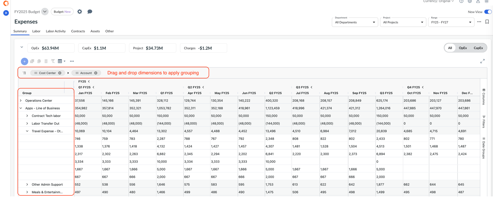

**New In-App Training Guides**

The In-App
Training Hub just got better with two new step-by-step guides:

- **Editing Plans** – Learn how to update and manage expense data in your plans.
- **Comparing Plans and Analyzing Variances** – Discover how to compare plans and
  interpret key differences to drive better decisions.

Access the guides directly within the product—no extra logins or tabs needed.

**Bug Fixes**

- Fixed an issue where Spend Waterfall charts displayed all bars in blue instead of using
  the correct positive/negative variance colors.
- Updated UI logic to only display the Charges KPI on the Summary, Dashboard, and Expenses
  pages when Labor Activity is enabled in the Company Profile.
- Resolved an issue to prevent the automated import of Actuals into Spend Management via
  Automated Data Manager (ADM) when the Actuals period is closed in Spend Management. This
  ensures closed periods are respected, maintaining data integrity during imports.

## 5.6 - August 4 – August 17, 2025

**Upgrade to PostgreSQL**

We are upgrading all Main environments to PostgreSQL as part of the 5.6 release. This
upgrade delivers improved performance, scalability, and long-term platform support. Your
environment will be upgraded on your designated upgrade day during Week 1 (Aug 4–10) or Week
2 (Aug 11–17) of the release window. Upgrades are processed alphabetically, with any
remaining environments completed in Week 2.

No action is required from your team. We recommend validating your core workflows
post-upgrade to ensure everything continues to function as expected.

**What’s Changing:**

- **Backend Migration:** Apptio Planning is moving from the current database to
  PostgreSQL.
- **Improved Performance:** Users can expect faster load times and more responsive
  interactions, especially in large plans.
- **Better Scalability:** The new infrastructure will support larger data volumes and
  growing planning needs.

If you have any questions or concerns, please contact your Customer Success Manager.

Note: Federal customers will be upgraded between August-December.

**Updated Line Items View**

The Updated Line Items View enhances visibility into recent changes across versions, making
it easier for users to review, track, and manage updates efficiently throughout the planning
process. A new toggle on the Expenses page allows users to switch between viewing all line
items or filtered to show only line items updated since the last submission or snapshot. The
Action column indicates the type of change made: New, Updated, or Deleted.

Note:

- Imported line items will be marked as new, with timestamp and username of the user
  who imported the data.
- Generated financials will reflect the last updated values of the source item (e.g.
  labor, labor activity, contracts or assets) that triggered the change.
- Deleted or updated line items due to Update Reference Data and Update Actuals will
  not be included.
- Plans created from a baseline will inherit the Last Updated values from the original
  plan.

This feature makes it faster and easier to spot what has changed, who changed it, and
when—helping teams collaborate and validate plan updates with confidence.

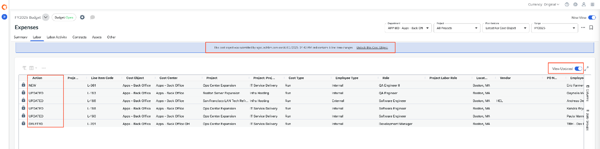

**Multi-Level Approval Workflows**

The new Multi-level Approval Workflow offers a flexible, asynchronous approach to managing
approvals, designed to support more complex planning processes and review chains. This
enhancement allows departments to define unique approval paths and introduces new permission
levels to improve control and collaboration during planning.

**Key Capabilities:**

- **Configurable Multi-Level Routing**
  - Set up custom approval chains for each Department.
  - Define up to 10 sequential approval levels.
  - Each level can include specific users responsible for review and approval.
- **Asynchronous Department Approvals**
  - Departments move independently through their defined approval chains.
  - Enables parallel planning and approvals across teams.
- **New “Edit ” Permission Level**
  - Allows users to make changes to plans without being able to submit them for
    approval.
  - Useful for collaborators or contributors who shouldn’t trigger approval workflow
    changes.
  - “Edit” permission is available for both Multi-Level Approval and Hierarchical
    Approval workflows.

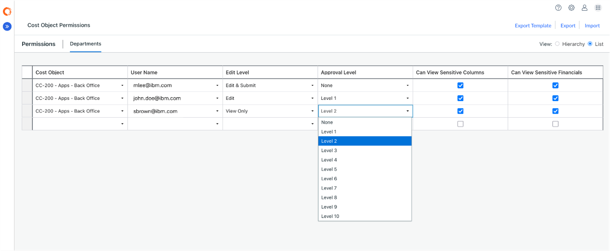

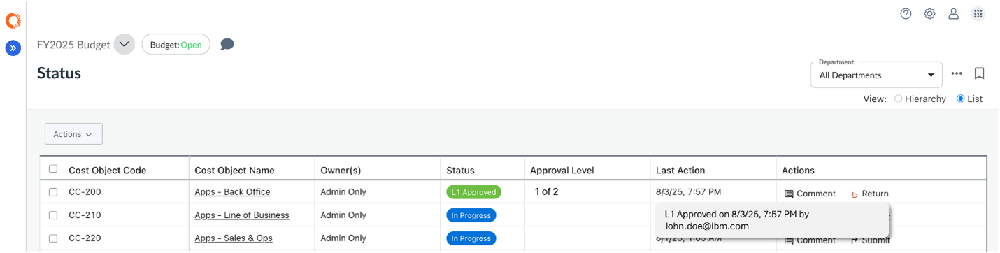

**Comparison: Hierarchical vs. Multi-Level Approval Workflows** 

|  |  |  |
| --- | --- | --- |
|  | **Hierarchical Approvals** | **Multi-Level Approvals** |
| **Approval Path** | Follows the Department hierarchy, progressing level by level through parent Departments. | Custom-defined per Department, with sequential approvals flowing in order (L1 → L2 → L3, etc.). |
| **Approval Levels** | Multiple Owners can be assigned per Department or Department Group, with only one approval required to advance. | Supports up to 10 approval levels per Department. Multiple approvers can be assigned per level, with only one required to approve. |
| **Group Submission** | Supports Group Department submissions, where submitting a Group automatically submits and approves all child Departments together. | Not applicable. |
| **Planning Flow** | Requires synchronous planning and submission (child Departments must submit before the parent Group can advance). | Supports asynchronous planning and review. Departments can submit and advance independently through the approval chain. |
| **Rejection Behavior** | Rejecting sends the plan back one level in the hierarchy. The Owner at each level must continue rejecting to push it down to the leaf Department. | Rejecting a Department sends it back to the beginning of the workflow, requiring the Department to re-submit to Level 1 |
| **Skip Nodes** | Supported by leaving the Owner unassigned at a level, rolling approvals up to the next higher-level Owner. | Not applicable. |
| **User Permissions** | Edit Level Permission: • **Owner:** Can edit, submit and approve or return plans. Receives email notifications when plans are approved or returned.  • **Edit & Submit** – Can edit and submit plans.  • **Edit** – Can edit plans but cannot submit.  • **View Only** – Can view plans but cannot edit or submit. | Edit Level Permissions:  • **Owner:** Can edit and submit plans. Receives email notifications when plans are approved or returned.  • **Edit & Submit** – Can edit and submit plans.  • **Edit** – Can edit plans but cannot submit.  • **View Only** – Can view plans but cannot edit or submit.  Approval Level permission:  • **Approval Level:** Set an approval level (1–10) to define the user’s position in the approval workflow. |

See **[Approval Workflows Overview](../planning/about-approval-workflows.html "Approval Workflows in Apptio Planning control how submitted plans move through review and approval stages, ensuring that plans are routed to the appropriate stakeholders for sign-off. These workflows provide flexibility to align with your organization’s structure and governance process.")** for
more details and configuration instructions.

**Bug Fixes**

- Fixed an issue in the New View where entering text in the Description field on the
  Labor tab resulted in an error and the value was not saved.
- Enhanced full screen mode on the New Expenses page to make better use of the browser’s
  full vertical height.
- Fixed an issue where automatic publishing from Automated Data Management (ADM) to TBM
  Studio failed due to fiscal period misalignment.
- Resolved an issue where users were unable to add values to fields marked as mandatory
  for data entry.

## 5.5 - July 28, 2025

**Decimal Precision Configuration**

Admins can now configure the number of decimal places displayed across Apptio Planning,
with support for up to 8 decimal places. This setting controls how numeric values appear in
the UI for all users.

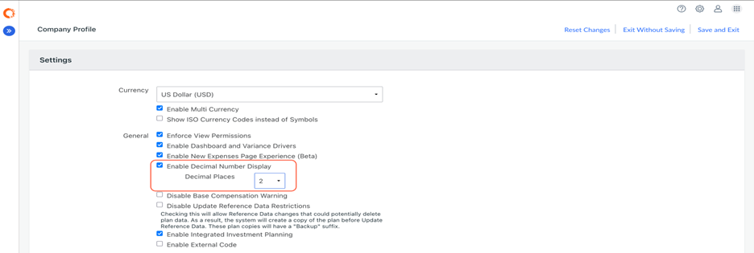

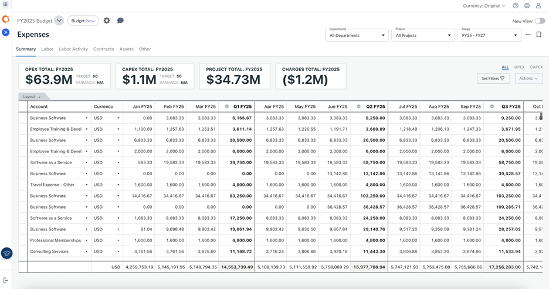

Additionally, users can now specify decimal precision at the time of export for greater
flexibility. All calculations and data storage continue to use full precision regardless of
display settings.

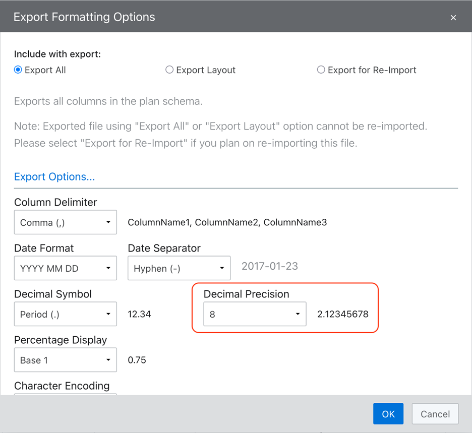

**Bug Fixes**

- Resolved an issue where the Export All feature ignored user-selected export options.

## 5.4 - July 14, 2025

**Maintenance Release**

This release contains system maintenance updates and bug fixes.

**Bug Fixes**

- To improve clarity and usability, we have updated the label of the "Groupings" menu in
  New View to "Date Groups." This change is based on user feedback highlighting confusion
  around finding month, quarter, and year groupings. The updated label better reflects the
  menu’s purpose—making it easier to locate and work with time-based data, including Plan
  Total, Year to Date, and Remaining Forecast groupings.
- Resolved an issue where the Actuals Line Item Dimension for Project Code incorrectly
  references the Cost Object instead of the Project ID/Code.
- Resolved an issue in Planning Apptio BI report where adding filters on Account
  hierarchy results in an Error 500.
- Resolved an issue where numeric values with more than 15 digits were exported to Excel
  as text due to Excel's automatic formatting, leading to incorrect totals.
- Fixed an issue where the Date Range Filter failed to limit grouping by Months/Quarters
  to the selected year, displaying data from all years instead.

## 5.3 - June 23, 2025

Note: This release applies to Postgres Beta customers only.

**Improved Department Dropdown Behavior**

The Department dropdown now dynamically displays only the departments a user has access to, based
on their cost object permissions. This enhancement simplifies navigation and provides clearer
visibility into cost rollups for all departments the user owns.

- Admin users will continue to see the full department hierarchy.
- Non-admin users will see only the departments they have view or edit permissions for.
- Selecting "All Departments" or a grouped Department level will display read-only expense data
  across all departments the user has access to.

**Bug Fixes**

- Resolved an issue where a forecast plan failed to include currency amounts from the "Other"
  Financials tab of the baseline budget.
- Addressed an issue where users were unable to duplicate lines with external codes in the New
  View.
- Fixed an issue where the "Project" filter showed a "Failed to load filters" error in certain
  plans.
- Resolved an issue where the Cost Center field was not auto-populated in the Labor Activity tab
  when selecting a Project without a default cost center. The field should now default to the
  Department's default cost center in such cases.
- Fixed an issue where an error was incorrectly displayed when adding a line item linked to a
  Project with a submitted default cost center. No error should occur in this scenario.

## 5.2 - June 9, 2025

**PostgresSQL Database Migration**

We are upgrading Apptio Planning’s database infrastructure to PostgreSQL, a modern, scalable
platform designed to deliver faster performance, improved reliability, and a more robust user
experience.

**What’s Changing:**

- **Backend Migration:** Apptio Planning is moving from the current database to PostgreSQL.
- **Improved Performance:** Users can expect faster load times and more responsive
  interactions, especially in large plans.
- **Better Scalability:** The new infrastructure will support larger data volumes and growing
  planning needs.
- **Foundation for AI & Automation:** This upgrade enables future enhancements like
  AI-powered forecasting and intelligent workflows.

**Bug Fixes**

- Fixed an issue where the Spend Trend chart on the Dashboard page displayed full-plan actuals
  instead of filtering to only the Projects and Departments the user has access to.
- Resolved an issue that caused Description filter values to overlap visually, making them hard to
  read or select when applying filters.
- Resolved an issue where users without permission to view sensitive data encountered an error on
  the New Expense Page when base compensation was marked as sensitive. With this fix, base
  compensation will be properly hidden for unauthorized users.

## 3.93 - June 3, 2025

Maintenance Release

This release contains system maintenance updates and bug fixes.

**Bug Fixes**

- Resolved an issue where renamed Project dimension in Integrated Investment Planning reverted to
  its default name when published to Apptio Costing.

## 3.92 - May 12, 2025

Attention: This will be the final release before Apptio Planning 5.0.

For details on what’s changing in the release cycle and platform infrastructure, please visit:
[Upcoming Changes to Apptio Planning's Release Cycle and Platform Infrastructure](https://community.ibm.com/community/user/discussion/upcoming-changes-to-apptio-plannings-release-cycle-and-platform-infrastructure "(Opens in a new tab or window)")

**In-App Training Hub**

The in-app training hub is an embedded learning experience built directly into Apptio Planning.
It provides step-by-step, self-paced guidance within the product interface—no separate logins or
external help portals required. Designed to simplify onboarding and support continuous learning, the
guide helps users access the right training at the moment they need it, driving faster adoption and
improved productivity.

Current guides include:

- Apptio Planning Overview
- Accessing Plans
- Basic Expenses Table Operations
- Submitting Plans
- Checking Plan Status
- Comparing Plans
- Reports & Analytics

The in-app training hub is available to **all Apptio Planning users**,
and we’ll continue to expand it with new topics in the future. To know more, see this [video](https://youtu.be/5B-FxNzE_mo "(Opens in a new tab or window)").

Select the Training Hub icon to access the training guides:

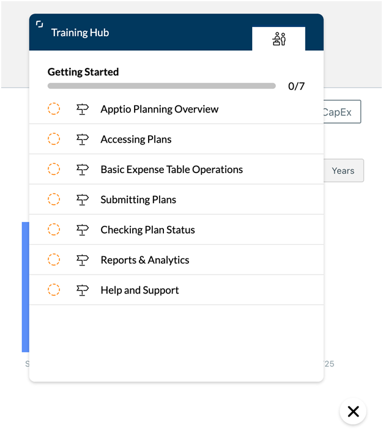

**Now in Beta: Apptio Assistant for IBM Apptio Planning**

We’re excited to introduce the Apptio Assistant—an AI-powered support tool that helps users get
answers to questions about IBM Apptio Planning and related how-tos. This assistant is designed to
enhance the user experience by providing on-demand help, especially for new users navigating the
platform.

The assistant can be enabled for specific users and is ideal for individuals who are new to
Apptio Planning.

**What to Expect as a Beta Tester**

Participants should plan for the following time commitments:

- A 30-minute kickoff call to review the testing program
- ~1 hour to interact with the assistant and ask product or TBM-related questions
- A 1-hour feedback session to share your experience
- Occasional follow-up emails from the Apptio AI team

**Interested in participating?**

Sign up here: [Beta Sign-Up Form](https://forms.monday.com/forms/a4fa2efe897704ff5cbe58649f5d6c1b?r=use1 "(Opens in a new tab or window)")

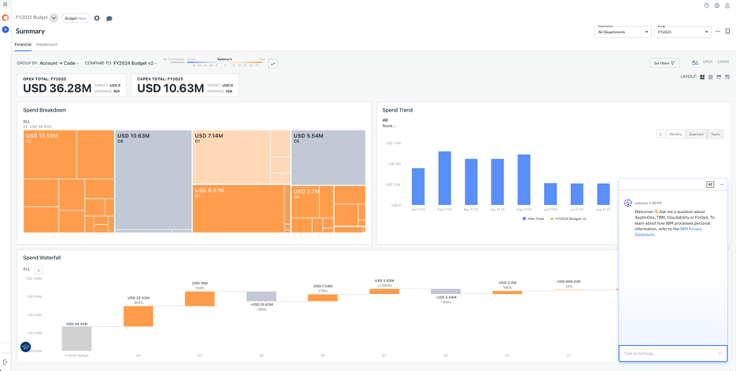

**Bug Fixes**

- Fixed an issue where mandatory fields in the Labor tab were not automatically highlighted.

## 3.91 - April 28, 2025

Enhanced Export Functionality

This release enhances the Export feature by introducing a comprehensive “Export
All” option, allowing users to export all dimensions and attributes in the plan schema.

Key Enhancements: 

- New "Export All" Option: Exports a complete dataset, including all
  dimensions and attributes in the plan schema.
- Renamed Export Options:
  - "Export Layout Only" is now "Export Layout" for
    clarity.
  - Existing "Export All" is now "Export for
    Re-Import", indicating it only includes editable fields required for re-import.
- Tooltips for Clarity: Each export option includes detailed tooltips to
  explain its purpose.

Export Behavior: 

- Export All: Exports the full plan schema, including all dimensions and
  attributes.
- Export Layout: Exports the latest saved layout, including all visible
  columns and filters.
- Export for Re-Import: Exports all editable fields in a format suitable
  for re-importing data.

Note: Publishing plan data through CTI or ADM will continue using the "Export for Re-Import" format
(formerly the legacy "Export All" format). In a future release, plan publishing will be updated to
include the full plan schema.

New "Last Updated" and "Modified By" Columns for Plan Line Items

We've added a Last Updated and Modified By column to all Plan Line Items tables—including Labor,
Labor Activity, Contracts, Assets, and Financials. The Last Updated and Modified By columns shows
the date, time, and username of the last user who edited each line item. The timestamp automatically
adjusts to your locale settings for a personalized experience.

Note: When creating a plan from a baseline, the Last Updated date and
Modified By user information will be carried over to the new plan.

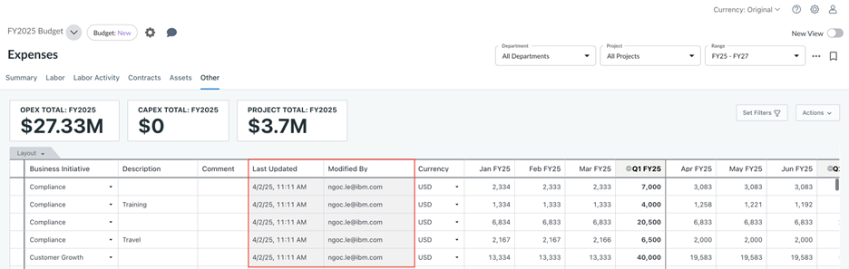

Bug Fixes 

- Resolved an issue where updating actuals in an open plan or creating a plan from a baseline
  incorrectly generated forecast line items with zero financial cost, leading to unnecessary rows.
  Now, only line items with financial values are included.
- Improved the performance of importing Labor Activity plan data when Working Calendar is used.

## 3.90 - April 14, 2025

Maintenance Release

This release contains system maintenance updates and bug fixes.

Bug Fixes 

- Fixed a bug where the Project filter did not work for Admin users.
- Resolved a performance issue affecting the Expenses page loading for users with All Projects
  level permissions in Integrated Investment Planning.
- Resolved a bug where opening a month in Spend Management inadvertently opened multiple months
  and reverted them to "NEW" status.
- Resolved an issue where Variance Analysis displayed incorrect plan variances after changes were
  made to the Department hierarchy.

## 3.89 - March 31, 2025

Export Variance
Commentary

This release adds the ability to export variance commentary as a .csv file directly from the
Variance Analysis report. With this enhancement, customers can efficiently access all variance
drivers and explanations in a structured format. The exported data can be seamlessly integrated into
TBM Studio or other BI tools for deeper analysis and reporting.

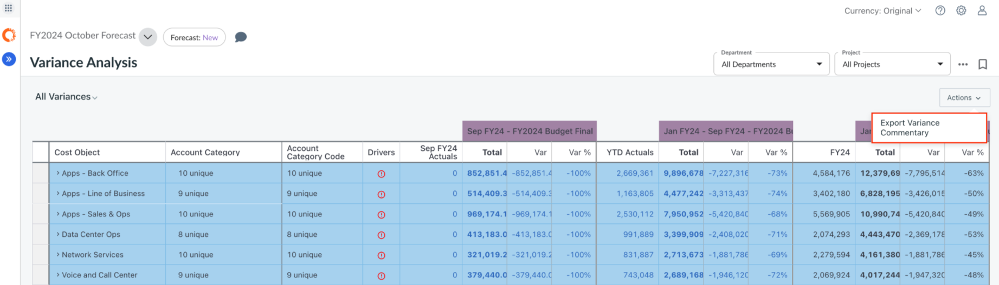

Bug
Fixes

- Resolved an issue in the Expenses view where the revert icon was not visible when Labor > Base
  Compensation was overridden.
- Fixed an issue where Project Actuals data did not update after modifying the project details
  from the Projects list.
- Addressed a performance issue affecting the Expenses page loading for users with All Projects
  level permissions in Integrated Investment Planning.
- Resolved an issue in Variance Analysis where incorrect financial data was displayed for
  non-existent Departments in a forecast comparison.
- Fixed an issue where an error occurred in Variance Analysis when a user provided a variance
  driver without adding a comment.
- Resolved an issue where opening a month in Spend Management inadvertently opened multiple months
  and reverted them to "NEW" status.

## 3.88 - March 17, 2025

Restricted Access Dimensions

This release introduces the ability for Admins to designate specific dimensions as "Restricted
Access", ensuring that only authorized users can modify them. This enhancement helps maintain data
integrity and prevents unintended changes.

Key Enhancements 

- New “Restricted Access” Setting  : Admins can mark specific dimensions as Restricted
  Access in the Edit System Attribute dialog within the Schema.
- Granular Permissions  : Only users with the new EditRestrictedDimensions
  permission can edit these dimensions.

  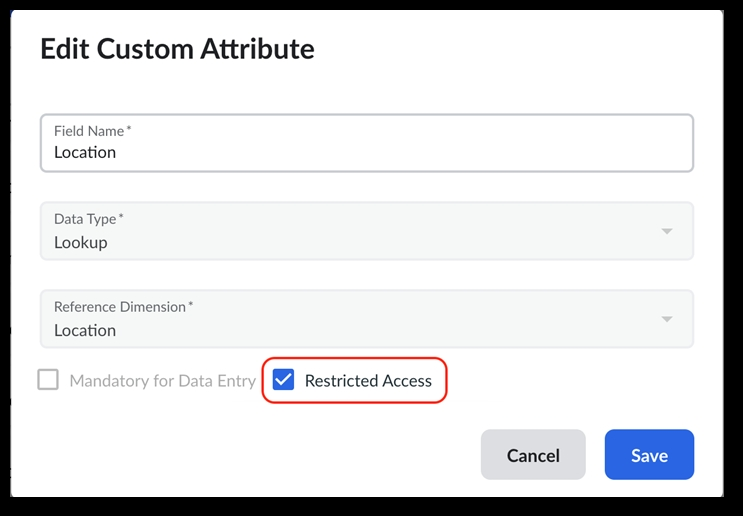
- Read-Only Display  : Users without this permission will see Restricted Access dimensions as
  read-only across the Expenses table.
- New View Tooltip  : A tool tip will appear when hovering over Restricted
  Access fields, indicating that the dimension is read-only.

  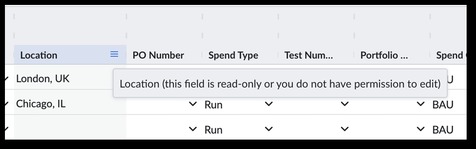
- Import Behavior  :
  - Users with EditRestrictedDimensions permission can import and modify Restricted Access
    dimensions.
  - Users without EditRestrictedDimensions permission will have Restricted Access dimensions
    automatically skipped during import, preserving existing values.
  - A warning message will notify users when Restricted Access dimensions are ignored during import.
- Change History  : Changes to Restricted Access dimensions are tracked in Change History.
- Permissions  : A new  EditRestrictedDimensions  permission has been introduced
  and assigned to Admin and Budget Process Owner roles in Frontdoor.

Enhanced Variance Threshold Configuration with AND/OR Operator

This update introduces an "AND/OR" operation type in variance configurations, giving users
greater flexibility when setting variance thresholds. Users can now choose between:

- AND  – Variance must meet both absolute value and percentage thresholds.
- OR  – Variance must meet either the absolute value or percentage
  thresholds.

  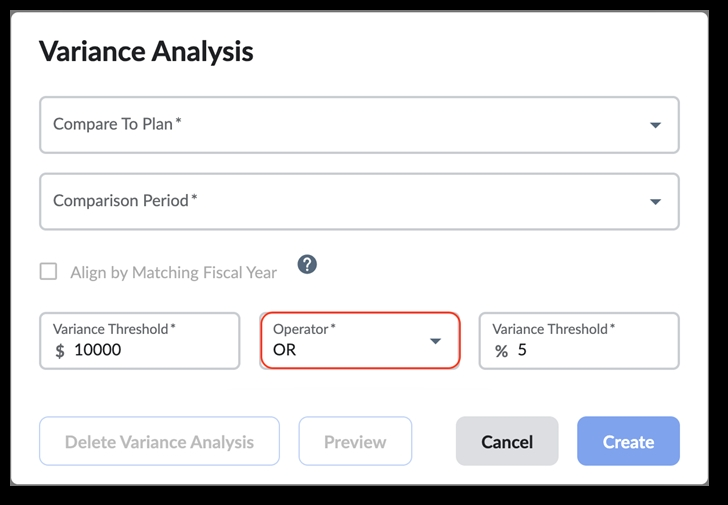

Updated Community Links

Community resource links have been updated to their new locations on the IBM Community platform.

Bug Fixes 

- Exported FTE periodic values are now correctly rounded and limited to two decimal places.

## 3.87 - March 3, 2025

Maintenance release only

This release contains system maintenance updates and bug fixes.

Bug Fixes 

- Optimized the Delegation calculation logic to prevent performance degradation when adding line
  items.
- Resolved an issue in Apptio BI where a user was unable to access the "Planning" data source
  under Data Source Management.
- Removed the duplicate Project dimension in Apptio Costing integration when Integrated Investment Planning is enabled. (Requires Apptio Standard).
- Resolved an issue where date dimensions displayed as NaN when line items were grouped in the New
  View.
- Fixed an issue where Grouping settings in the New View do not persist as expected.

## 3.86 - February 17, 2025

Enhanced Variance Analysis

This release expands variance analysis capabilities, allowing Admin users to compare Forecasts
against plans (Budgets or Forecasts) in Open and New states for any selected time period, such as
full-year variance.

Key Enhancements 

- Users can now configure variance analysis between Forecast and Plan (Budget or Forecast) for
  flexible time periods, enabling more comprehensive financial tracking and planning.
- All active plans in Open and New states are now available in the Compare To Plan dropdown when
  configuring variance analysis. However, please note that Cost Center Owners will not have access to
  view variance analysis when comparing to a plan in the New state.
- The Account Category column has been added to the Variance Analysis table, enabling better
  categorization and tracking of financial data.

  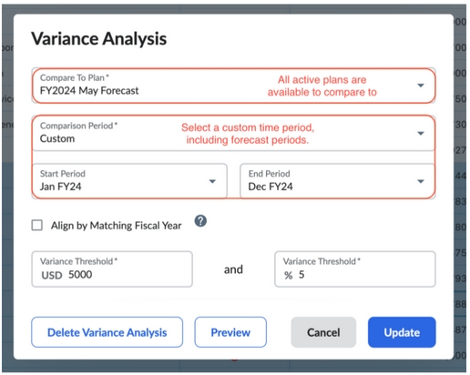
- Previously, variance analysis was limited to Forecast versus Actuals, but this enhancement
  provides greater flexibility to analyze financial performance across different scenarios.

  Note:
  When comparing to  Forecast Periods  , Admin users can select " 
  Update Variance Analysis  " to refresh variance calculations, ensuring variance amounts
  reflect the latest forecast updates. This option is available in the "..." menu on the Variance
  Analysis page.

  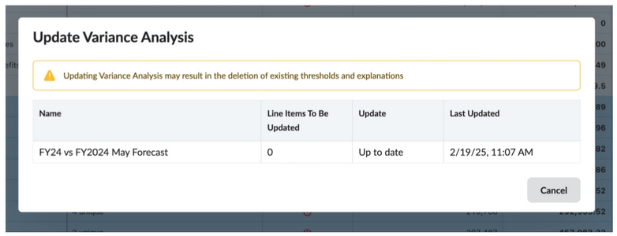

Variable Contract Extensions for External Contracts

We have expanded the Variable Contract Extension Adjustments feature to support External
Contracts, which are used to import contract line items as read-only.

- Set up compounding contract extension adjustments for External Contracts.
- Define unique adjustment percentages for each contract extension.

By incorporating these adjustments, you can achieve more accurate financial modeling, accounting
for factors such as inflation and rate changes over multi-year planning cycles. To know more, see
 [here](../planning/vrbl-cntc-ext-adj.html "Apptio Planning supports extending contracts beyond their original end date — with different capabilities depending on whether you are using the Legacy View or the New View.") .

## 3.85 - February 3, 2025

Remaining Forecast Total in Forecast Plans

This release introduces a new feature in the New View that allows users to toggle the Remaining
Forecast column on or off in Forecast Plans. Remaining Forecast provides a sum of all forecast
periods in the first plan year, offering a quick and consolidated view of remaining forecasted
amounts.

Bug Fixes 

- Fixed an issue where filter settings were not retained when switching between tabs on the
  Expenses page.
- Fixed an issue in Apptio BI reporting where Labor Activity FTE data was incorrectly displayed
  when grouped by quarterly, half-yearly, or yearly intervals. This fix applies to Integrated Investment Planning.
- Resolved an issue where importing Cost Object Permissions did not trigger an error for
  non-existent usernames in Frontdoor.
- Addressed an issue where exported plan data did not adhere to the configured number formatting
  settings.
- Resolved an issue where the Boolean Cost Center attribute value was incorrectly displayed as
  "false" in plan comparisons.
- Fixed an issue where Cost Center is not automatically populating in the Labor tab after creating
  a new line item.
- Fixed an issue where Automated Data Management (ADM) loaded forecast data into the wrong fiscal
  year for fiscal calendars with non-January start dates.
- Fixed an issue where the commenting feature is disabled when using the Japanese Locale
  setting.
- Resolved an issue where the "Contract Type" field was not saved when adding a new row in the
  Contracts tab while using Japanese language settings.

## 3.84 - January 20, 2025

Variable Contract Extension Adjustments

This release introduces the Variable Contract Extension Adjustments feature, providing enhanced
flexibility in modeling contract costs. With this functionality, you can:

- Apply compounding extension adjustment on each contract renewal.
- Extend the contract for a duration less than plan length over current default behavior of always
  extending the contract for the full plan length.
- Set different extension adjustment percentages for each contract renewal.
- Provide comments to support each renewal adjustment

This feature enables more accurate modeling by accounting for specific financial changes, such
as inflation or rate adjustments, across multi-year planning cycles.

Note  : This feature is available only when the New View is enabled.

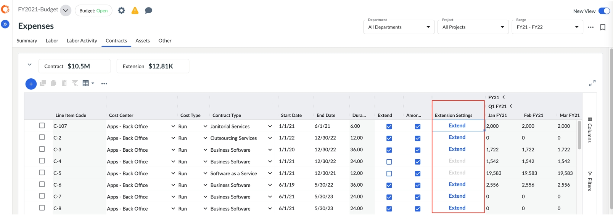

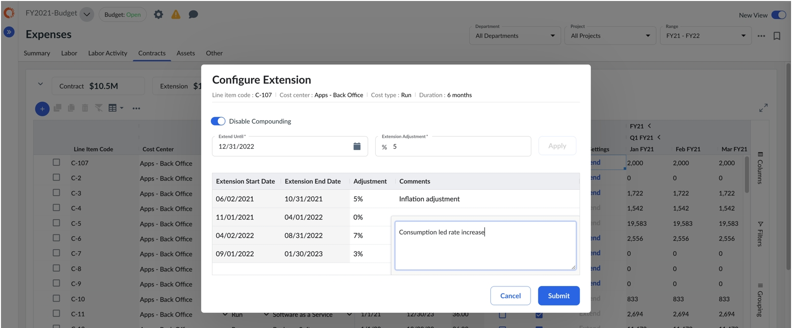

To know more, see [Variable Contract Extension Adjustment](../planning/vrbl-cntc-ext-adj.html "Apptio Planning supports extending contracts beyond their original end date — with different capabilities depending on whether you are using the Legacy View or the New View.")  .

Project Expense KPIs

This release introduces new Project expense KPIs available when Integrated Investment Planning
is enabled, along with tooltips added to all KPIs for improved usability:

- Project Total  : Displays the combined total of operational (OpEx) and capital
  expenditures (CapEx) associated with a project. This is calculated as the sum of financial line
  items where Project ID is not null.
- Charges Total  : Shows the total credits applied from Project Labor Activity expenses,
  calculated as the sum of line items where Cost Type = Charges.

These KPIs are accessible on  Expenses  >  Summary  ,  Dashboard  and
 Summary  pages. Additionally, the  Charges Total  KPI is included in  Expenses
 >  Labor Activity  . With the addition of tooltips, users can now view detailed
explanations for each KPI directly within the interface, enhancing clarity and usability.

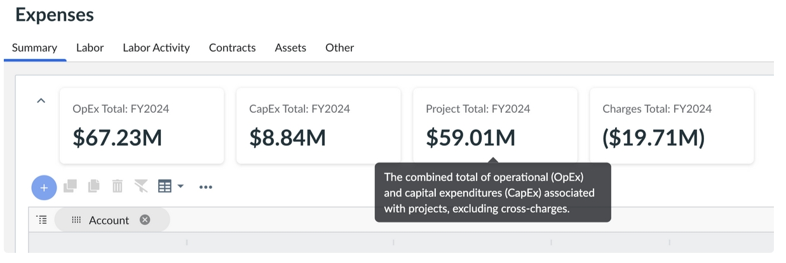

IBM Planning Analytics Integration

We are excited to announce the integration of IBM Planning Analytics with IBM Apptio, enabling
seamless connectivity between these platforms to enhance financial planning and analysis. This
bi-directional integration allows users to unify their planning processes, align financial data, and
drive more accurate, data-informed decisions across their organization.

Key Features  :

- Automatically sync financial data between IBM Planning Analytics and IBM Apptio to ensure a
  consistent view of budgets, forecasts, and actuals.
- Combine Apptio’s IT financial management capabilities with IBM Planning Analytics’ planning and
  forecasting tools for more comprehensive and integrated planning processes.
- Reduce manual effort and errors with automated data exchange, ensuring financial plans are
  always up-to-date.

To enable the IBM Planning Analytics data connectors, refer to the configuration guide linked
below.

[IBM Planning Analytics Integration Configuration Guide](https://www.ibm.com/docs/en/apptio-platform/datalink/saas?topic=connectors-configure-planning-analytics-connection "(Opens in a new tab or window)")

Note  : This integration requires IBM Planning Analytics Software as a Service (cloud).

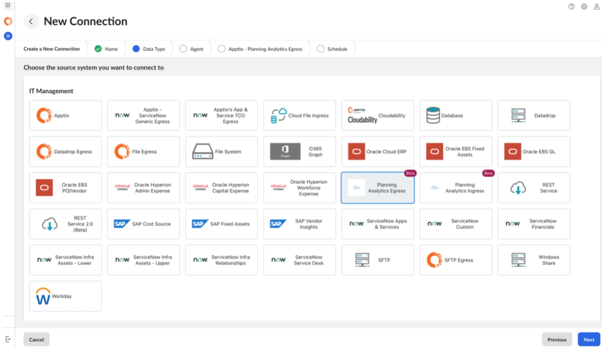

Bug Fixes 

- Resolved an issue where admin users were unable to view columns marked as sensitive after
  assigning cost object permissions with view restrictions.
- Fixed an issue with Forecast Plan baselining, where selecting a forecast start month in Year 2
  caused the baseline plan to fail in copying lines for all years.
- Addressed an issue in  Expenses  > Contracts  , where default values were not
  populated when adding a new contract line with hidden "Start date" or "End Date" dimensions.
- Resolved an issue with Actuals import where providing a project code instead of a cost object
  code resulted in an invalid cost object and cost center mapping error.
- Migrated the  Create Variance Analysis  dialog to the modern user interface. Note: This
  update is purely a visual enhancement with no functional changes.
- Resolved an issue where importing lists with special characters adds unintended double quotes to
  text values.
