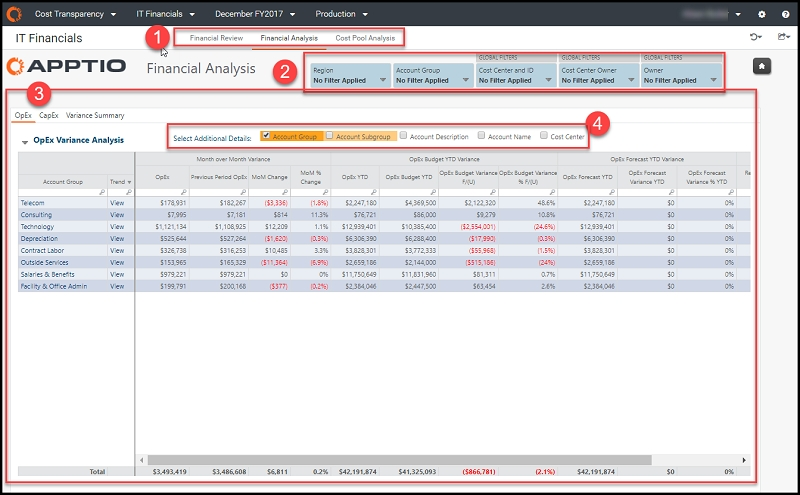
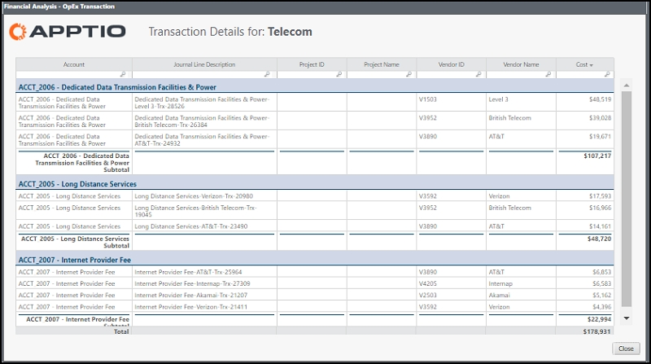
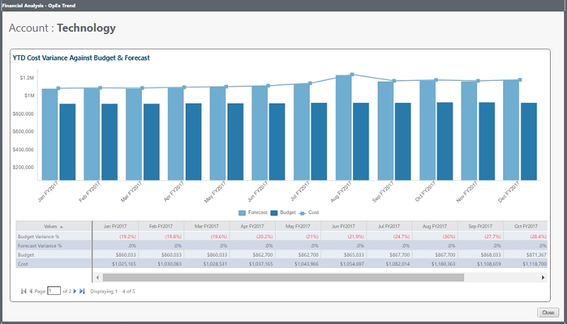
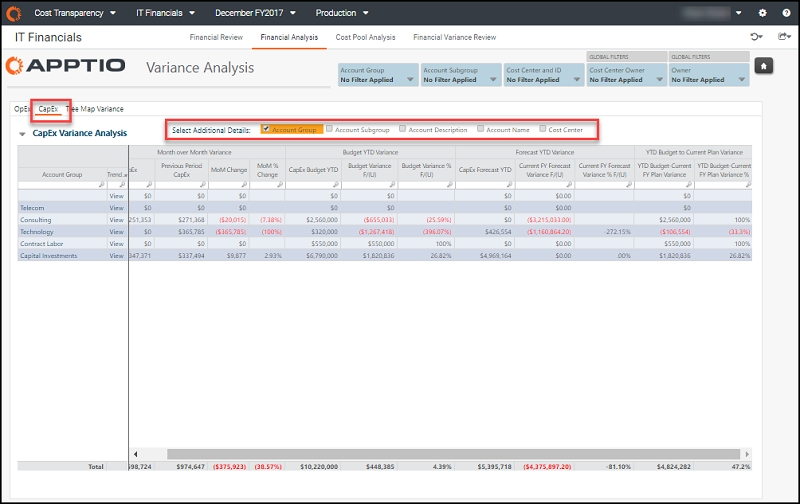
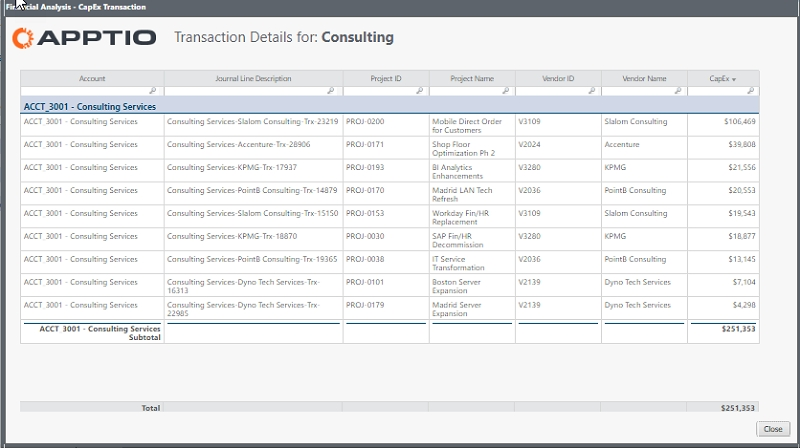
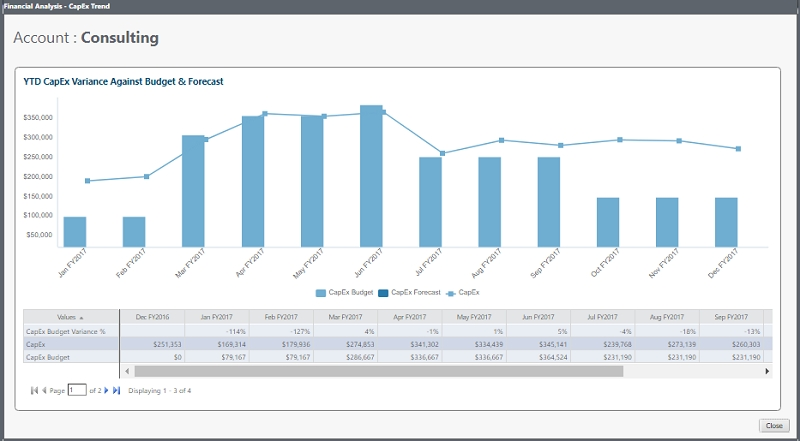
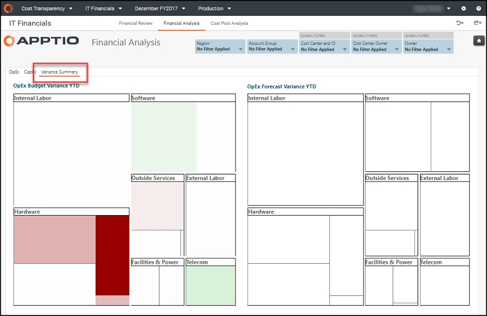
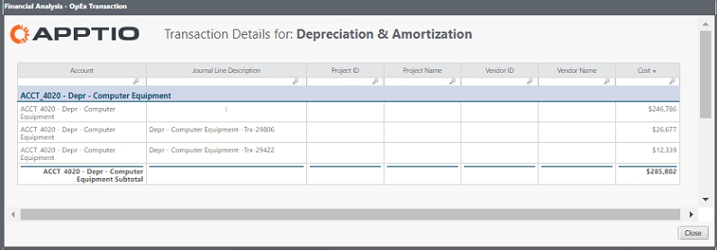
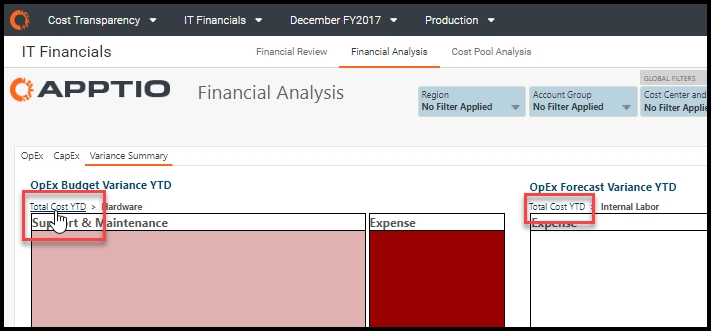

# Financial Analysis report (v104 and later)

◆ Applies to: Planning and Costing
Standard on TBM Studio 12.3 and later, with Template v104 and
later

The Financial Analysis report shows a detailed view of month-over-month
OpEx and CapEx variance, year-to-date budget variance, and year-to-date forecast variance. You can
use this report to review and manage IT spend and variance for account groups, account subgroups,
accounts, and cost centers.

## Display the report

1. Log in to Apptio and navigate to Planning > Costing
   Standard.
2. On the Home page, click IT Financials.

   The Financial Review report opens.
3. In the report collection tab (element 1, below), click Financial
   Analysis.

1. Log in to Apptio and navigate to Costing Standard.
2. On the Home page, click IT Financials.

   The Financial Review report opens.
3. In the report collection tab (element 1, below), click Financial
   Analysis.

The report contains the following elements.

(1) Report collection

Each of the reports in this collection provide the financial details you need to review your
spend variances and forecast accuracy:

- [Financial Review
  report (v107)](itfmf-ct_financialreview107.html "◆ Applies to: Planning and Costing Standard on TBM Studio 12.3 and later, with Template v107 and later")
- [Financial
  Review - CapEx report (v107)](itfmf-ct_financialreviewcapexv107.html)
- Financial Analysis (described in this article)
- [Cost Pool Analysis
  report (v104 and later)](itfmf-ct_costpoolanalysis104.html "◆ Applies to: Planning and Costing Standard on TBM Studio 12.3 and later, with Template v104 and later")

(2) Slicers

Use the local and global slicers to refine the data in your report. Slicers in this report let
you see your cost data by region, account group, and organizational accountability, including cost
center, cost center owner, and owner.

The following roles can use the slicers in this report for a more personalized view:

- IT Financial Controller - Without setting any slicers, you can see the
  overview of the spend of each cost pool across the organization. You can drill down into cost pools,
  cost center owners, and individual accounts.
- Financial Analyst - Set the Cost Center slicer for
  areas you support, or set a specific account group to enable a detailed, cross-organizational
  category spend analysis.

(3) Report views

Click one of the following views:

- OpEx - Analyze your month-over-month OpEx change, your YTD budget and
  forecast variance, and your remaining budget and forecast. Additional columns can be added to the
  table to change the analysis to focus on account group, account subgroup, account description,
  account name, and cost center (element 4).
  - Click any item in the left-most columns to see transaction-level details for that account
    hierarchy or cost center.

    
  - Click any item in the Trend column to see the OpEx trending for the
    selected item. The bar chart allows you to view the trend of spend variance against budget and
    forecast YTD. The table provides details about cost, budget, forecasts, and variance
    percentages.

    
- CapEx - Analyze your month-over-month CapEx change, your YTD budget and
  forecast variance, and your remaining budget and forecast. Additional columns can be added to the
  table to change the analysis to focus on account group, account subgroup, account description,
  account name, and cost center (element 4).

  

  - Click any item in the left-most columns to see transaction-level details for that account
    hierarchy or cost center.

    
  - Click any item in the Trend column to see the CapEx trending for the
    selected item. The bar chart allows you to view the variance against budget and forecast YTD. The
    table provides details about the CapEx budget variance percentage, CapEx, and CapEx budget.

    
- Variance Summary - This tab provides a visual analysis of your OpEx
  actuals compared to budget and to forecast. Hover over any segment of see details. Click a segment
  once to drill into the cost pool. (A box can contain multiple clickable segments.)

  

  Click a segment a second time to see account-level transaction details.

  

  Return to the original view by clicking the Total Cost breadcrumb above
  either image.

  

## Questions answered

You can use this report to answer the following questions:

- Where do we have the largest spend?
- Where do we have the largest change period over period?
- Are we spending more than we expected?
- What is the spend that drove the difference between the latest forecast and the budget?
- Is a variance real, or is it caused by mis-categorization?
- How does a cost center adjust their forecast to hit a target?
