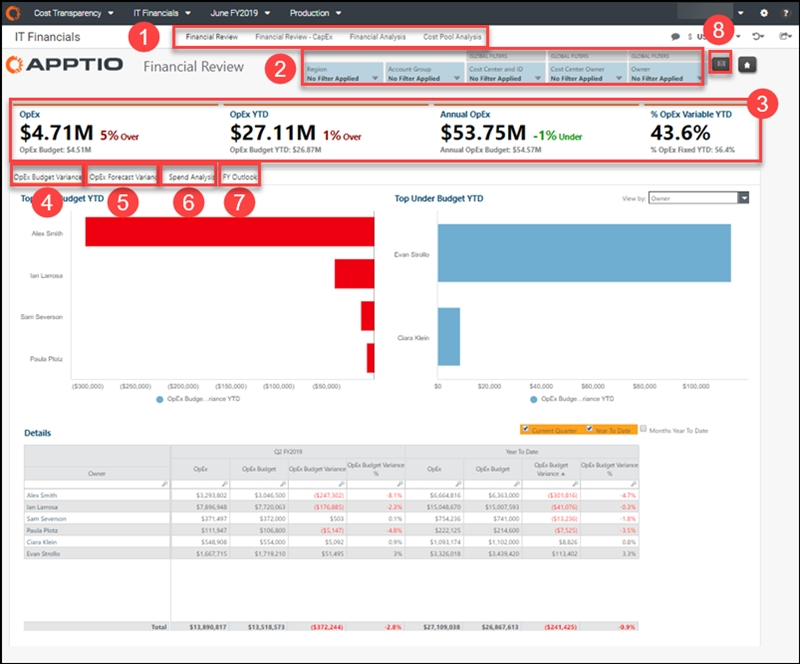
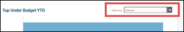
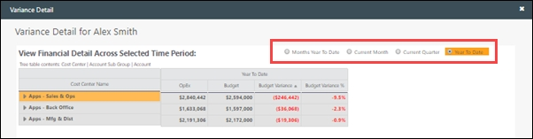
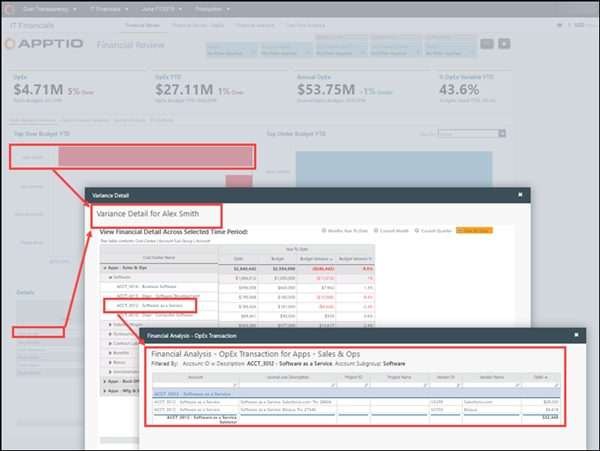
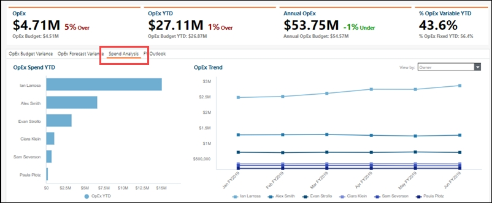

# Financial Review (OpEx) report (v107)

◆ Applies to: Planning and Costing
Standard on TBM Studio 12.3 and later, with Template v107 and
later

Use cases

- Track IT spend per CIO-1 at an executive level, by cost center owner, and by cost
- Analyze transaction-level details to understand variance plan drivers
- Identify significant spend-to-plan variances

The Financial Review report provides an executive view of the overall OpEx budget variance
and OpEx spend of your organization. The report breaks down IT cost per cost pool and owner so you
can determine which IT owners are responsible for the largest IT spend. Various charts in the report
also help you determine whether variances are real or caused by mis-categorization.

Use this report to create an executive brief that explains IT OpEx spend and to perform the
periodic financial reviews that are essential for effectively managing IT spend. Data in this report
includes general ledger line items so you can adjust plans to accommodate for variance.

This report is designed for use by the following roles:

- CIO -1 (TBM Office)
- Cost center owners
- IT financial analysts

## Display the report

1. Log in to Apptio and navigate to Planning > Costing
   Standard.
2. On the Home page, click IT Financials.

   The Financial Review report opens.

1. Log in to Apptio and navigate to Costing Standard.
2. On the Home page, click IT Financials.

   The Financial Review report opens.

The report contains the following elements.

(1) Report collection

This report collection provides the IT financial details you need to review your spend variances
and forecast accuracy:

- Financial Review (open by default) (described in this article)
- [Financial
  Review - CapEx (v107)](itfmf-ct_financialreviewcapexv107.html)
- [Financial
  Analysis report (v104 and later)](itfmf-ct_financialanalysis104.html "◆ Applies to: Planning and Costing Standard on TBM Studio 12.3 and later, with Template v104 and later")
- [Cost Pool Analysis
  report (v104 and later)](itfmf-ct_costpoolanalysis104.html "◆ Applies to: Planning and Costing Standard on TBM Studio 12.3 and later, with Template v104 and later")

(2) Slicers

Use the local and global slicers to refine the data in your report. Slicers in this report let
you see your cost data by region, account group, and organizational accountability, including cost
center, cost center owner, and owner (for example, CIO -1).

The following roles can use the slicers in this report for a more personalized view:

- IT Financial Controller or CIO. Without setting any slicers, you can see the overview of
  the spend across all cost centers in the organization. You can drill down into cost pools, cost
  center owners, and individual accounts.
- Cost Center Owner or CIO -1. Set the Cost Center or Cost Center Owner
  slicers to filter for your areas of responsibility.
- Financial Analyst. Set the Cost Center slicer for areas you support, or set a
  specific account group to enable a detailed, cross-organizational category spend analysis.

(3) KPIs

KPIs provide a high-level view of your OpEx spend:

- OpEx YTD and OpEx Budget - These two KPIs show your overall OpEx budget compared
  to the OpEx spend for the current month. The percentage of variance is shown to the right.
- OpEx YTD and OpEx Budget YTD - These two KPIs show your OpEx spend compared to the
  budget YTD. The percentage of variance is shown to the right.
- Annual OpEx and OpEx Budget YTD - These two KPIs show your OpEx spend compared to
  the budget YTD. The percentage of variance is shown to the right.
- % OpEx Variable YTD and % OpEx Fixed YTD - These KPIs help you determine the
  agility of your IT spend by looking at the ratio of fixed and variable expenditures for the fiscal
  year.

(4) OpEx Budget Variance

Select a metric (cost pool, account group, owner, cost center owner, or cost center ID) from the
View by list to populate the Top Over Budget YTD and **Top Under Budget YTD**charts with the items with the greatest budget variance to plan YTD. This information will help
you prioritize where to look for reduction opportunities.

Click a bar in either chart to open a Variance Detail dialog that shows the OpEx spend,
budget, variance, and percentage of variance for the selected metric. Use the options at the top of
the page to select a time period.

Click an account code in the left column to see the transaction details from your financial
source of record (such as your general ledger).

The Details table allows you to see a summary of the OpEx budget, variance, and percentage
of variance for all items in the selected metric based on the time periods you select above the
table.

Questions answered:

- Where are significant variances between spend vs. plan?
- Which cost centers are driving spend vs. plan variance and who is responsible for those cost
  centers?
- Is a variance real or caused by mis-categorization of an expense?
- Where does the largest portion of our IT spend go? By cost pool? By IT owner (for example,
  CIO-1)? By cost center owner?
- Are there significant changes in spend period-over-period?
- What expense line items contribute to the cost of an IT function?

(5) OpEx Forecast Variance

Select a metric (cost pool, account group, owner, cost center owner, or cost center ID) from the
View by list to populate the Top Over Forecast YTD and Top Under Forecast YTD
charts with the items with the greatest forecast variance to plan YTD.

Click a bar in either chart to open a Variance Detail dialog that shows the OpEx spend,
forecast, forecast variance, and percentage of variance for the selected metric. Use the options at
the top of the page to select a time period.

Click an account code in the left column to see the transaction details from your financial
source of record (such as your GL).

The Details table allows you to see a summary of the OpEx forecast, forecast variance, and
percentage of forecast variance for all items in the selected metric based on the time periods you
select above the table.

Questions answered:

- Where does the largest portion of our IT spend go? By cost pool? By IT owner (for example,
  CIO-1)? By cost center owner?
- Where have we seen any significant period-over-period changes in spend?
- What are the expense line items that contribute to the cost of an IT function?

(6) Spend Analysis

Select a metric (cost pool, account group, owner, cost center owner, or cost center ID) from the
View by list to populate the OpEx Spend YTD and OpEx Trend charts with the
items with the highest variance in spending to plan YTD and the spending trend over the previous six
months.

Click a bar in the chart to open a Variance Detail dialog that shows the monthly,
quarterly, and yearly OpEx spend for the selected metric. Use the options at the top of the page to
select a time period.

Click an account code in the left column to see the transaction details from your financial
source of record (such as your GL).

(7) FY Outlook

Use the FY Outlook tab to view the OpEx budget, forecast, and spend variance for the
fiscal year.

Click any item in the left column to see the transaction details from your financial source of
record (such as your GL).

(8) Email icon

The email icon is visible only to financial analysts with admin permissions. Click the icon to
open the Finance Variance Review email report. See the [Finance Variance
Review email report](itfmf-ct_financialvariancereviewemail104.html "◆ Applies to: Planning and Costing Standard on TBM Studio 12.3 and later, with Template v104 and later").
