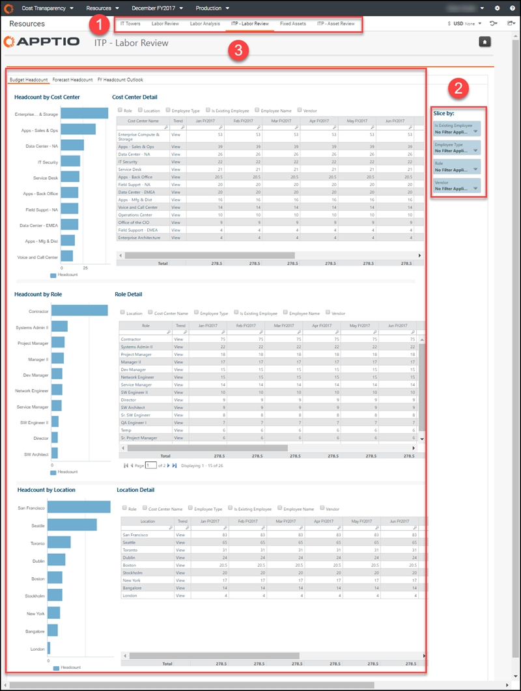
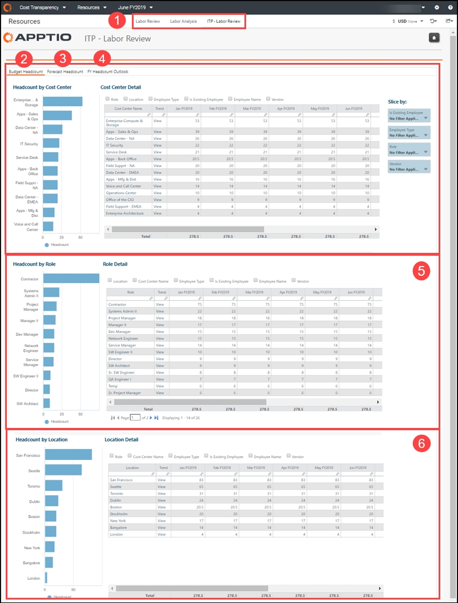
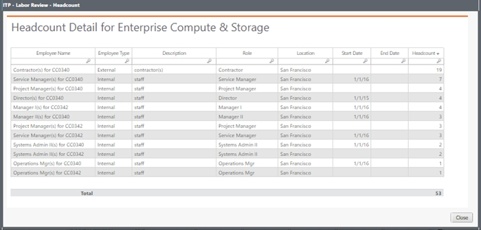
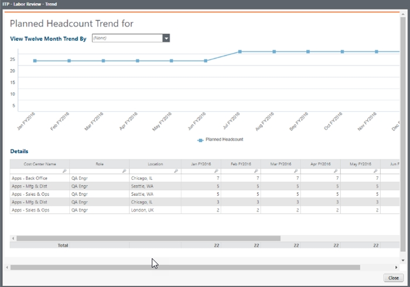

# ITP - Labor Review report (v104 and later)

◆ Applies to: Planning and Costing Standard on TBM Studio 12.3 and later, with Template
v104 and later

Use case:

- View the largest changes in staffing by role YTD
- See headcount, headcount plan, variance, and spend by role for the current period
- Review headcount, plan, and average cost by location

The ITP - Labor Review report provides a view into the labor plan for the year to help you
decide whether to delay or accelerate hiring based on the budget. Use the report to see your
month-over-month headcount for budget and forecast that matches what you see in Costing Standard,
except that this view contains only headcount data, without financial data that is captured in the
main Labor Review report. The labor details per role and location are from Planning.

This report is designed for the following roles:

- IT leadership, for an aggregate view so you can control costs
- Resource managers, so you can track where and how labor is handled
- Cost center owners and budget owners (CIO -1), so you can manage your people and their
  budgets

## Display the report

1. Log in to Apptio and navigate to Planning > Costing
   Standard.
2. On the Home page, click Labor.

   The Labor Review report opens.
3. In the report collection tabs (element 1, below), click ITP - Labor Review.

1. Log in to Apptio and navigate to Costing Standard.
2. On the Home page, click Labor.

   The Labor Review report opens.
3. In the report collection tabs (element 1, below), click ITP - Labor Review.

The ITP - Labor Review report contains the following elements.

(1) Report Collection

This report collection provides the details you need to review your labor resources:

- IT Towers report (v104)
- Labor Review report (v104)
- Labor Analysis report (v104)
- ITP - Labor Review report (v104)
- Fixed Assets report (v104)
- ITP - Asset Review report (v104)

(2) Slicers

Slicers in this report let you see your labor data broken out by employee, employee type, role,
and vendor.

The following roles can use the slicers in this report for a more personalized view:

- IT Financial Controller or CIO - Without setting any slicers, you can see the overview of
  the spend of each cost pool, role, and location. You can drill down into details for each.
- Cost Center Owner or CIO -1 - Set the Slice by Role filter to see staffing
  changes. Set the Slice by Location filter to review headcount, plan, and average cost by
  location.
- Financial Analyst - Set the slicers for areas you support and see headcount, headcount
  plan, variance, and spend by role for the current period.

(3) Budget Headcount by Cost Center, Role, and Location

Use these charts to view your labor spend across cost centers, roles, and locations.

- Headcount by Cost Center - Use the chart and table to view headcount totals and monthly
  labor spend per cost center. Select options above the table to add and remove columns for roles,
  location, employee types, employee status, employee names, and vendors.

  Click any item in the Cost Center Name column to open a Headcount Detail dialog
  with more detail about the item you clicked. The data in the dialog changes based on the options
  selected above the table.

  

  Click the View link for any item in the Trend column to see a trend chart and
  month-over-month detail for the item you clicked.

  
- Headcount by Role - Use the chart and table to compare headcount totals and monthly labor
  spend per role. The options above the table and links within the table are the same as for the
  Headcount by Cost Center section.
- Headcount by Location - Use the chart and table to compare headcount totals and monthly
  labor spend per location. The options above the table and links in the table are the same as for the
  Headcount by Cost Center section.

## Questions answered

You can use this report to answer the following questions:

- What is our headcount per role?
- How is our staffing comparing to plan? Are we over- or under-staffed in key roles?
- How do headcounts vary by location?
