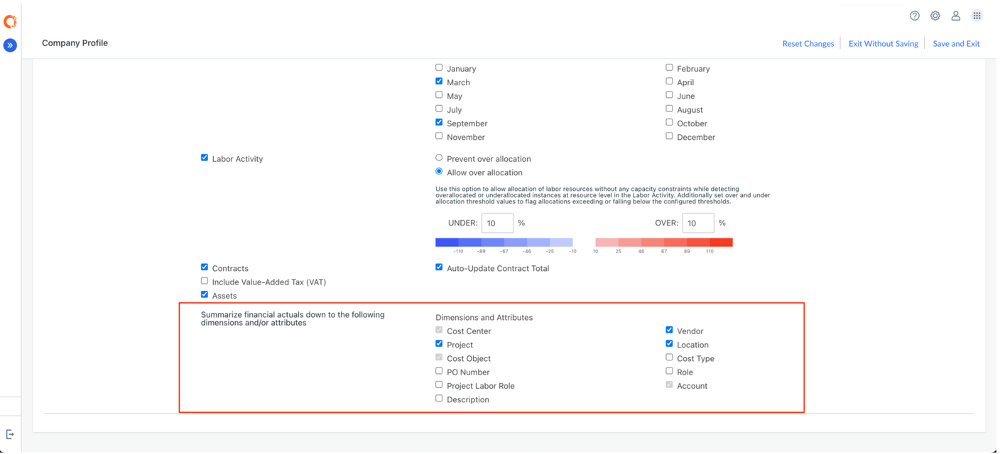

# Ajustes reales de resumen

Esta característica describe cómo se segregan las partidas individuales reales, basándose en las columnas que se eligen para la integración.

Nota: Se requieren los roles de Administrador o Propietario de Proceso Presupuestario para modificar los ajustes de Resumen Real.

Al crear un plan de previsiones, se puede elegir cómo se resumirán (agregarán) los datos reales antes de importarlos al plan. La integración real le permite controlar el nivel de detalle con el que se presentan los datos reales, lo que garantiza que los datos coincidan con el modo en que su equipo planifica y analiza los gastos.

## Para qué sirve

La integración de reales agrupa los reales según las dimensiones seleccionadas y, a continuación, agrega las partidas individuales reales en consecuencia.

Esto resulta especialmente útil si los datos reales son más detallados que el modelo de planificación; por ejemplo, si los datos reales incluyen detalles a nivel de transacción, pero el plan de previsiones sólo necesita un resumen a nivel de departamento y cuenta.

Puede integrar reales utilizando dimensiones estándar (por ejemplo, Departamento, Cuenta, Centro de coste) y/o dimensiones personalizadas, siempre y cuando dichas dimensiones existan tanto en el esquema de reales como en el de finanzas.

## Cómo configurar la integración real

- Vaya a **Ajustes (icono de engranaje)** → **Perfil de empresa**.
- En la sección **Resumir reales**, seleccione las **dimensiones** por las que desea que se agreguen los reales.
- Haga clic en **Guardar y salir**.

**Notas importantes:**

- Estos ajustes sólo se aplicarán en adelante a los planes de nueva creación.
- Para los planes existentes, debe crear un nuevo plan para aplicar la configuración de integración actualizada.
- Las dimensiones están disponibles para la integración sólo si existen tanto en el esquema de reales como en el de finanzas.

