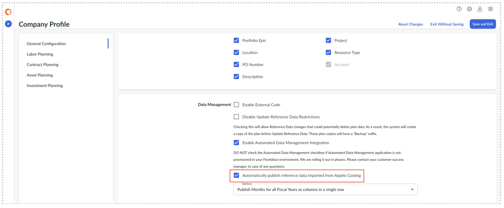

# Importar datos de referencia desde Apptio Cálculo de costes

Los datos de referencia en Apptio Planificación definen las dimensiones básicas utilizadas para la planificación, la previsión y la elaboración de informes, tales como cuentas, centros de costes, departamentos, proveedores, proyectos y funciones laborales. Con la gestión automatizada de datos Data Management (ADM), puede importar datos de referencia fiables y controlados directamente desde Apptio Costing para garantizar la coherencia en todos los flujos de trabajo financieros.

Nota: Estas tareas requieren el rol de administrador con el DataOrchestrationServiceFeatureFullAccess permiso.

Recuerde: La función automatizada Data Management (ADM) está habilitada

## Antes de empezar

Asegúrese de que se cumplan los siguientes requisitos previos:

- **Automatizado Data Management (ADM)** se aprovisiona en su entorno
- ADM está habilitado en Apptio Planificación:
  - Ve a **Configuración (⚙) → Perfil de la empresa.**
  - Seleccionar **Habilitar integración Data Management automatizada**
- **Los conjuntos de datos de integración de planificación** necesarios se instalan en Apptio Costing
- Tienes el rol de administrador con el **DataOrchestrationServiceFeatureFullAccess** permiso.

## Gestión de entidades

Asegúrese de que **la asignación automatizada Data Management → Asignación de entidades** incluya las asignaciones correctas a los conjuntos Apptio de datos de costes. Cuando se añade una nueva dimensión personalizada en Apptio Planning, ADM crea automáticamente una entrada correspondiente en la tabla de asignación de entidades, sin necesidad de configuración manual.

1. Ve a **Configuración (⚙) → Automatizado Data Management**
2. Navega hasta **Gestión de entidades**.
3. Localice el conjunto de datos de referencia adecuado haciendo coincidir el **nombre de la entidad**.
4. Asigne el **conjunto de datos de costes Apptio** correspondiente a la entidad.
5. Seleccione **Actualizar** para guardar los cambios.

Más información: [Gestión de entidades](https://www.ibm.com/docs/en/apptio-platform/adm/saas?topic=administration-entity-management "(se abre en una pestaña o una ventana nueva)")

## Importar datos de referencia a Apptio Planificación

Con la automatización Data Management activada, las actualizaciones de los datos de referencia realizadas en Apptio Costing se importan automáticamente a Apptio Planning. El proceso integral funciona de la siguiente manera:

1. Un usuario actualiza conjuntos de datos asignados a entidades de datos de referencia y realiza un registro en Apptio Cálculo de costes ( Data Studio ).
2. Los cambios se envían a la cola de cálculo de costes y se procesan.
3. Una vez completados los cálculos, Apptio Costing notifica al servicio Data Management automatizado que hay datos actualizados disponibles.
4. ADM recupera los datos de referencia actualizados del entorno de preparación de costes y los importa para su uso en Apptio Planificación.

Si **la opción Publicar automáticamente los datos de referencia importados desde Apptio Cálculo de costes** está activada en **Perfil de la empresa** :

- Los conflictos de datos de referencia se resuelven automáticamente
- Las importaciones de datos de referencia se completan sin necesidad de publicación manual

Si esta opción está desactivada:

- Los datos se importan, pero se mantienen en estado pendiente
- Cualquier conflicto en los datos de referencia debe resolverse manualmente
- Los datos deben publicarse antes de que estén disponibles en los planes

**Tema principal:** [Conectarse a Apptio Costing](../../../it-planning/planning/adm/adm_capabilities.html "Apptio La planificación se integra con Apptio el cálculo de costes mediante el sistema automatizado Data Management (ADM). ADM es un servicio de plataforma compartida diseñado para proporcionar una experiencia de intercambio de datos unificada, segura y escalable entre Apptio aplicaciones.")
