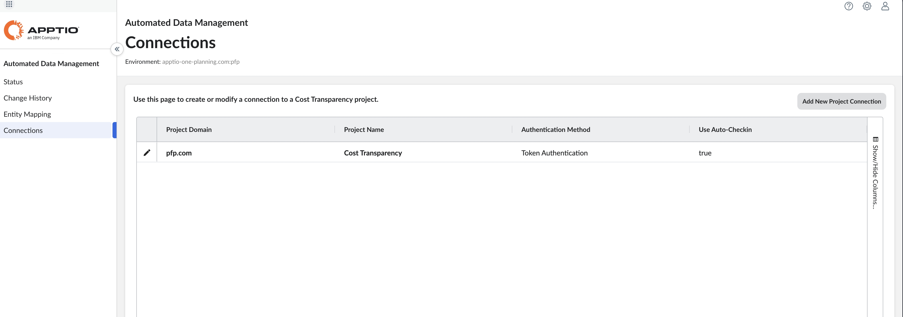

# Configuración automatizada Data Management

Los siguientes son los prerrequisitos para habilitar Automated Data Management en un Costing & Planning - Plan.

## Instale los componentes de Cost Transparency Integration para compartir datos de referencia y reales

Este paso sólo es necesario si no ha configurado Costing Standard Integration. Siga este procedimiento sólo si es la primera vez que configura la integración con Costing Standard.

1. En Costing Standard, instale el componente Apptio ITPF Integration. Consulte [Instalar los componentes de integración de ITPF](https://www.ibm.com/docs/en/apptio-commercial/costing-standard/saas?topic=install-itpf-integration-components "(se abre en una pestaña o una ventana nueva)") para obtener más información.

   Este paso instala automáticamente todas las plantillas de conjuntos de datos de referencia necesarias para integrar los productos.
2. Si utiliza Activos y Vendedor, deberá instalar también los componentes Apptio ITPF Asset y Apptio ITPF Vendor. Para más información, consulte [Instalar los componentes](https://www.ibm.com/docs/en/apptio-commercial/costing-standard/saas?topic=install-itpf-integration-components "(se abre en una pestaña o una ventana nueva)").

## Instale Costing Standard Componentes de integración para Plan Automated Data Management

1. En Costing Standard, instale el componente de integración del plan ApptioOne.

   Este paso instala automáticamente todas las plantillas de conjuntos de datos del Plan necesarias para importar los datos del plan desde Costing a Cálculo del coste y planificación - Plan.

## Configure la conexión a la instancia Costing Standard en Automated Data Management

Para configurar Automated Data Management manualmente, vaya a [Conexiones](https://www.ibm.com/docs/en/apptio-platform/adm/saas?topic=administration-connections "(se abre en una pestaña o una ventana nueva)").

Para configurar automáticamente los ajustes de conexión de Automated Data Management, asegúrese de que la opción **Activar integración de Automated Data Management** está seleccionada en la página [Editar el perfil de la empresa](../edit-company-profile.html "El Perfil de Empresa permite a los usuarios Administradores y Propietarios de Procesos Presupuestarios configurar los parámetros de la aplicación para personalizar la visualización, activar o desactivar funciones y definir el comportamiento del flujo de trabajo en Apptio Planning.").

**Tema principal:** [Conéctese a Apptio Costing](../../../it-planning/planning/adm/adm_capabilities.html)
