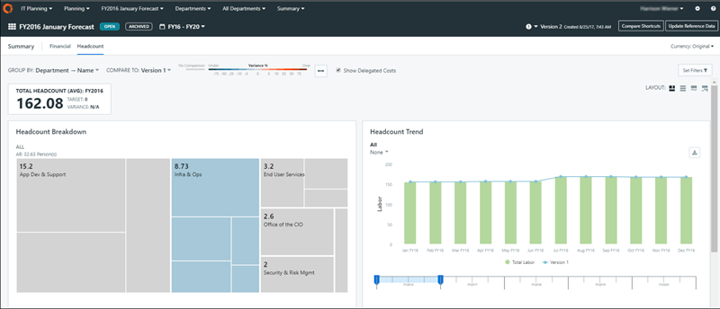

# Analizar los efectivos laborales

Una vez que los datos de mano de obra están presentes, puede analizar el recuento de mano de obra a través de la página Resumen.

1. Asegúrese de que las funciones de planificación laboral están activadas. Véase [Editar el perfil de la empresa](edit-company-profile.html "El Perfil de Empresa permite a los usuarios Administradores y Propietarios de Procesos Presupuestarios configurar los parámetros de la aplicación para personalizar la visualización, activar o desactivar funciones y definir el comportamiento del flujo de trabajo en Apptio Planning.").
2. En el menú de la sección Plan, seleccione Departamentos. Véase [Navegar en las aplicaciones Apptio Planning](navigate-apptio-planning.html) .
3. En el menú de la subsección Plan, seleccione un departamento específico o Todos los departamentos.
4. En el menú Componente, seleccione Planning. Véase [Navegar en las aplicaciones Apptio Planning](navigate-apptio-planning.html) . > Resumen.
5. Seleccione la pestaña Recuento.
6. Si lo desea, puede aplicar un diseño diferente a la página seleccionando una opción de diseño en la parte superior derecha.

A diferencia de los análisis financieros de OpEx o CapEx valores financieros, los análisis de recuento de mano de obra utilizan el recuento de mano de obra como unidad de medida en lugar de valores financieros:

Nota: El código de colores de la desviación con respecto a los objetivos de mano de obra sólo aparece si se han establecido objetivos de mano de obra. Véase [Fijar objetivos de plantilla](set-labor-headcount.html).

## Comparar los efectivos laborales

Ahora puede comparar los datos Laborales entre dos planes.

1. Asegúrese de que la opción Habilitar nueva experiencia de página de gastos (Beta). Véase [Editar el perfil de la empresa](edit-company-profile.html "El Perfil de Empresa permite a los usuarios Administradores y Propietarios de Procesos Presupuestarios configurar los parámetros de la aplicación para personalizar la visualización, activar o desactivar funciones y definir el comportamiento del flujo de trabajo en Apptio Planning.").
2. Vaya a Gastos > pestaña Mano de obra. Activa el conmutador Nueva vista.
3. Expanda el icono y seleccione la opción Comparar accesos directos. Ver [Comparar atajos](compare-versions-plans.html).

   
4. En la ventana emergente Gestionar accesos directos de comparación, seleccione los planes que desea comparar y haga clic en el botón Comparar. Aparece la página siguiente.

   

   

   Nota: La agrupación por defecto es por Objeto de Coste. Pero si desea analizar la varianza por otras dimensiones, puede actualizar la vista de tabla añadiendo más grupos de columnas. En la captura de pantalla anterior se ha actualizado la agrupación de columnas por defecto añadiendo el grupo de columnas Proveedor y Ubicación para que los usuarios puedan desglosar la vista de columnas agrupadas para comprender la variación de recuentos por proveedor y ubicación.
5. Haga clic en + Añadir comparación para ver los planes de mano de obra seleccionados en el paso 3 anterior. Si se dispone de varios años de datos para la comparación, el usuario debe seleccionar un año cada vez para la comparación.

   

   La comparación de planes actualiza automáticamente la presentación para Agrupar por objeto de coste.
6. Elija el plan adecuado y seleccione Comparar. Los usuarios pueden utilizar esta vista para comparar el recuento de mano de obra de distintos planes.

   
7. Para añadir planes adicionales para comparar, seleccione cualquier columna mensual y, a continuación, elija la opción Añadir comparación.

   

   
8. Elija los valores adecuados y haga clic en Comparar. El plan adicional se añade al mes seleccionado para la comparación, como se muestra.

   
9. Para eliminar cualquier plan de la comparación, seleccione esa columna y elija Eliminar comparación.

   

Puede añadir y eliminar comparaciones varias veces, para distintos planes y métodos de alineación. Si no hay valores para un ejercicio fiscal coincidente, aparecerá un mensaje de error.
