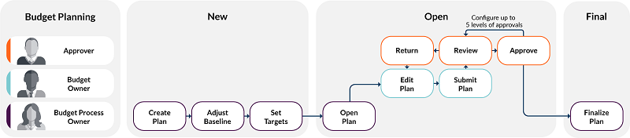
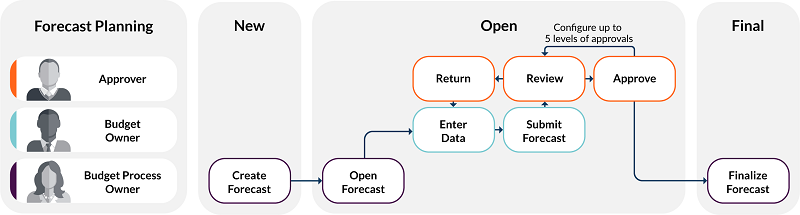
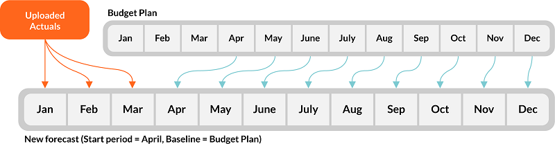

# Planificación y previsión presupuestarias

Una vez que el administrador haya configurado su aplicación Apptio Planning , podrá empezar a prever y planificar su presupuesto. Consulte [Configurar y administrar las aplicaciones Apptio Planning](configure-administer-apptio.dita "(se abre en una pestaña o una ventana nueva)") .

Vea estos vídeos de Apptio Education Services:

- [Flujo de trabajo de planificación informática 2.0](https://community.ibm.com/community/user/viewdocument/it-planning-20-workflow-2-min "(se abre en una pestaña o una ventana nueva)")
- [Comprender las jerarquías de datos en ITP](https://community.ibm.com/community/user/viewdocument/understanding-data-hierarchies-in-i "(se abre en una pestaña o una ventana nueva)")

## Cómo funcionan la planificación y la previsión presupuestarias en Apptio

El éxito de las aplicaciones de Apptio Planning requiere una visión clara de las tareas de los usuarios y de los flujos de procesos. Las siguientes imágenes muestran ejemplos de tareas (columnas) y funciones de usuario (filas) para las tareas de planificación presupuestaria en las aplicaciones Apptio Planning . Las imágenes muestran ejemplos de un proceso de planificación o previsión presupuestaria con tres niveles. Puede adaptar este proceso a las necesidades de su organización. Por ejemplo, su organización puede no tener un responsable de presupuesto, tener un único responsable de presupuesto o varios niveles de responsables de presupuesto. Del mismo modo, su organización puede tener uno o varios usuarios que aprueben planes.

En los siguientes ejemplos, sólo hay un Propietario de Proceso Presupuestario designado pero probablemente varios propietarios de presupuesto. Los propietarios de un Código padre en los datos de referencia de Departamentos, o de los datos de referencia de Proyectos, Servicios o Unidades de negocio habilitados se consideran propietarios de presupuesto de grupo. Véase [Gestionar datos financieros de referencia](manage-financial-dimensions.html "Las siguientes tareas sólo pueden ser realizadas por usuarios asignados a los roles de Administrador o Propietario de Proceso Presupuestario. Para obtener más información sobre las funciones, consulte Permisos y funciones de Frontdoor.").

He aquí un flujo de trabajo de planificación presupuestaria:

He aquí un flujo de trabajo de planificación de previsiones:

- Los Propietarios de Procesos Presupuestarios son responsables de crear el plan que utilizarán los propietarios de presupuestos para introducir datos y realizar un seguimiento de sus gastos. Los responsables del proceso presupuestario también se encargan de finalizar y cerrar los planes.
- Los propietarios del presupuesto son responsables de introducir la información presupuestaria para sus objetos de coste. Esto puede aplicarse a propietarios individuales o colectivos de departamentos, proyectos, servicios o unidades de negocio.
- Los aprobadores son las personas designadas para aprobar o rechazar los planos presentados. Los aprobadores no están vinculados a la jerarquía de credenciales, sino a la jerarquía de objetos de coste (véanse [los datos de referencia de Gestionar permisos de objetos de coste](manage-cost-object.html "Los Permisos de Objetos de Coste determinan qué usuarios pueden ver, editar, enviar o aprobar planes a nivel de Departamento (Objetos de Coste). Cada Departamento puede tener uno o más usuarios asignados con permisos de nivel de edición y, para las aprobaciones de varios niveles, permisos de nivel de aprobación.") ). Apptio Planning admiten hasta cinco niveles de aprobadores.

## Previsión

Una previsión suele constar de:

- Un plan o previsión presupuestaria anterior que sirva de referencia para la nueva previsión.
- Datos reales mensuales que se han cargado en su aplicación Apptio Planning (véase [Importar y publicar datos reales](import-publish-actuals.html) ). Los históricos reales no son editables. Si la nueva previsión incluye importes reales, pero no importes previstos en el futuro, esto representa un gasto no planificado.

Cada previsión que cree abarca todo el año del plan (normalmente su ejercicio fiscal). Por ejemplo, su año del plan es un año natural de enero a diciembre. Previamente ha creado un plan presupuestario anual y ha cargado los datos reales de enero a marzo. Ahora quiere crear una previsión. En la nueva previsión, se rellenan los datos reales históricos de enero a marzo y los valores de las partidas de abril a diciembre se copian de la línea de base del Plan Presupuestario:

Una vez actualizada y finalizada la nueva previsión, puede utilizarla como referencia para una previsión posterior. Si utiliza el Plan Presupuestario como base de referencia para la previsión inicial del año, podrá utilizar cada previsión trimestral como base de referencia para las previsiones posteriores. Por ejemplo, puede utilizar el Plan Presupuestario como línea de base para la previsión Q1, luego utilizar la previsión Q1 como línea de base para la previsión Q2, la previsión Q2 como línea de base para la previsión Q3, y así sucesivamente. La misma lógica de secuenciación se aplica a los periodos de previsión mensuales o de otro tipo.

## Tareas de planificación presupuestaria y de previsiones

- [Crear un plan o previsión](create-budget-plan.html)
- [Gestionar tablas de partidas](manage-line-item.html)
- [Introducir datos financieros y ajustar los valores de referencia](enter-financial-details.html)
- [Fijar objetivos financieros](set-financial-targets.html)
- [Plan plurianual](plan-multiple-years.html "Utilice las funciones de planificación plurianual para planificar y realizar un seguimiento de sus finanzas de TI en un horizonte temporal continuo y plurianual. Puede respaldar planes a largo plazo y previsiones continuas más allá de los límites del ejercicio fiscal.")
- [Abrir un plano o una previsión](open-plan-forecast.html "Después de crear un plan presupuestario o una previsión, ajuste opcionalmente los valores de referencia, fije los objetivos y abra el plan para que los propietarios del presupuesto puedan editar las partidas individuales. Los propietarios del presupuesto no pueden ver un plan cuando está en estado Nuevo. Al abrir un plan, se envía una notificación por correo electrónico a los propietarios del presupuesto y a todos los usuarios que tengan el permiso Editar y enviar asociado a los objetos de coste de ese plan.")
- [Importar y publicar datos reales](import-publish-actuals.html)
- [Analizar un plan o una previsión](analyze-plan-forecast.html). Utilice el Costing Standard [Informe de revisión financiera](../reports-itfmf-ctv104/itfmf-ct_financialreview107.dita "(se abre en una pestaña o una ventana nueva)") para revisar el gasto acumulado hasta el momento, el gasto anual proyectado y la variación del presupuesto por grupo de costos. Utilice el Costing Standard [Informes de Revisión de Mano de Obra](../reports-itfmf-ctv104/itfmf-ct_itplaborreview104.html "◆ Se aplica a: Planificación y Cálculo de Costes Estándar en TBM Studio 12.3 y posteriores, con Plantilla v104 y posteriores") para visualizar los costos de mano de obra por personal interno y externo por Centro de Costos. Vea los gastos de mano de obra más importantes por función y desglose interno y externo.
- [Comparar versiones o planes](compare-versions-plans.html)
- [Revisar, aprobar o devolver planes u objetos de coste](review-approve-return.html)
- [Archivar, restaurar o eliminar planes](manage-plans.html "Con la página Planes, puede gestionar sus planes de forma fácil e intuitiva.")
