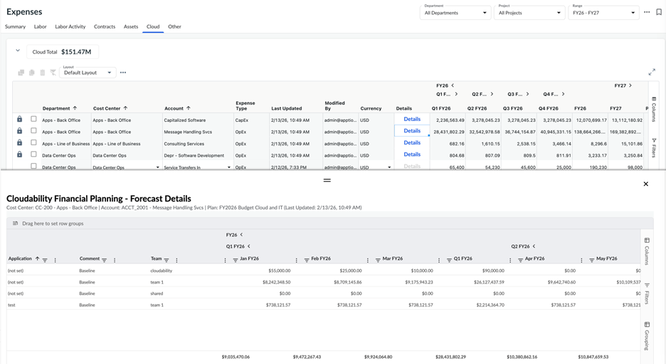
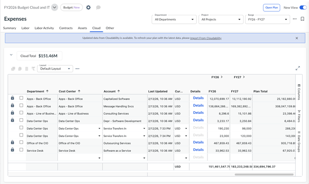

# Configurar y gestionar la integración de la planificación financiera en la nube

Nota: Para realizar estas tareas se requieren los roles de administrador o responsable del proceso presupuestario.

Importante: Disponible con la *suscripción* ***al estándar de planificación « Apptio ».***

Recuerde: La nueva vista está habilitada.

La configuración de integración de Cloud Financial Planning (CFP) se configura **por plan** dentro de la configuración del plan. Estos ajustes establecen la conexión entre la planificación de Apptio y el **plan CFP** específico y **la vista de propiedad de costes**, y definen cómo las dimensiones de planificación (departamento, centro de costes, cuenta, etc.) Mapa de las estructuras de propiedad de costes de CFP.

**Para configurar los ajustes de integración de CFP**

1. **Abre el plan** que deseas conectar a CFP.
2. En el menú de navegación izquierdo, vaya a **Configuración del plan → Integración de Cloud Financial Planning**.
3. En la página Configuración de integración de CFP, revise los **detalles del entorno generado** (solo lectura):
   - **Dominio** : su dominio de cliente Apptio
   - **Nombre del entorno** : el nombre de su entorno de Apptio
   - **Cloudability Moneda** : la moneda configurada en CFP
4. En el menú desplegable **«Ver nombre»**, seleccione la vista de propiedad de costes CFP adecuada.
5. Seleccione el **nombre del plan** de CFP. Solo aparecerán los planes CFP con el **mismo año de inicio** que el plan de planificación actual Apptio.
6. Configure las asignaciones predeterminadas que se utilizan cuando los valores de propiedad de costes CFP no tienen asignaciones explícitas:
   - **Departamento predeterminado** : se aplica cuando un valor de propiedad de costes no tiene asignación a nivel de departamento
   - **Centro de costes predeterminado** : se aplica cuando no existe ninguna asignación de centros de costes
   - **Cuenta predeterminada** : se aplica cuando no existe ninguna asignación de cuenta
   - **Proyecto predeterminado** *(opcional)* : se utiliza si es necesario asignar el proyecto
   - **Proveedor predeterminado** *(opcional)* : se utiliza cuando la asignación de proveedores es relevante
7. Seleccione el comportamiento **«Rellenar hacia adelante»** que determina cómo se amplían los datos CFP a años futuros en una planificacion Apptio :
   - **Ninguno** : no se copian datos en años que no figuran en el plan CFP
   - **Copiar último período** : el último período del plan CFP se copia en todos los años restantes
   - **Copiar el año pasado** : el último año del plan CFP se copia en todos los años restantes

## Para configurar las asignaciones de datos

Esta configuración define cómo **los valores de propiedad de costes** en CFP se asignan a las **dimensiones empresariales** correspondientes en Apptio Planning. Estas asignaciones garantizan que todos los gastos importados desde CFP se asignen a las dimensiones de planificación correctas.

1. Cada valor **de propiedad de costes** debe asignarse a un **departamento**, **centro de costes** y **cuenta** para que la asignación sea válida.
2. También puede asignar opcionalmente los valores de Propiedad de costes a las dimensiones **Proyecto** y **Proveedor**.
3. Para crear una asignación, seleccione un valor **de Propiedad de costes** en el menú desplegable y elija los valores adecuados **de Departamento**, **Centro de costes**, **Cuenta**, **Proyecto** y **Proveedor** en las listas correspondientes.
4. También puede **cargar asignaciones a través de CSV** para realizar actualizaciones masivas.
5. Durante la importación, Apptio Planning realiza una validación de los datos de referencia para garantizar que el **departamento** asignado coincida con el centro de costes y que el **proyecto coincida con el centro de costes**.

Nota: Durante el proceso de importación del CFP se realiza una comprobación de validación de datos de referencia para garantizar que el departamento asignado esté correctamente asociado al centro de costes seleccionado y que el proyecto asignado sea válido para ese centro de costes.

## Importar datos del plan desde Cloud Financial Planning

Nota: Para realizar estas tareas se requieren los roles de administrador o responsable del proceso presupuestario. Además, los roles de usuario personalizados con permisos de « CanImportFromCloudability » también pueden realizar estas tareas.

***Para importar datos desde Cloud Financial Planning:***

- Abre tu plan y ve a la pestaña **Nube** dentro de **Gastos** > **Nueva vista.**
- En el menú de acciones del nivel de tabla (botón de tres puntos), seleccione **Importar elementos de línea de cloudability.**
- En el cuadro de diálogo de confirmación de importación, revise el nombre del plan CFP y el nombre de la vista y haga clic en el botón **Importar**.
- Una vez completada la importación, aparecerá un mensaje indicando que la operación se ha realizado correctamente y el número de líneas importadas.
- En caso de errores de importación, se mostrarán los detalles junto con una opción para descargar el archivo de ayuda CSV para un análisis más detallado de la importación fallida.

***Comportamiento de importación:***

1. Las líneas importadas siguen la configuración **de Rellenar hacia adelante** definida en Configuración del plan:
   - **Ninguno** : no se proyectan datos para años futuros.
   - **Copiar último período** : el último período del plan CFP se copia en los años futuros.
   - **Copiar el año anterior** : el último año del plan CFP se copia en los años futuros.
2. Todas las líneas importadas desde CFP se crean como **líneas externas**, lo que significa que son **de solo lectura** para todos los usuarios.
3. Cada línea importada recibe un **código** **de línea** único con el prefijo **CL** la primera vez que se importa al plan.
4. Las importaciones posteriores desde CFP **sobrescriben las líneas importadas existentes desde CFP** con valores actualizados, conservando los mismos códigos de partida.
5. Las líneas importadas por CFP se añaden a la **última versión del objeto de coste** y solo son visibles en los departamentos en los que el usuario que realiza la importación tiene acceso de edición.
6. Las líneas de nube importadas también aparecen en **Gastos → Resumen** en modo de solo lectura con **Tipo** **de partida** = Nube.
7. La importación se **bloquea** si el departamento de destino está bloqueado debido a la presentación del presupuesto.
8. En los planes multidivisa, todas las conversiones de divisas siguen los **tipos de cambio multidivisa** definidos en Apptio Planning.
9. Para eliminar todas las líneas importadas de CFP de la pestaña Cloud, utilice **la opción Eliminar elementos de línea de Cloudability** del menú **de acciones a nivel de tabla**. Esta acción elimina *todas* las líneas importadas por CFP para el plan.

**Vista detallada de la partida presupuestaria CFP**

Nota: El usuario necesita permiso en CFP Plan para ver la vista detallada de las partidas.

1. Las líneas importadas desde CFP se muestran en Apptio Planning como entradas resumidas según la configuración de mapeo de datos definida en la configuración de integración de planificación financiera en la nube del plan.
2. Para ver los detalles subyacentes, los usuarios pueden hacer clic en el botón **Detalles** de la columna **Detalles** de la pestaña Nube.
3. Esto abre un **cajón de solo lectura** que muestra las líneas del plan CFP.

**Notificación de actualización de datos CFP**

**Nota:** Para ver esta notificación se requiere el **CanImportFromCloudability** permiso.

1. Cuando se realizan actualizaciones en el plan conectado en CFP, Apptio Planning muestra un **banner de notificación** a los usuarios con el acceso adecuado, incluidos **los administradores**, **los propietarios del proceso presupuestario** y los usuarios con permiso **CanImportFromCloudability**, indicando que hay nuevos datos disponibles para importar.
2. Para actualizar los datos de la pestaña «Cloud», los usuarios solo tienen que **volver a importar las partidas « Cloudability »**, lo que actualiza el plan con la información más reciente de CFP.

**Tema principal:** [Conectarse a Cloudability Financial Planning](../../it-planning/planning/connect-cfp.html)
